# 📘 DevOps Challenge - Day 4

- Repository dumbways-batch-23 dibuat private

- Demokan penggunaan Pull Request

## 📃 Membuat Repositori dumbways-batch-23 Menjadi Private

- Membuka repositori dumbways-batch-23
- Pilih Settings
- Muncul halaman Settings untuk repositori tersebut, scroll sampai menemukan tampilan sebagai berikut, lalu pilih Change visibility
- Change to private

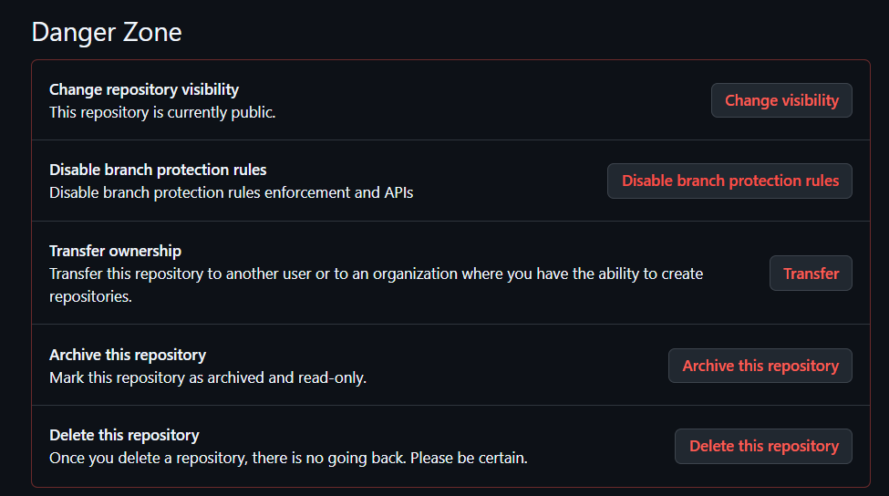

- Klik I want to make this repository private

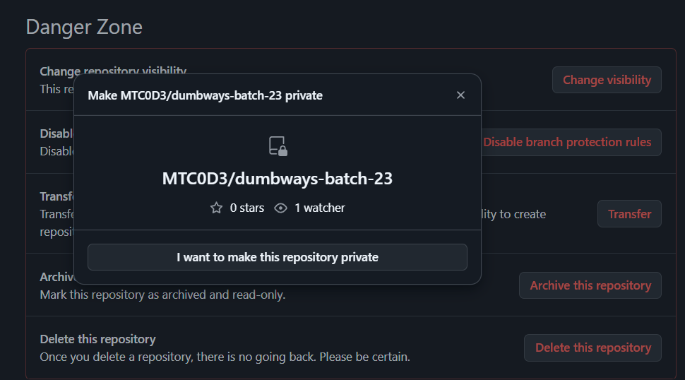

- Klik I have read and understand these effects

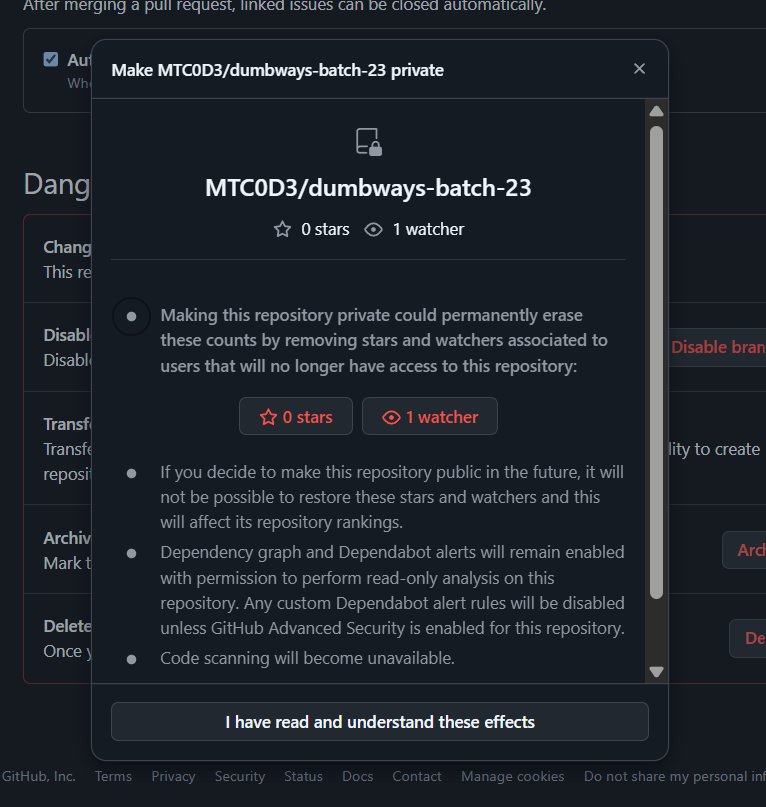

- Klik Make this repository private


- Masukkan password akun Github untuk konfirmasi

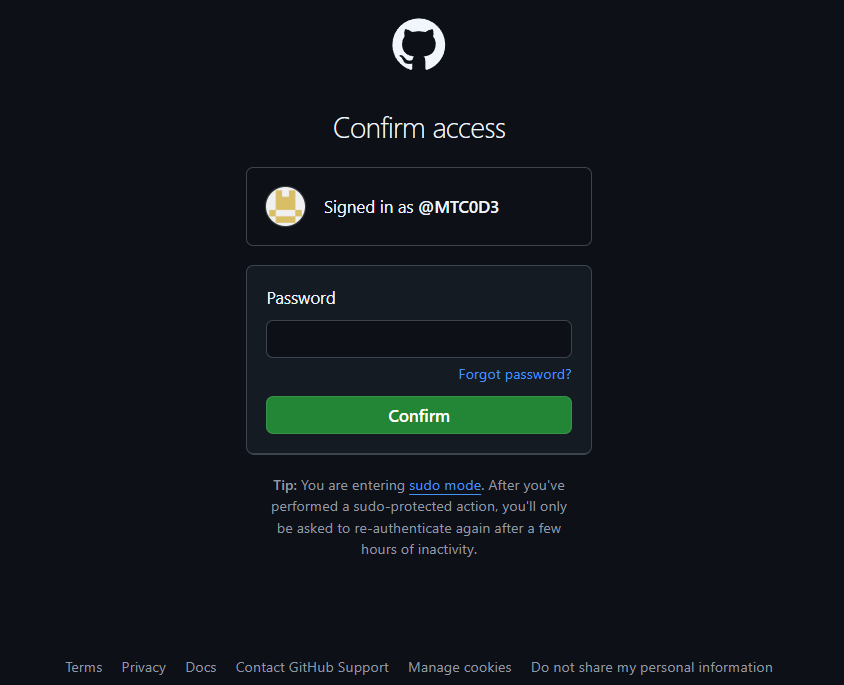

- Setelah berhasil maka repositori dumbways-batch-23 sudah menjadi Private

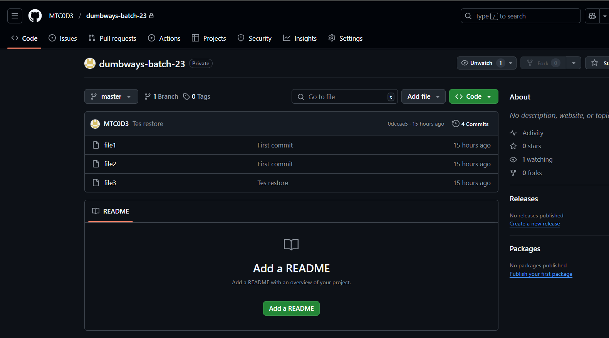

## 📝 Demonstrasi Git Pull Request

- Clone repositori dumbways-batch-23 ke direktori lokal

```
git clone git@github.com:MTC0D3/dumbways-batch-23.git backend-1
```

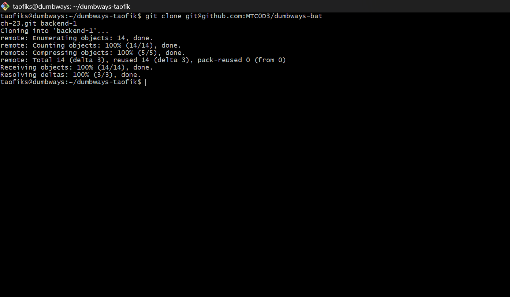

- Masuk ke direktori backende-1 dan buat branch baru

```
cd backend-1
```

```
git checkout -b hero
```

```
git status
```

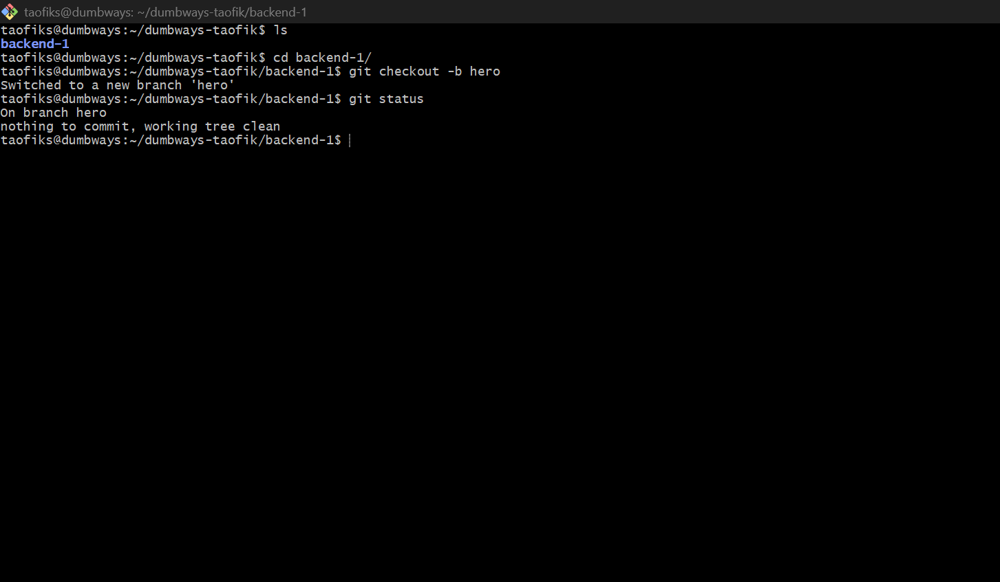

- Buat perubahan pada salah satu file yang tersedia, misal file1

```
ls
```

```
cat file1
```

```
nano file1
```

```
cat file1
```

```
git status
```

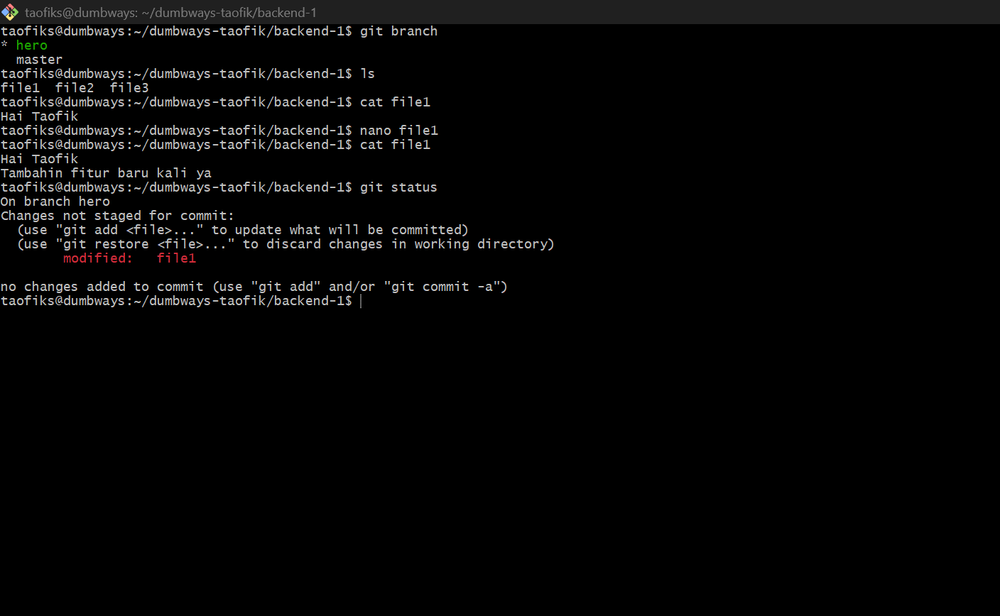

- file1 telah mengalami perubahan (modified), melakukan staging file1, commit, dan push kembali ke repositori dengan branch 'hero'

```
git add .
```

```
git commit -m "Buat hero section"
```

```
git push origin hero
```

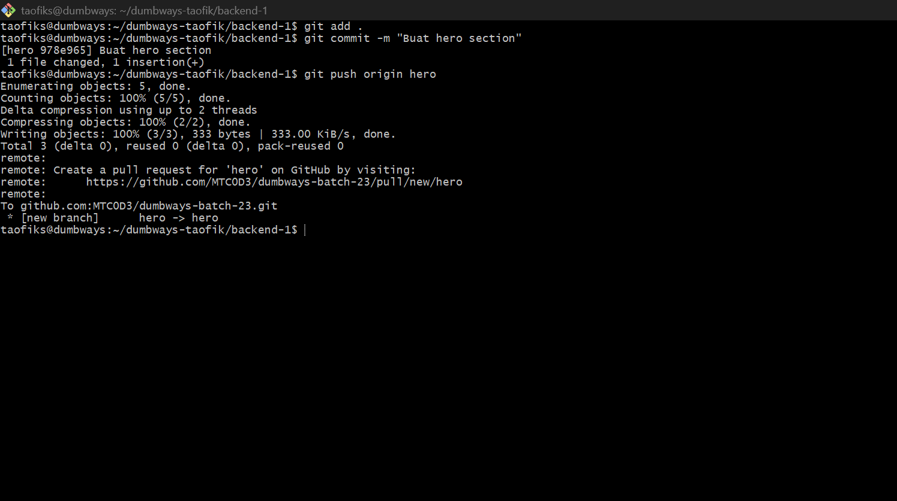

- Buka repositori dumbways-batch-23 dan akan muncul tombol 'Compare & pull request'. Saat ini seolah pemilik repositori akan meninjau pull request sehingga tombol tersebut perlu diklik

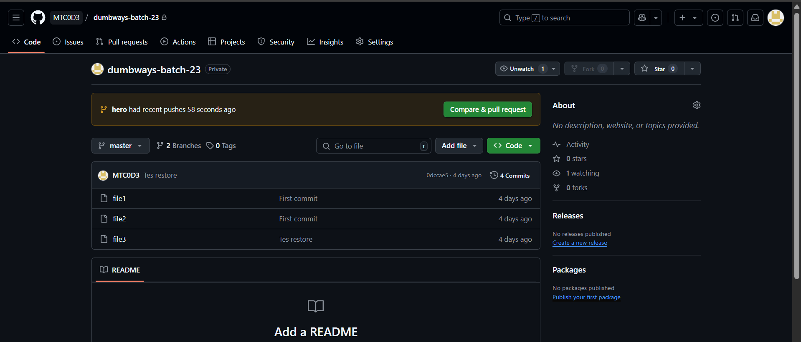

- Open pull request dengan mengisi title dan description klik 'Create pull request'

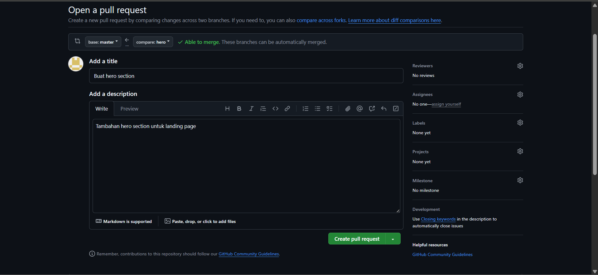

- Jika pemilik repositori ingin melihat perubahan pada file yang diajukan, dapat melihat pada tab 'Files changed'

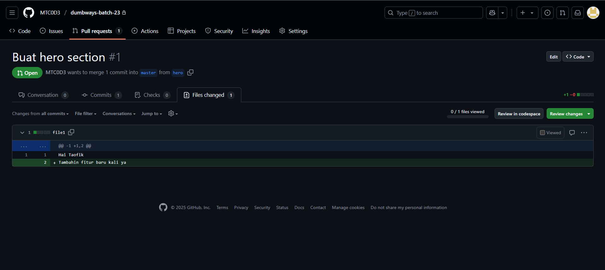

- Setelah Open Pull request, pemilik repositori dapat langsung melakukan merge jika tidak ada konflik dengan base branch dengan klik 'Merge pull request'.

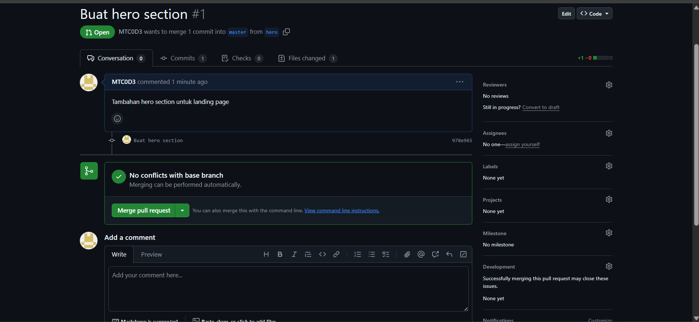

- Mengisi informasi untuk melakukan Merge lalu Confirm merge

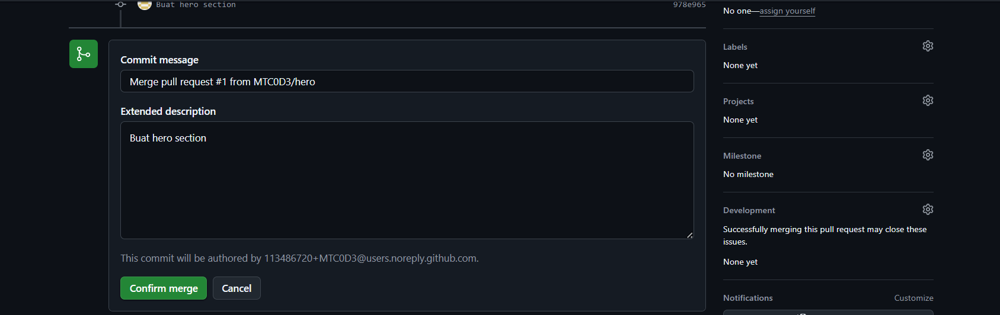

- Pull request yang telah dikonfirmasi untuk Merge akan memiliki tampilan sebagai berikut

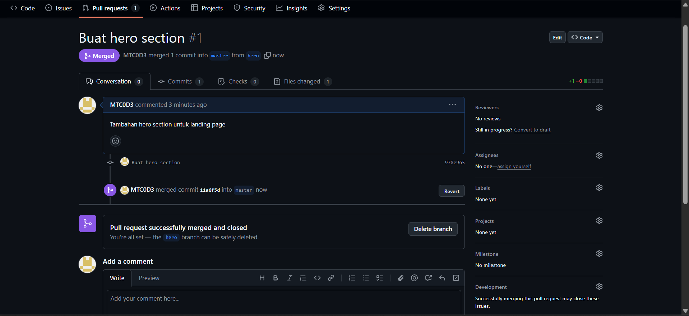

- jika pull request sudah dilakukan merge dengan base branch, maka dari backend-1 dapat membersihkan branch hero (Opsional)

```
git checkout master
```

```
git pull origin master
```

```
git branch -d hero
```

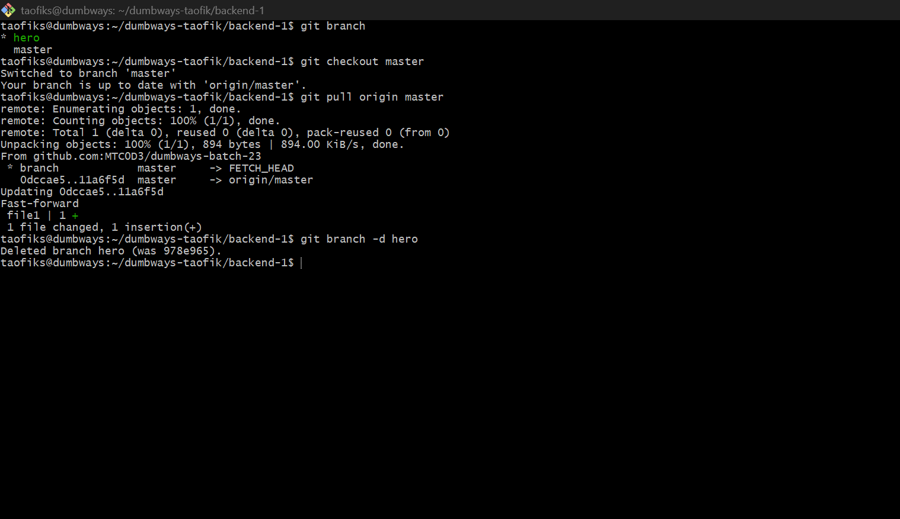

Dari pemilik repositori:

```
git push origin --delete hero
```

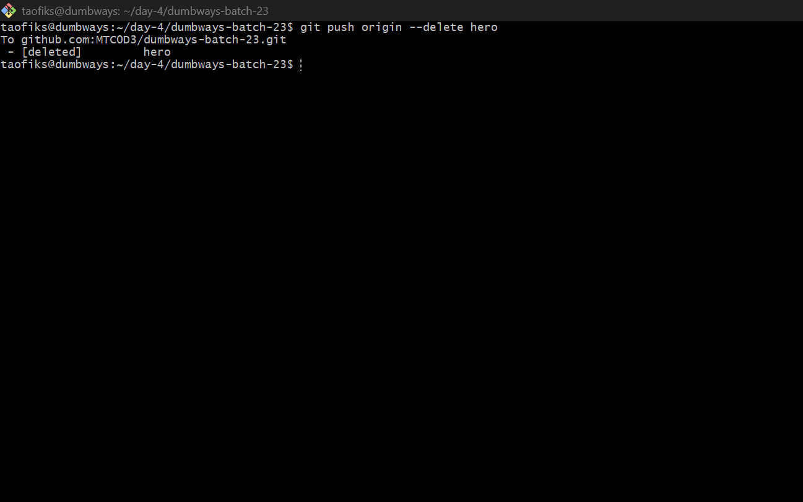

Sebelum branch hero dihapus:

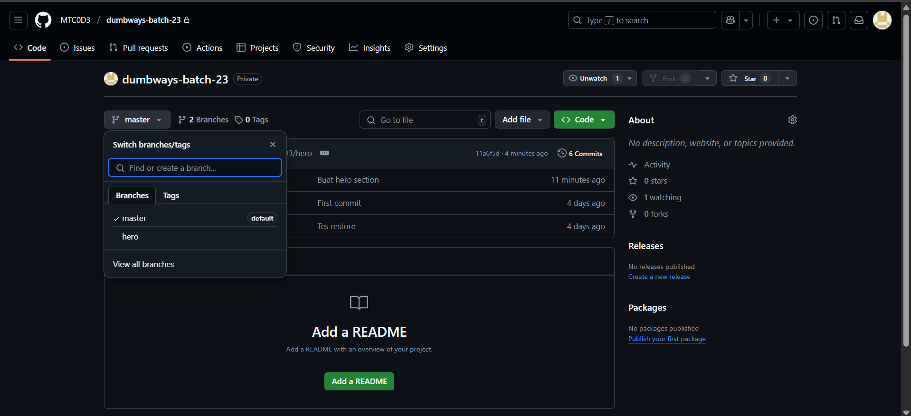

Setelah branch hero dihapus:

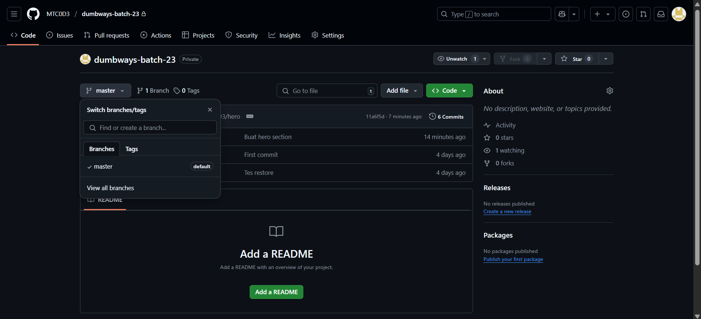
