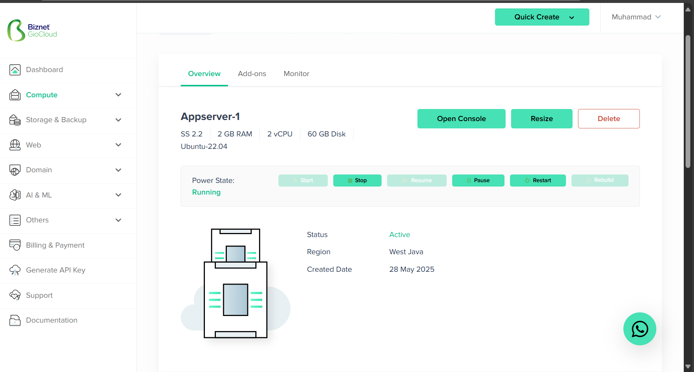
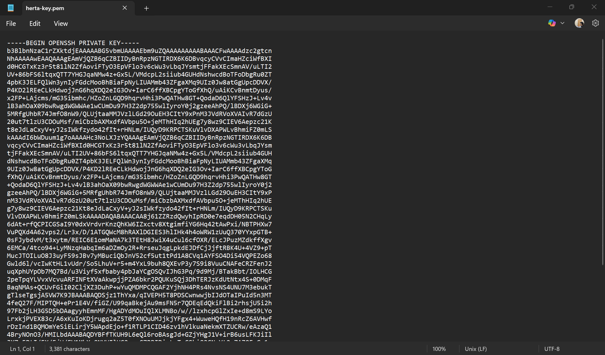
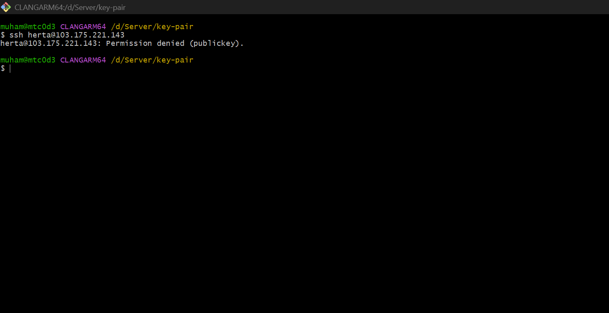

# 📘 DevOps Task - Day 2

- Rebuild ulang server BiznetGio kalian, lalu gunakan username "dumbways" yang kalian gunakan bersama, pastikan menggunakan login melalui ssh-key dan bukan password. (1 key untuk semua akan menjadi bonus) 

- Deploy aplikasi Web Server, Frontend, Backend, serta Database on top `docker compose`

- Di dalam docker-compose file buat suatu custom network dengan nama **team kalian**, lalu pasang ke setiap service yang kalian miliki. (Nilai Bonus)

  - Untuk Web Server buatlah configurasi reverse-proxy menggunakan nginx on top docker.
    - **SSL CLOUDFLARE OFF!!!**
    - Gunakan docker volume untuk membuat reverse proxy
    - SSL sebisa mungkin gunakan wildcard
    - Untuk DNS bisa sesuaikan seperti contoh di bawah ini
      - Frontend team.studentdumbways.my.id
      - Backend api.team.studentdumbways.my.id
  - Push image ke docker registry kalian masing".
- Aplikasi dapat berjalan dengan sesuai seperti melakukan login/register.

## 📃 Rebuild Server Biznet

1. Pertama login ke akun biznet gio cloud dan akses dashboard nya

2. Pilih server yang ingin di rebuild

3. Lalu stop dulu server yang ingin di rebuild 

4. Lalu klik rebuild 

5. Pilih os yang ingin digunakan, lalu confirm 

6. Jika sudah benar, Klik Rebuild

7. Tunggu sampai proses rebuild selesai, lakukan Refresh secara berkala. Jika sudah berhasil statusnya akan menjadi Active



## Buat User Baru

1. Jika sudah aktif, konek ke server menggunakan SSH. Lalu buat user baru.

```
sudo adduser herta
```

2. Buat user ini jadi sudoers

```
sudo usermod -aG sudo herta
```

3. Lalu akses user baru tersebut 

```
su - herta
```

4. Generate sshkey dengan menggunakan command berikut:

```
ssh-keygen
```

5. Copy isi file dari id_rsa.pub

6. Pastekan pada file authorized_keys, jika tidak ada buat manual

7. Copy isi file id_rsa.

8. Pastekan ke local machine dengan membuat file baru



9. Lakukan chmod.

```
chmod 400 herta.pem
```

10. Login SSH menggunakan sshkey tadi.

```
ssh herta@103.175.221.143
```

11. Lakukan konfigurasi pada file konfigurasi SSH

```
sudo nano /etc/ssh/sshd_config
```

12. Atur parameter sebagai berikut. Setelah selesai simpan file tersebut.

```
PubkeyAuthentication yes
PasswordAuthentication no
```

13. Restart SSH service pada terminal

```
sudo systemctl restart sshd
```
14. Disconnect SSH dengan mengetikkan "exit" atau ctrl + d di terminal dan coba login ke Server dengan passwor

15. Server menolak login menggunakan password dan login hanya bisa menggunakan Public Key



16. Untuk login gunakan perintah 

```
ssh -i herta-key.pem herta@103.175.221.143
```

## Installasi Docker Engine

1. Buka dokumentasi docker engine https://docs.docker.com/engine/install/ubuntu/

2. jika kamu gunakan docker versi lama kamu bisa uninstall dengan perintah berikut (direkomendasikan)

```
for pkg in docker.io docker-doc docker-compose docker-compose-v2 podman-docker containerd runc; do sudo apt-get remove $pkg; done
```

3. Ikuti semua langkah 1 per 1 untuk Install using the apt repository

```
# Add Docker's official GPG key:
sudo apt-get update
sudo apt-get install ca-certificates curl
sudo install -m 0755 -d /etc/apt/keyrings
sudo curl -fsSL https://download.docker.com/linux/ubuntu/gpg -o /etc/apt/keyrings/docker.asc
sudo chmod a+r /etc/apt/keyrings/docker.asc

# Add the repository to Apt sources:
echo \
  "deb [arch=$(dpkg --print-architecture) signed-by=/etc/apt/keyrings/docker.asc] https://download.docker.com/linux/ubuntu \
  $(. /etc/os-release && echo "${UBUNTU_CODENAME:-$VERSION_CODENAME}") stable" | \
  sudo tee /etc/apt/sources.list.d/docker.list > /dev/null
sudo apt-get update
```

4. Install the Docker packages

```
sudo apt-get install docker-ce docker-ce-cli containerd.io docker-buildx-plugin docker-compose-plugin
```

5. Untuk regular user kita harus menambahkan nya ke group docker

```
sudo usermod -aG docker $USER
```

6. Jalankan perintah berikut untuk mengaktifkan perubahan pada grup.

```
newgrp docker
```

## Deploy aplikasi Web Server, Frontend, Backend, serta Database on top `docker compose`

### Buat image database mysql

1. Buat folder wayshub-database

```
mkdir wayshub-database
```

2. Buat file Dockerfile

```
FROM mysql:8.0
LABEL project="Wayshub"
LABEL author="mtc0d3"

EXPOSE 3306

CMD ["mysqld", "--default-authentication-plugin=mysql_native_password"]
```

3. Selanjutnya build dengan menjalankan command berikut. Tunggu sampai proses selesai.

```
docker build -t wayshub-db .
```

4. Cek list image dengan perintah berikut

```
docker images
```

### Buat image backend

1. Clone repo wayshub-backend

```
git clone https://github.com/dumbwaysdev/wayshub-backend.git
```

2. Masuk ke folder wayshub-backed

```
cd wayshub-backed
```

3. Edit file config/config.json, Lalu ganti sesuai dengan settingan database yang nanti akan dibuat

```
nano config/config.json
```

```
{
  "development": {
    "username": "user",
    "password": "password",
    "database": "wayshub",
    "host": "database",
    "dialect": "mysql"
  },
  "test": {
    "username": "root",
    "password": null,
    "database": "database_test",
    "host": "127.0.0.1",
    "dialect": "mysql"
  },
  "production": {
    "username": "root",
    "password": null,
    "database": "database_test",
    "host": "127.0.0.1",
    "dialect": "mysql"
  }
}
```

4. Buat file dengan nama Dockerfile

```
FROM node:13-alpine

WORKDIR /wayshub-backend

COPY . .

RUN npm install && \
    npm install -g pm2@4.4.0 sequelize-cli

EXPOSE 5000
```

5. Buat file baru lagi dengan nama ecosystem.config.js

```
module.exports = {
  apps: [
    {
      name: 'wayshub-backend',
      script: 'npm',
      args: ['run', 'start'],
    }
  ]
};
```

6. Selanjutnya build dengan menjalankan command berikut. Tunggu sampai proses selesai.

```
docker build -t wayshub-be .
```

### Buat image frontend

1. Clone repo wayshub-frontend

```
https://github.com/dumbwaysdev/wayshub-frontend
```

2. Masuk ke folder wayshub-frontend

```
cd wayshub-frontend
```

3. Edit file /src/config/api.js, ubah baseURL dengan dns backend

```
import axios from 'axios';

const API = axios.create({
    baseURL: "https://api.taofik.studentdumbways.my.id/api/v1"
});

const setAuthToken = (token) => {
    if(token){
        API.defaults.headers.common['Authorization'] = `Bearer ${token}`;
    } else {
        delete API.defaults.headers.common['Authorization'];
    }
}

export {
    API,
    setAuthToken
}
```

4. Buat file dengan nama Dockerfile

```
FROM node:13-alpine

WORKDIR /wayshub-frontend

COPY . .

RUN npm install && \
    npm install -g pm2@4.4.0

EXPOSE 3000
```

5. Buat file baru lagi dengan nama ecosystem.config.js

```
module.exports = {
  apps: [
    {
      name: 'wayshub-frontend',
      script: 'npm',
      args: ['run', 'start'],
    }
  ]
};
```

6. Selanjutnya build dengan menjalankan command berikut. Tunggu sampai proses selesai.

```
docker build -t wayshub-fe .
```

### Buat docker compose

1. Kembali ke folder home, lalu buat file baru dengan nama docker-compose.yaml

```
cd && nano docker-compose.yaml
```

2. Masukan script berikut

```
version: '3.8'

services:
  database:
    image: wayshub-db
    container_name: wayshub-db
    restart: always
    networks:
      - herta
    environment:
      MYSQL_ROOT_PASSWORD: rootpassword
      MYSQL_USER: user
      MYSQL_PASSWORD: password
      MYSQL_DATABASE: wayshub
    ports:
      - "3306:3306"
    volumes:
      - mysql-data:/var/lib/mysql
    healthcheck:
      test: ["CMD", "mysqladmin", "ping", "-h", "localhost"]
      timeout: 5s
      retries: 10

  backend:
    image: wayshub-be
    container_name: wayshub-be
    restart: always
    depends_on:
      database:
        condition: service_healthy
    networks:
      - herta
    environment:
      DB_HOST: database
      DB_USER: user
      DB_PASSWORD: password
      DB_NAME: wayshub
    ports:
      - "5000:5000"
    command: >
      sh -c "
      npx sequelize db:create &&
      npx sequelize db:migrate &&
      pm2-runtime ecosystem.config.js
      "

  frontend:
    image: wayshub-fe
    container_name: wayshub-fe
    restart: always
    depends_on:
      - backend
    networks:
      - herta
    stdin_open: true
    ports:
      - "3000:3000"
    command: >
      sh -c "
      pm2-runtime ecosystem.config.js
      "

volumes:
  mysql-data:

networks:
  herta:
```

3. Jika sudah disimpan, Jalankan command berikut

```
docker compose up -d
```

## Push image ke Docker Hub

1. Buat akun di docker hub

2. Untuk push image kita ke docker hub harus ada penambahan nama user docker hub kita

```
# awalnya
wayshub-db

# menjadi
mtc0d3/wayshub-db
```

3. Lakukan build ulang

```
docker build -t mtc0d3/wayshub-db .
```

4. Lalu gunakan perintah berikut untuk login dari docker engine

```
docker login -u mtc0d3 

# masukan password 

# maka login akan sukses
```

5. lalu push image ke docker dengan printah

```
docker push mtc0d3/wayshub-db:latest
```

6. Maka repositori public telah terbuat dan image sudah di push