# üìò DevOps Task - Day 1

- Deploy aplikasi wayshub dengan backend dan frontend yang berjalan (bisa register, datanya ada di database)

- Gunakan PM2 untuk manage web app wayshub

## 📃 Deploy aplikasi wayshub dengan backend dan frontend yang berjalan (bisa register, datanya ada di database)

### 1. Pertama kita akses server yang kita punya dengan ssh

- untuk bisa melakukan ssh ke server pastikan anda sudah mempunyai key-pair, biasanya ketika membuat server kita diharuskan membuat key-pair nya juga, nanti private key nya akan di simpan di local device kita.

- pastikan path nya merujuk pada private key berada ketika ingin mengakses menggunakan terminal

```
ssh appserver-1
```

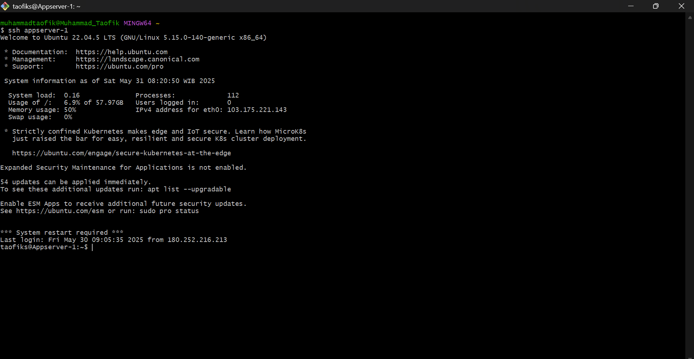

- alternatif lain bisa kita atur di path C:/Users/<nama device>/.shh

- Pastikan file config ada disana

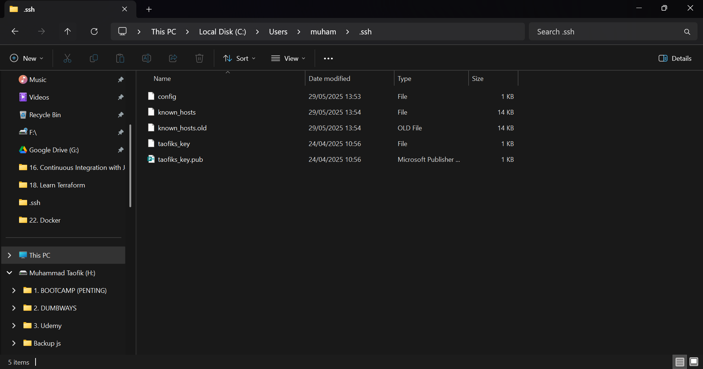

- Buka dan ubah lah file config nya, contoh nya seperti berikut

```
Host appserver-1
    HostName 103.175.221.143
    User taofiks
    Port 22
    IdentityFile /c/Users/muham/Downloads/appserver1.pem
```

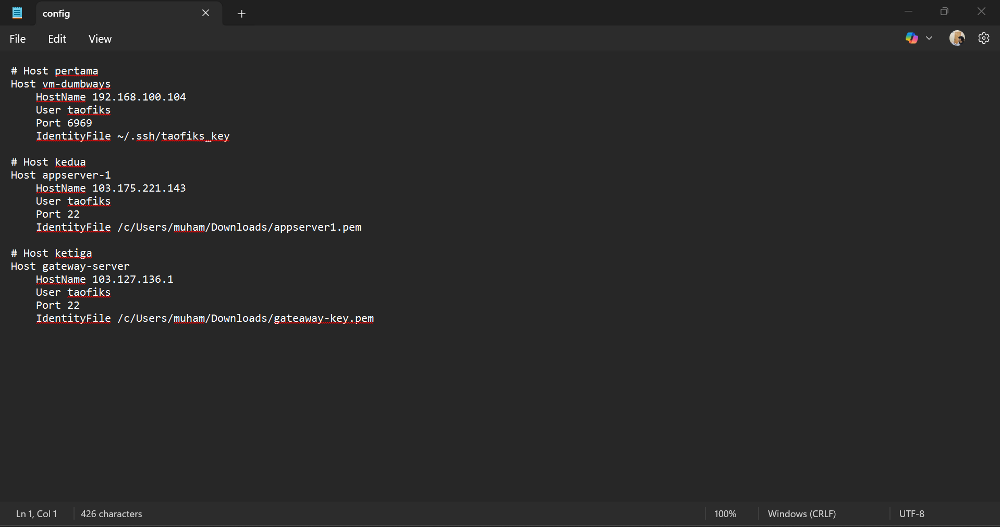

### 2. Kita coba deploy dulu wayshub-fronted dan memastikan dia berjalan di server

- Pastikan selalu update repositori server dengan perintah

```
sudo apt update
```

### 3. Install NodeJS dan download nvm melalui script bash berikut (URL Script):

curl -o- https://raw.githubusercontent.com/nvm-sh/nvm/v0.40.3/install.sh | bash

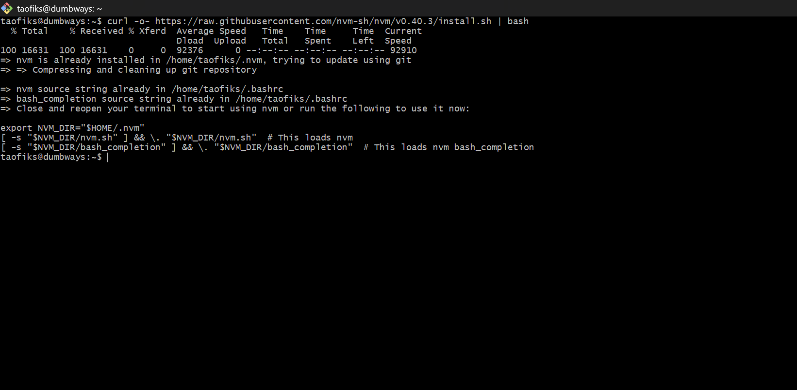

### 4. Refresh bash dengan kode berikut

```
exec bash
```

### 5. Clone repository wayshub-frontend

```
git clone git@github.com:dumbwaysdev/wayshub-frontend.git
```


### 6. Cek versi NodeJS, nvm, dan npm. Install Node 13 yang sesuai dengan project wayshub-frontend

```
node -v && nvm current && nvm -v
```

- jika masih kosong kita install salah satu versi

```
nvm install 13
```

- Lalu bisa di cek lagi

```
node -v && nvm current && nvm -v
```


### 6. Masuk ke direktori wayshub-frontend

```
cd wayshub-frontend
```

### 7. Jalankan server dengan perintah berikut

```
npm start
```

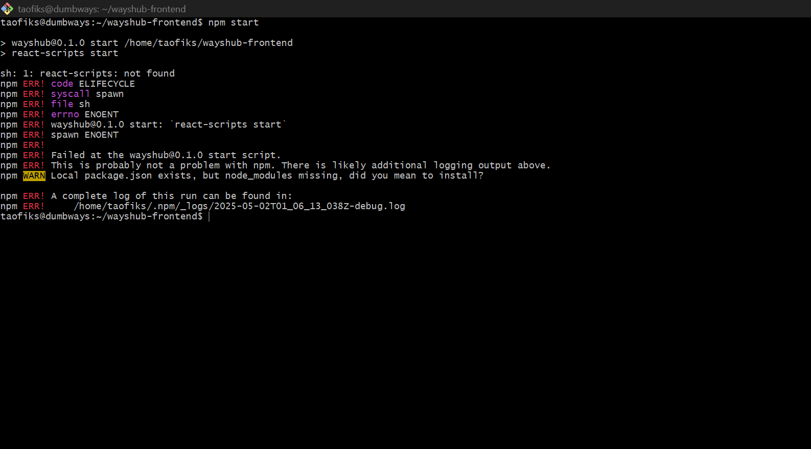

- jika node_module belum ada, kamu perlu menginstal beberapa modules terlebih dahulu.

- gunakan versi node js yang sesuai dengan project mu

```
nvm use 13
```

```
npm install
```

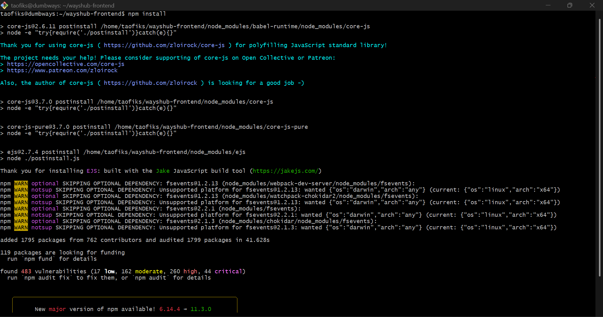

### 8. Setelah instal modules jalankan kembali server nya

```
npm start
```


### 9. Lalu kita harus membuat reverse proxy sebagai jembatan ke app server

- pastikan kamu mempunyai sever lain yang memiliki web server di dalamnya

### 10. Akses server reverse proxy nya dengan ssh

```
ssh gateway-server
```

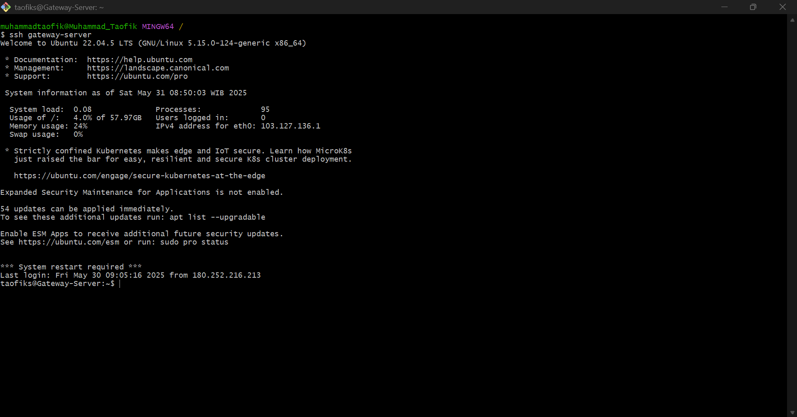

### 11. Lakukan update repositori server

```
sudo apt update
```

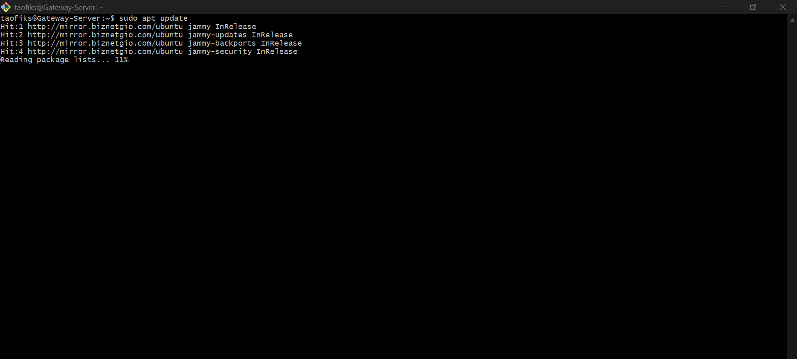

### 12. Install nginx service

```
sudo apt install nginx
```


### 13. Cek status nginx running atau tidak

```
sudo systemctl status nginx
```

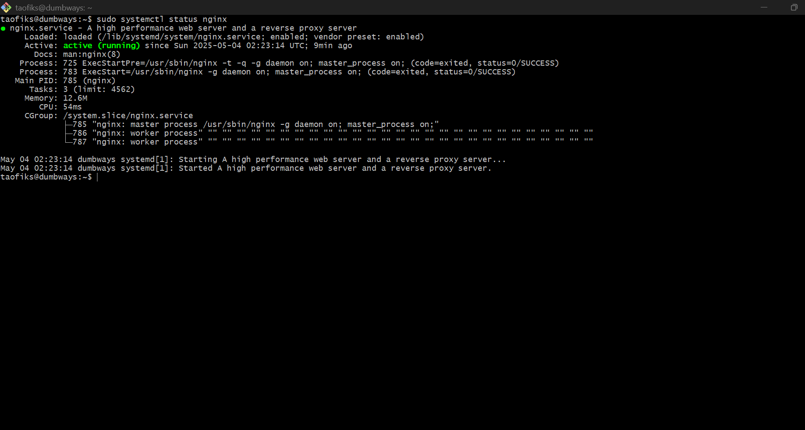

### 14. Cek di browser dengan ip server kamu

```
103.127.136.1
```

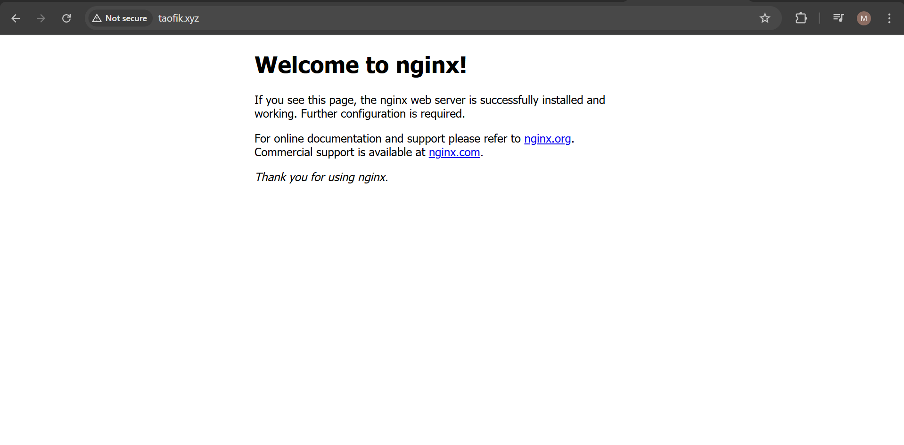

### 15. Buat file untuk konfigurasi di sites-enabled

```
sudo nano /etc/nginx/sites-enabled/rproxyfe
```

```
server {
    server_name _;  # Default jika tidak pakai domain

    location / {
        proxy_pass http://103.175.221.143:3000;
    }
}
```

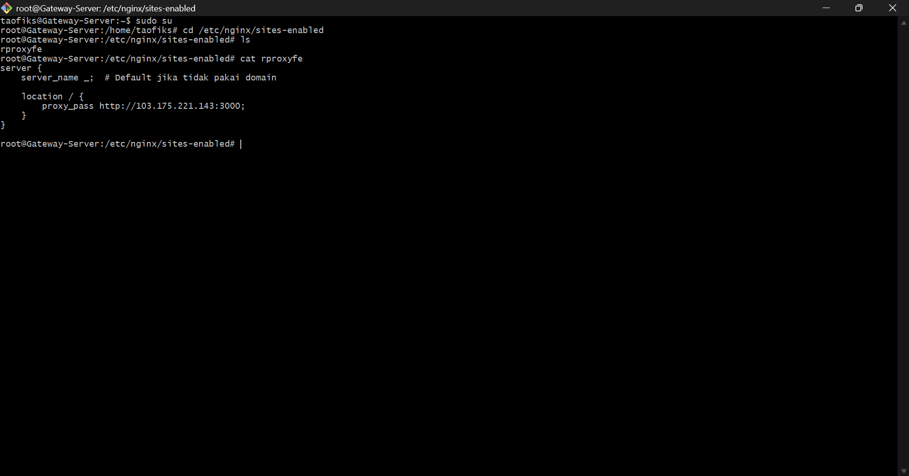

### 16. Tes konfigurasi nginx dan restart nginx

```
sudo nginx -t
```

```
sudo systemctl restart nginx
```

### 17. Cek kembali di browser dengan menggunakan ip server reverse proxy

```
103.127.136.1
```

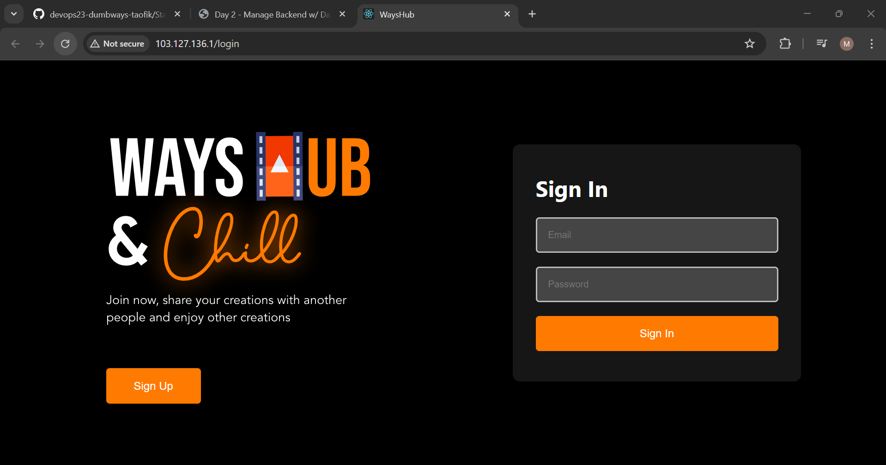

## ⚔️ Gunakan PM2 untuk manage web app wayshub

- untuk deploy backend kita akan lakukan bersamaan dengan pm2 untuk memanage web app nya

### 1. Install pm2 dengan perintah berikut

- gunakan versi node js sesuai project

```
nvm use 13
```

- install pm2 dengan versi yang mendukung di node js 13

```
npm install -g pm2@4.4.0
```


### 2. buat file ecosystem pm2 di wayshub-frontend dan konfigurasi

- masuk ke folder wayshub-frontend

```
cd wayshub-frontend
```

- lalu gunakan perintah berikut untuk membuat file ecosystem nya

```
pm2 init
```

- buka dan edit file ecosystem

```
module.exports = {
  apps : [{
    name: 'wayshub-frontend',
    script: 'npm start',
    watch: false,
  }],

  deploy : {
    production : {
      user : 'SSH_USERNAME',
      host : 'SSH_HOSTMACHINE',
      ref  : 'origin/master',
      repo : 'GIT_REPOSITORY',
      path : 'DESTINATION_PATH',
      'pre-deploy-local': '',
      'post-deploy' : 'npm install && pm2 reload ecosystem.config.js --env production',
      'pre-setup': ''
    }
  }
};
```

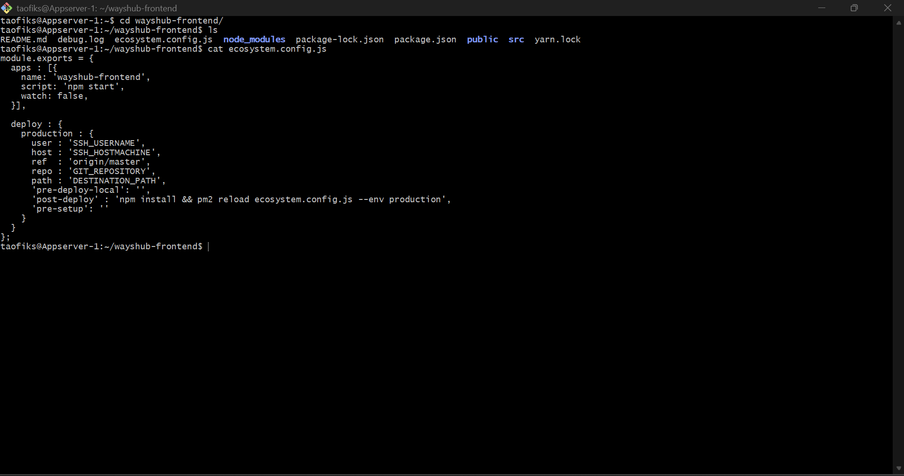

### 3. Jalankan server NodeJS pada direktori wayshub-frontend dengan menggunakan pm2

```
pm2 start
```

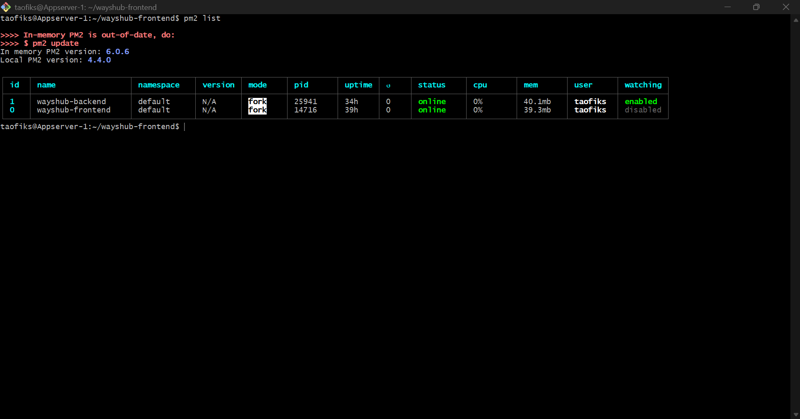

### 4. Kita buat databse untuk backend nya

### 5. Install mysql service dan cek status nya

```
sudo apt install mysql-server -y
```

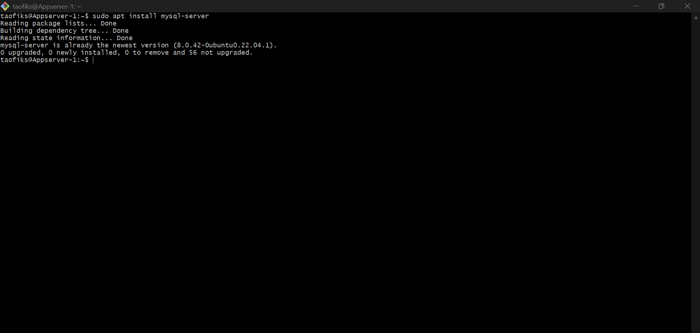

```
sudo systemctl status mysql
```

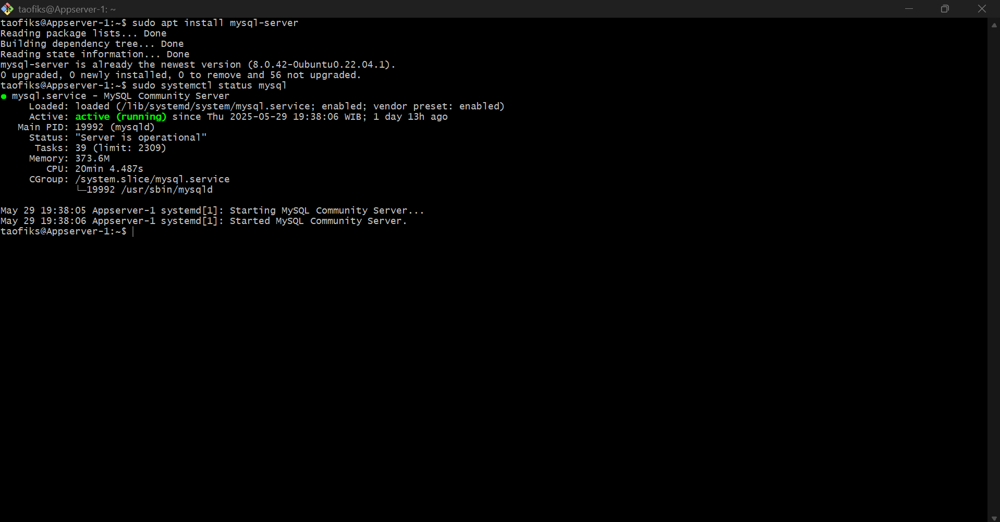

### 6. konfigurasi keamanan mysql dan root user

- pertama gunakan perintah berikut untuk mengakses mysql nya, secara default dia akan masuk dengan root user

```
sudo mysql
```

- lalu kita tambahkan password untuk user root dengan perintah berikut

```
ALTER USER 'root'@'localhost' IDENTIFIED WITH caching_sha2_password BY 'masukan password baru';
```

- lalu kita refresh konfigurasi mysql dengan perintah

```
FLUSH PRIVILEGES;
```

- lalu kita buat database nya lebih secure dengan perintah berikut

```
sudo mysql_secure_installation
```

- lalu kita validate password yang sudah dibuat dengan memilih `yes`

- pilih level validate password nya sesuai passsword kamu, jika meminta untuk mengubah password bisa `no`

- lalu ada remove anonymus user, artinya siapa aja bisa akses database nya dan mungkin kamu g mau user yang tidak punya identitas bisa mengakses ke dalam database, maka bisa pilih `yes` untuk remove

- lalu ada disallow root login remotely, artinya untuk login root user itu di disable jika di akses dari area lain atau di luar server nya, lalu bisa pilih 'yes'

- lalu ada bawaan database bernama test, kamu bisa remove database nya dengan pilih `yes`

- lalu ada reload privilege table, pilih `yes` untuk mereload table nya

- lalu coba masuk dengan user root, maka akan ditolak karena tidak menggunakan password

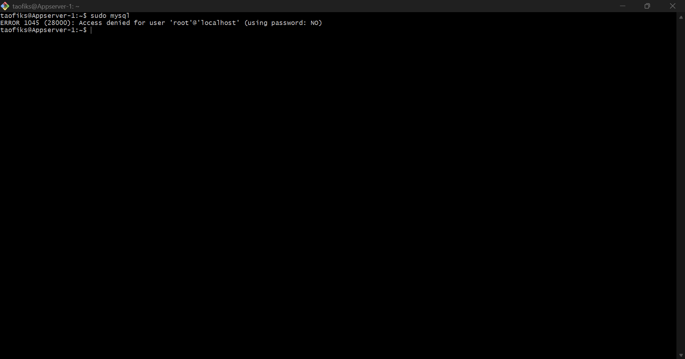

### 7. Membuat user baru

- diperlukan karena root user ibarat nya kaya sudo dipakai jika di perlukan aja, selebih nya gunakan regular user aja

- gunakan perintah berikut untuk membuat user

```
CREATE USER 'taofiks'@'%' IDENTIFIED BY 'password baru';
```

- lalu user taofiks, ini bisa kita kasih akses untuk bisa mengakses semua database dan table dengan perintah berikut

```
GRANT ALL PRIVILEGES ON *.* TO 'taofiks'@'%';
```

- coba akses mysql dengan user yang telah dibuat

```
sudo -u taofiks -p
```

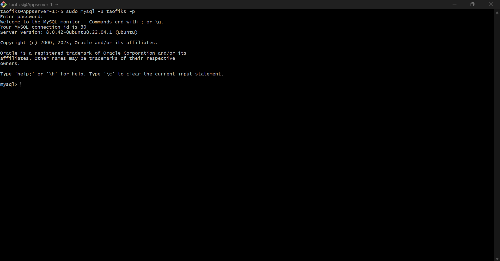

### 8. Membuat databse

- buat database dengan perintah berikut

```
CREATE DATABASE wayshub;
```

- lalu coba lihat apakah database uda dibuat dengan perintah

```
SHOW DATABASES;
```

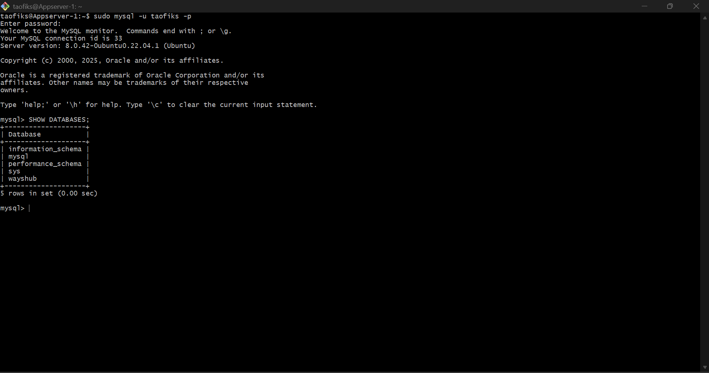

- lalu coba kita pilih database nya dengan perintah

```
USE wayshub;
```

- lalu lihat table-table yang ada di dalamnya dengan perintah

```
SHOW TABLES;
```

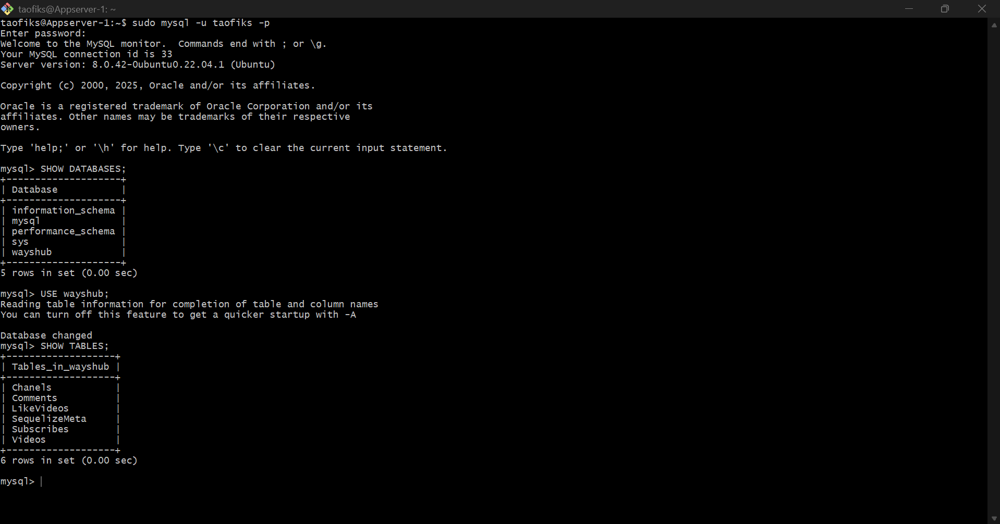

### 8. Sekarang deploy wayshub-backend nya

### 9. Clone repository wayshub-frontend

```
git clone git@github.com:dumbwaysdev/wayshub-backend.git
```

### 10. Masuk ke folder nya lalu kita install node modules

- masuk direktori

```
cd wayshub-backend
```

- pilih versi node js yang sesuai

```
nvm use 13
```

- install node modules

```
npm install
```

### 11. Lalu kita ubah config.json

```
cd config/
```

```
nano config.json
```

- ubah bagian development saja, konekan dengan database yang dibuat dengan user dan password

- untuk host kita masi gunakan localhost, jika database nya berada di server lain maka masukan ip address nya di `host`

```
{
  "development": {
    "username": "taofiks",
    "password": "Taofik020501",
    "database": "wayshub",
    "host": "127.0.0.1",
    "dialect": "mysql"
  },
  "test": {
    "username": "root",
    "password": null,
    "database": "database_test",
    "host": "127.0.0.1",
    "dialect": "mysql"
  },
  "production": {
    "username": "root",
    "password": null,
    "database": "database_test",
    "host": "127.0.0.1",
    "dialect": "mysql"
  }
}
```

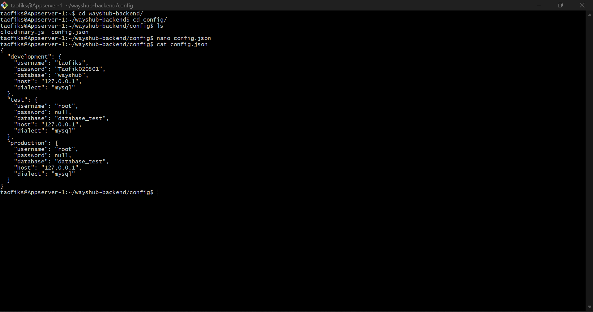

### 12. Install ORM Sequelize untuk mempermudah manipulasi database

- install sequelize

```
npm i -g sequelize-cli
```

- cek apakah benar sudah terinstall

```
sequelize
```

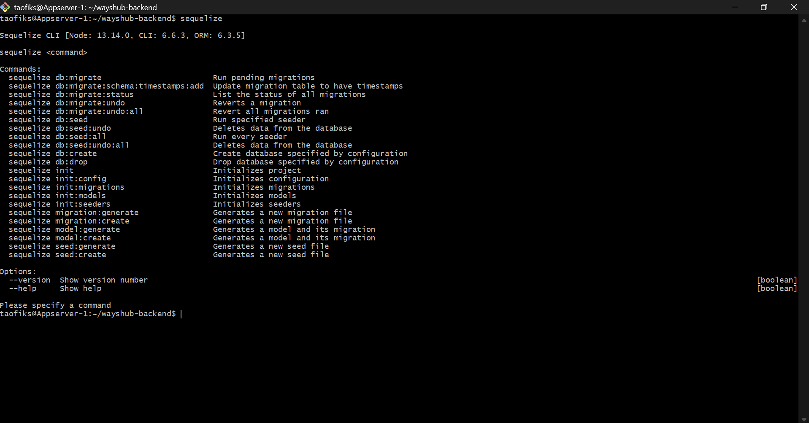

### 13. Manipulasi database dengan Sequelize ORM

- karena kita sudah konfigurasi di config.json, dan kita belum ada database nya di mysql kita bisa gunakan perintah berikut

```
sequelize db:create
```

- setelah database wayshub sudah dibuat, gunakan perintah berikut untuk migrasi semua table ke dalam database nya

```
sequelize db:migrate
```

### 14. Buat file pm2 ecosystem

```
pm2 init
```

### 15. Buka dan ubah file ecosystem nya

```
nano ecosystem.config.js
```

- ubah isi file nya

```
module.exports = {
  apps : [{
    name: 'wayshub-backend',
    script: 'npm start',
    watch: '.'
  }],

  deploy : {
    production : {
      user : 'SSH_USERNAME',
      host : 'SSH_HOSTMACHINE',
      ref  : 'origin/master',
      repo : 'GIT_REPOSITORY',
      path : 'DESTINATION_PATH',
      'pre-deploy-local': '',
      'post-deploy' : 'npm install && pm2 reload ecosystem.config.js --env production',
      'pre-setup': ''
    }
  }
};
```

### 16. Jalankan server backend nya

```
pm2 start
```

- cek apakah sudah berjalan

```
pm2 list
```


### 17. Akses backend nya di browser

```
ip address:5000
```

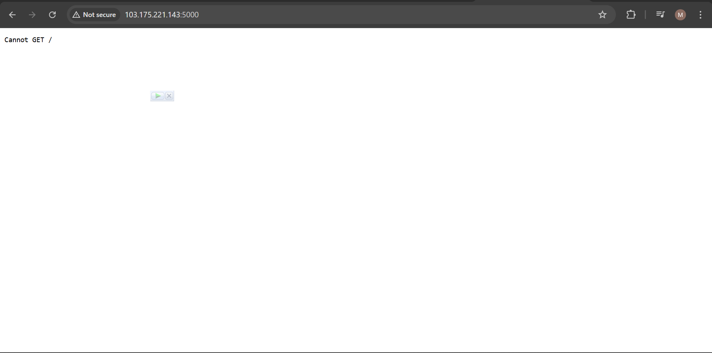

### 18. Nah frontend dan backend sudah berjalan lalu sekarang kita hubungkan keduanya

### 19. Masuk ke direktori wayshub-frontend dan akses path berikut

```
cd wayshub-frontend/src/config
```

### 20. Ubah file api.js

- ubah variable `baseURL` dengan url backend nya

```
nano api.js
```

```
import axios from 'axios';

const API = axios.create({
    baseURL: "http://103.175.221.143:5000/api/v1"
});

const setAuthToken = (token) => {
    if(token){
        API.defaults.headers.common['Authorization'] = `Bearer ${token}`;
    } else {
        delete API.defaults.headers.common['Authorization'];
    }
}

export {
    API,
    setAuthToken
}

```

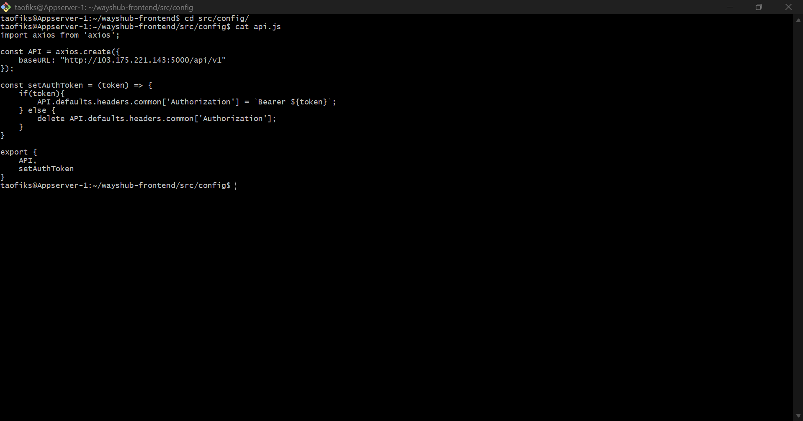

### 21. Kita akses lagi web nya dengan ip reverse proxy dan bisa kita uji coba sign up / sign in

- uji coba sign up

```
http://103.127.136.1/register
```


- uji coba sign in

```
http://103.127.136.1/login
```

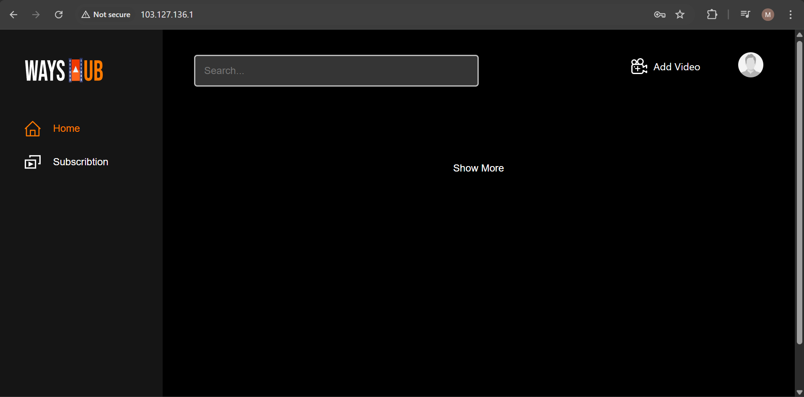
