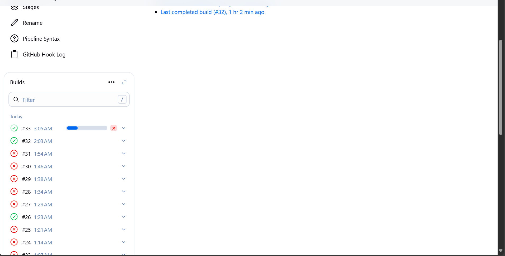

# 📘 DevOps Task - Day 3

- Reverse Proxy Jenkins
  - gunakan domain ex. pipeline-team.studentdumbways.my.id
- Buatlah beberapa Job untuk aplikasi kalian
  - Job Frontend
  - Job Backend
- Buat Jenkinsfile dengan proses seperti ini :
     - Pull dari repository
     - Dockerize/Build aplikasi kita
     - Test application
     - Deploy aplikasi on top Docker
     - Push ke Docker Hub
- Auto trigger setiap ada perubahan di SCM (setiap repository berubah, otomatis menjalankan build)

## 📃 CICD dengan Jenkins

1. Langkah pertama yaitu buat folder baru bernama jenkins. Lalu masuk ke dalam folder tersebut dan buat file baru bernama docker-compose.yaml

```
mkdir jenkins; cd jenkins; nano docker-compose.yaml;
```

2. Masukkan script ini kedalamnya

```
version: '3.8'

services:
  jenkins:
    image: jenkins/jenkins:lts
    ports:
      - "8080:8080"
      - "50000:50000"
    volumes:
      - jenkins_data:/var/jenkins_home
    restart: unless-stopped

volumes:
  jenkins_data:
```

3. Selanjutnya jalankan command berikut

```
docker compose up -d
```

4. Jika sudah, cek apakah jenkins berjalan

```
docker compose ps -a
```

5. Akses servernya menggunakan browser dengan menggunakan ip address dan port 8080

```
<ip address>:8080
```

6. Selanjutnya, masuk ke bash dari jenkins

```
docker exec -it jenkins-jenkins-1 bash
```

7. Lalu jalankan command berikut

```
cat /var/jenkins_home/secrets/initialAdminPassword
```

8. Copy paste password tersebut ke browser tadi, lalu klik continue

9. Pilih yang install suggested plugins

10. Lalu tunggu sampai proses setup selesai

11. Selanjutnya, buat akun admin

12. Klik Save and Finish

13. Selanjutnya, masuk ke cloudflare dan buat subdomain baru dengan mempointing ke ip webserver

```
pipeline.taofik.studentdumbways.my.id
```

14. Di webserver pada path nginx/conf, buat konfigurasi baru untuk subdomain jenkins

```
sudo nano pipeline.taofik.conf
```

15. Masukkan script konfigurasi berikut

```
upstream jenkins {
  keepalive 32; # keepalive connections
  server 103.175.221.143:8080; # ip address + port server jenkins
}

# Required for Jenkins websocket agents
map $http_upgrade $connection_upgrade {
  default upgrade;
  '' close;
}

server {
  listen          80;       # Listen on port 80 for IPv4 requests
  listen 443 ssl;
  ssl_certificate /etc/letsencrypt/live/taofik.studentdumbways.my.id/fullchain.pem; # lokasi ssl cert
  ssl_certificate_key /etc/letsencrypt/live/taofik.studentdumbways.my.id/privkey.pem; # lokasi ssl cert

  server_name     pipeline.taofik.studentdumbways.my.id;  # subdomain yang tadi

  # this is the jenkins web root directory
  # (mentioned in the output of "systemctl cat jenkins")
  root            /var/run/jenkins/war/;

  access_log      /var/log/nginx/jenkins.access.log;
  error_log       /var/log/nginx/jenkins.error.log;

  # pass through headers from Jenkins that Nginx considers invalid
  ignore_invalid_headers off;

  location ~ "^/static/[0-9a-fA-F]{8}\/(.*)$" {
    # rewrite all static files into requests to the root
    # E.g /static/12345678/css/something.css will become /css/something.css
    rewrite "^/static/[0-9a-fA-F]{8}\/(.*)" /$1 last;
  }

  location /userContent {
    # have nginx handle all the static requests to userContent folder
    # note : This is the $JENKINS_HOME dir
    root /var/lib/jenkins/;
    if (!-f $request_filename){
      # this file does not exist, might be a directory or a /**view** url
      rewrite (.*) /$1 last;
      break;
    }
    sendfile on;
  }

  location / {
      sendfile off;
      proxy_pass         http://jenkins;
      proxy_redirect     default;
      proxy_http_version 1.1;

      # Required for Jenkins websocket agents
      proxy_set_header   Connection        $connection_upgrade;
      proxy_set_header   Upgrade           $http_upgrade;

      proxy_set_header   Host              $http_host;
      proxy_set_header   X-Real-IP         $remote_addr;
      proxy_set_header   X-Forwarded-For   $proxy_add_x_forwarded_for;
      proxy_set_header   X-Forwarded-Proto $scheme;
      proxy_max_temp_file_size 0;

      #this is the maximum upload size
      client_max_body_size       10m;
      client_body_buffer_size    128k;

      proxy_connect_timeout      90;
      proxy_send_timeout         90;
      proxy_read_timeout         90;
      proxy_request_buffering    off; # Required for HTTP CLI commands
  }

}
```

16. Simpan lalu reload webserver nginx

```
docker compose exec webserver nginx -s reload
```

17. Selanjutnya ke jenkins -> Manage Jenkins -> System

18. Pastikan di bagian Jeknins URL sudah sesuai. Lalu Apply & Save

```
https://pipeline.taofik.studentdumbways.my.id/
```

19. Selanjutnya ke Plugins -> Available Plugins -> cari SSH Agent dan Discord Notifier -> Install

20. Kembali ke Manage Jenkins -> Credentials

21. Lalu pilih Add Credentials

  - Pada bagian Kind, pilih SSH Username with private key.
  - Pada bagian ID, masukan id yang nantinya akan dipakai pada file Jenkinsfile.

  ```
  taofiks-appserver
  ```
  - Pada bagian Username, masukkan username dari server backend.

  ```
  taofiks
  ```

22. Pada bagian Privat Key, Klik Enter Directly Lalu klik Add. Masukkan privat key dari server backend

23. Masuk ke github, lalu tambahkan Public key dari ssh tadi. Ke Settings -> SSH and GPG keys -> New SSH Key

24. Masukkan Public keynya lalu klik Add SSH Key.

25. Jika sudah, tes koneksi ke github. `ssh -T git@github.com`

26. Selanjutnya buat repository baru di github bernama CICD

27. Jika sudah dibuat, jalankan command berikut

```
git config --global user.email "alamat email" && git config --global user.name "username github"
```

28. Selanjutnya pergi ke folder wayshub-backend dan buat file baru dengan nama Jenkinsfile. Berikut adalah isi dari file Jenkinsfile. Silahkan edit sesuai kebutuhan

```
def secret = 'taofiks-appserver'
def server = 'taofiks@103.175.221.143'
def directory = '/home/taofiks/wayshub-backend'
def branch = 'main'
def namebuild = 'wayshub-backend:1.0'

pipeline {
    agent any
    stages {
        stage ('pull new code') {
            steps {
                sshagent([secret]) {
                    sh """
                        ssh -o StrictHostKeyChecking=no ${server} << EOF
                            cd ${directory}
                            git pull origin ${branch}
                            echo "Selesai Pulling!"
                            exit
                        EOF
                    """
                }
            }
        }

        stage ('build the code') {
            steps {
                sshagent([secret]) {
                    sh """
                        ssh -o StrictHostKeyChecking=no ${server} << EOF
                            cd ${directory}
                            docker build -t ${namebuild} .
                            echo "Selesai Building!"
                            exit
                        EOF
                    """
                }
            }
        }

        stage ('deploy') {
            steps {
                sshagent([secret]) {
                    sh """
                        ssh -o StrictHostKeyChecking=no ${server} << EOF
                            cd ${directory}
                            docker compose down
                            docker compose up -d
                            echo "Selesai Men-Deploy!"
                            exit
                        EOF
                    """
                }

            }
        }
    }
}
```

29. Jika sudah simpan dan jalankan command berikut, sesuaikan dengan nama branch dan repository yang barusan dibuat.

```
git remote set-url origin git@github.com:MTC0D3/CICD.git && git add .
```

```
git commit -m "chore: Adding Jenkins and Docker" && git push origin main
```

30. Cek kembali repository tadi

31. Ke Dashboard Jenkins. Klik New Item.

32. Masukkan nama yang diinginkan, lalu pilih yang Pipeline -> Klik OK.

```
wayshub-backend
```

33. Ceklist pada bagian GitHub hook triger for GITScm polling

34. Scroll kebawah,

  - Pada bagian Definition ganti menjadi Pipeline script from SCM
  - Pada bagian SCM ganti menjadi Git
  - Pada bagian Repository, masukkan alamat repository tadi.

  ```
  https://github.com/MTC0D3/CICD.git
  ```

  - Pada bagian Credentials, pilih credentials yang barusan dibuat

  ```
  taofiks
  ```

35. Scroll kebawah lagi, Sesuaikan untuk branch dan Script path.

```
*/main
```

36. Jika sudah, coba untuk menjalankannya dengan klik Build Now.

37. Jika sukses tanpa error, akan tampil seperti ini, jika ada error cek kembali file Jenkinsfile tadi.

38. Selanjutnya Login ke docker hub dan buat repository baru. Pastikan visibility Public

```
wayshub-backend
```

39. Buat credentials baru di jenkins. 
  - Masukkan username dan password dari akun docker
  - Dan pada bagian ID `masukkan docker-hub-credentials`

40. Jika sudah, edit kembali script Jenkinsfile tadi. Lalu tambahkan stage Test, Push ke Docker hub dan tambakan script notif ke Discord. Sesuaikan dengan Kebutuhan.

```
def secret = 'taofiks-appserver'
def server = 'taofiks@103.175.221.143'
def directory = '/home/taofiks/wayshub-backend'
def branch = 'master'
def namebuild = 'wayshub-backend:1.0'
def dockerHubCredentials = 'docker-hub-credentials'
def dockerHubRepo = 'mtc0d3/wayshub-backend'

pipeline{
    agent any
    stages{
        stage ('pull new code'){
            steps{
                sshagent([secret]){
                    sh """ssh -o StrictHostKeyChecking=no ${server} << EOF
                    cd ${directory}
                    git pull origin ${branch}
                    echo "Selesai Pulling!"
                    exit
                    EOF"""
                }
            }
        }

        stage ('build the code'){
            steps{
                sshagent([secret]){
                    sh """ssh -o StrictHostKeyChecking=no ${server} << EOF
                    cd ${directory}
                    docker build -t ${namebuild} .
                    echo "Selesai Building!"
                    exit
                    EOF"""
                }
            }
        }

        /*stage ('test the code'){
            steps{
                sshagent([secret]){
                    sh """ssh -o StrictHostKeyChecking=no ${server} << EOF
                        cd ${directory}
                        docker run -d --name testcode -p 5009:5000 ${namebuild}
                        if wget --spider -q --server-response http://127.0.0.1:5009/ 2>&1 | grep '404 Not Found'; then
                            echo "Webserver is up and returning 404 as expected!"
                        else
                            echo "Webserver is not responding with expected 404, stopping the process."
                            docker rm -f testcode
                            exit 1
                        fi
                        docker rm -f testcode
                        echo "Selesai Testing!"
                        exit
                    EOF"""
                }
            }
        }*/

        stage ('deploy'){
            steps {
                sshagent([secret]){
                    sh """ssh -o StrictHostKeyChecking=no ${server} << EOF
                    cd ${directory}
                    docker compose down
                    docker compose up -d
                    echo "Selesai Men-Deploy!"
                    exit
                    EOF"""
                }
            }
        }

        stage('push to Docker Hub') {
            steps {
                withCredentials([usernamePassword(credentialsId: dockerHubCredentials, usernameVariable: 'DOCKER_USER', passwordVariable: 'DOCKER_PASS')]) {
                    sshagent([secret]) {
                        sh """ssh -o StrictHostKeyChecking=no ${server} << EOF
                        cd ${directory}
                        echo $DOCKER_PASS | docker login -u $DOCKER_USER --password-stdin
                        docker tag ${namebuild} ${dockerHubRepo}:latest
                        docker push ${dockerHubRepo}:latest
                        echo "Selesai Push ke Docker Hub!"
                        exit
                        EOF"""
                    }
                }
            }
        }

        stage('push notif to discord') {
            steps {
                discordSend description: 'test desc', footer: '', image: '', link: '', result: 'SUCCESS', scmWebUrl: '', thumbnail: '', title: 'Discord Notif', webhookURL: 'https://discord.com/api/webhooks/1382515352096870461/lxo6OwPf-tKKvxbPytKXQdru8kizfdkZS2c4NEUIVozqvtev5z3LhHmpn1CxPvszmH48'
            }
        }

    }
}
```

41. Jika sudah, Simpan filenya dan Push kembali ke github.

42. Test kembali scriptnya dengan klik Build Now di jenkins.

43. Selanjutnya ke github repository tadi, lalu Klik Settings

44. Ke bagian Webhook -> Add webhook

45. Masukkan Payload URL dengan alamat URL dari jenkins + ditambah /github-webhook. Lalu klik Add Webhook

```
https://pipeline.taofik.studentdumbways.my.id/github-webhook/
```

46. Jika sudah, coba buat perubahan pada backend dan push kembali ke github

47. Lalu cek lagi di jenkins, maka proses build sudah otomatis berjalan ketika user push ke github

