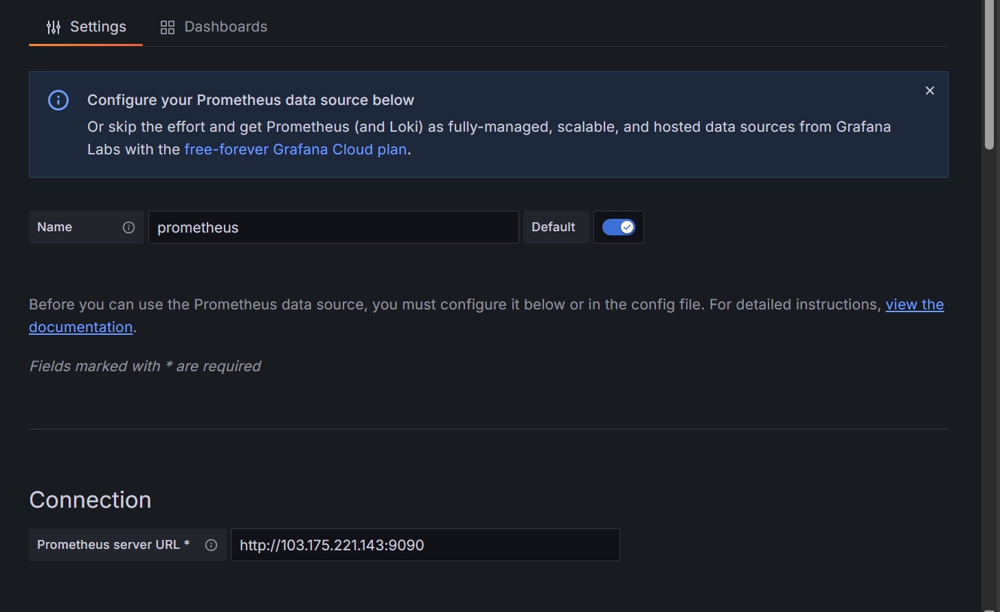
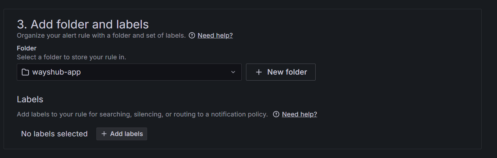

# 📘 DevOps Task - Day 3

- Monitoring 
  - Menjalankan semua app monitoring via ansible + docker
  - Setting prometheus : Job = dw-devops-23; monitor server app dan gateway
  - Dashboard grafana menggunakan template
  - Alerting untuk : CPU diatas 20%, RAM diatas 30%

## Menjalankan semua app monitoring via ansible + docker &
## Setting prometheus : Job = dw-devops-23; monitor server app dan gateway

1. Tambahkan variabel di group variabel

```
# Inventory
username: "taofiks"
SSHport: "22"

# Create New user
newuser: "mentor"
home_dir: "/home/{{ newuser }}"
public_key: "/home/{{username}}/.ssh/id_rsa.pub" # location of your pub_key in your local machine
enc_pass: "$6$zPj2MDxDKoYtjKa2$HOEIwJNblz8uoAy.8VouCtUEV5DKTiZNp90JiDyOqiy1rHZxs5k8NXFDuCi94qrJ5DIswUO6mguFNOg4J7PAU." # 1

# Monitoring
job_name: "dw-devops-23"
scrape_interval: "5s"
targets:
  - "103.175.221.143:9100"
  - "103.127.136.1:9100"
grafana_dir: "{{ home_dir }}/grafana"
prometheus_config: "{{ grafana_dir }}/prometheus.yml"
grafana_datasources: "{{ grafana_dir }}/provisioning/datasources"
grafana_data: "{{ grafana_dir }}/data"

# Reverse Proxy
nginx_dir: "{{ home_dir }}/nginx"
cloudflare_api: "419c5a759060eac71d19cbf9a231ec94267ca"
cloudflare_email: "taofik.code@gmail.com"
domain: "taofik.studentdumbways.my.id"
subdomains:
  - name: "exporter."
    backend: "103.175.221.143:9100"
  - name: "monitoring."
    backend: "103.175.221.143:3005"
  - name: "prom."
    backend: "103.175.221.143:9090"
```

2. buat playbook monitoring

```
nano monitoring.yaml
```

```
- name: "Deploy Monitoring"
  hosts: all
  become: yes

  tasks:

    - name: "Create 'grafana' directory if it does not exist"
      ansible.builtin.file:
        path: "{{ grafana_dir }}"
        state: directory
        owner: "{{ newuser }}"
        group: "{{ newuser }}"
        mode: "0755"

    # appserver only
    - name: "Create 'prometheus.yml' file"
      ansible.builtin.copy:
        dest: "{{ prometheus_config }}"
        owner: "{{ newuser }}"
        group: "{{ newuser }}"
        mode: "0644"
        content: |
          scrape_configs:
          - job_name: {{ job_name }}
            scrape_interval: {{ scrape_interval }}
            static_configs:
            - targets:
            
              - {{ x }}
            
      when: inventory_hostname == 'appserver'

    - name: "Create Docker network 'monitoring'"
      docker_network:
        name: monitoring
        state: present

    - name: "Deploy node-exporter container"
      docker_container:
        name: node-exporter
        image: prom/node-exporter:latest
        restart_policy: unless-stopped
        volumes:
          - /proc:/host/proc:ro
          - /sys:/host/sys:ro
          - /:/rootfs:ro
        command:
          - '--path.procfs=/host/proc'
          - '--path.rootfs=/rootfs'
          - '--path.sysfs=/host/sys'
          - '--collector.filesystem.mount-points-exclude=^/(sys|proc|dev|host|etc)($$|/)'
        ports:
          - "9100:9100"
        networks:
          - name: monitoring

    # appserver only
    - name: "Deploy prometheus container"
      docker_container:
        name: prometheus
        image: prom/prometheus:latest
        restart_policy: unless-stopped
        volumes:
          - "{{ prometheus_config }}:/etc/prometheus/prometheus.yml"
          - prometheus_data:/prometheus
        command:
          - '--config.file=/etc/prometheus/prometheus.yml'
          - '--storage.tsdb.path=/prometheus'
          - '--web.console.libraries=/etc/prometheus/console_libraries'
          - '--web.console.templates=/etc/prometheus/consoles'
          - '--web.enable-lifecycle'
        ports:
          - "9090:9090"
        networks:
          - name: monitoring
      when: inventory_hostname == 'appserver'

    # appserver only
    - name: "Deploy grafana container"
      docker_container:
        name: grafana
        image: grafana/grafana:latest

        restart_policy: unless-stopped
        user: root
        volumes:
          - "{{ grafana_datasources }}:/etc/grafana/provisioning/datasources"
          - "{{ grafana_data }}:/var/lib/grafana"
        ports:
          - "3005:3000"
        networks:
          - name: monitoring
      when: inventory_hostname == 'appserver'
```

3. Jalankan playbook yang sudah dibuat

```
ansible-playbook monitoring.yaml
```

- Node Exporter


- Prometheus


- Grafana


---

##  Dashboard grafana menggunakan template

### Add data source

1. Akses grafana di browser 

2. Login ke dashboard grafana

3. Pilih tab connections, lalu pilih data sources

4. Klik add data source

5. Pilih Prometheus

6. Lalu beri nama 

7. Di connection masukan url dimana service prometehus berjalan



8. Lalu klik save & test


### Menggunakan Template

1. Untuk mencari template grafana bisa kunjungi `https://grafana.com/grafana/dashboards/`

2. Pilih satu template lalu copy id nya

3. Pilih tab dashboards, lalu klik new dan pilih import

4. Lalu masukan id nya, lalu load 


5. Lalu beri nama dashboard nya

6. Untuk prometheus data source masukan data source yang dibuat tadi


7. Maka dashboard pun telah terbuat


---

## Alerting untuk : CPU diatas 20%, RAM diatas 30%

### Add contact points

1. Klik table Alerting

2. Klik Contact points

3. Klik `Create contact point`

4. Beri nama contact point

5. Untuk integration saya pilih discord

6. Masukan webhook url yang didapat dari discord


7. Kalau mau coba sudah terhubung atau belum silahkan klik tombol test

### Add alert rules CPU

1. Klik tab Alert rules

2. Lalu klik `New alert rule`

3. Lalu beri nama rule `High CPU Usage`

4. Lalu pada `Define query and alert condition` pilih data source yang dibuat, lalu kita gunakan code untuk memasukan query nya

```
100 - (avg by(instance) (rate(node_cpu_seconds_total{mode="idle"}[5m])) * 100)
```
5. Lalu alert condition pilih `is above`, lalu masukan 20 


6. Buat folder baru `wayshub-app`



7. Set evaluation behavior, buat evalution group baru 

8. Pending period atur ke 1m


9. Lalu Configure notifications, pilih `contact point` ke discord yang dibuat tadi 


10. lalu save rule dan exit

### Add alert rules CPU

1. Lalu klik `New alert rule`

2. Lalu beri nama rule `High RAM Usage`

3. Lalu pada `Define query and alert condition` pilih data source yang dibuat, lalu kita gunakan code untuk memasukan query nya

```
((node_memory_MemTotal_bytes - node_memory_MemAvailable_bytes) / node_memory_MemTotal_bytes) * 100
```

4. Lalu alert condition pilih `is above`, lalu masukan 30


5. Masukan ke folder yang dibuat sebelumnya

6. Evalution pilih yang sudah dibuat tadi

7. Notifikasi pilih contact point discord yang telah dibuat

8. Lalu save and exit

