# 📘 DevOps Task - Day 2

## Diagram Jaringan

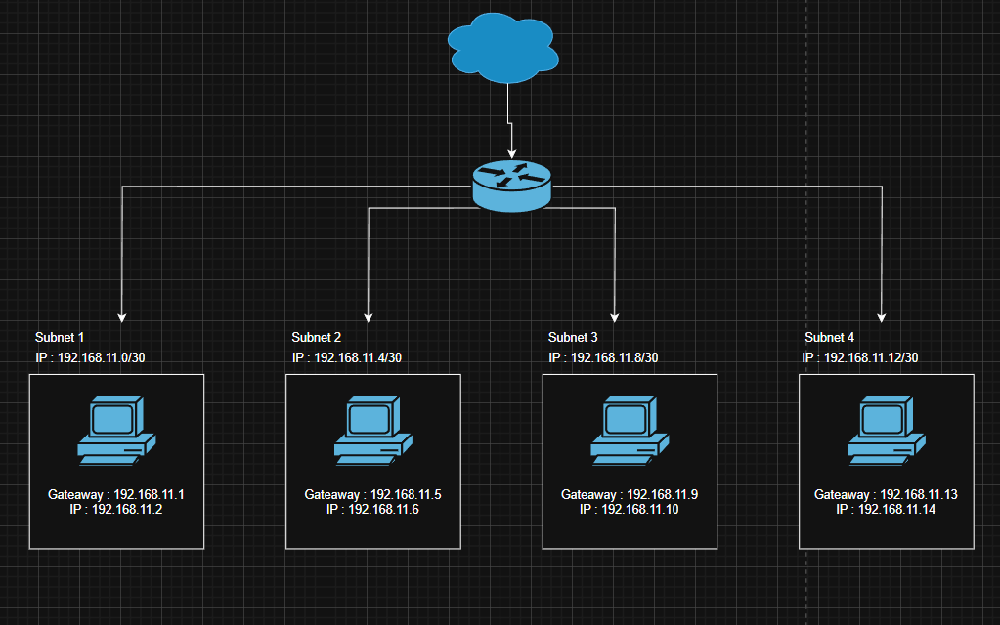

- **Perhitungan Jumlah Subnet**

  Untuk menghitung jumlah subnet, kita bisa menggunakan rumus 2^x (di mana x adalah
  banyaknya angka 1 dalam oktet terakhir di subnet mask).

  192.168.11.0/30
  Subnet mask = 11111111.11111111.11111111.11111100
  Maka 2^6 = 64 Subnet

- **Jumlah host per Subnet**

  Jumlah host per subnet bisa kita ketahui melalui rumus (2^y)-2 (di mana y adalah banyaknya
  angka 0 dalam oktet terakhir di subnet mask).

  Dari subnet mask 11111111.11111111.11111111.11111100, oktet terakhirnya adalah 00. Itu artinya, (2^2)-2 = 4-2 = 2 host per subnet.

  Kenapa harus dikurangi 2?

  Karena ada 2 IP address yang tidak bisa dipakai oleh host, yakni network
  address dan broadcast address.

  Dalam kasus 192.168.11.0/30, network address-nya adalah 192.168.11.0 dan broadcast
  address-nya adalah 192.168.11.3.

  Jadi, rentang IP address yang valid untuk host adalah 192.168.11.1–192.168.11.2.

## Perbedaan SH (Shell) dan BASH (Bourne-Again Shell)

| Aspek            | SH (Shell)                                                                                                   | BASH (Bourne-Again Shell)                                                                                     |
| ---------------- | ------------------------------------------------------------------------------------------------------------ | ------------------------------------------------------------------------------------------------------------- |
| **Definisi**     | SH adalah antarmuka baris perintah dasar yang digunakan untuk menjalankan perintah dan skrip di sistem Unix. | BASH merupakan pengembangan dari Bourne Shell yang menghadirkan fitur tambahan untuk interaksi dan scripting. |
| **Fungsi Utama** | Shell dasar untuk menjalankan perintah dan skrip sederhana.                                                  | Shell modern dengan fitur lengkap untuk scripting dan interaksi.                                              |

## Dokumentasi Dasar Command Linux

### Manajemen Paket

| Perintah           | Fungsi                                                    |
| ------------------ | --------------------------------------------------------- |
| `sudo apt update`  | Memperbarui daftar paket dari repositori.                 |
| `sudo apt upgrade` | Menginstal versi terbaru dari paket yang sudah terpasang. |
| `sudo apt install` | Menginstall paket                                         |
| `sudo apt remove`  | Menghapus paket                                           |

---

### Navigasi Direktori

| Perintah          | Fungsi                                                   |
| ----------------- | -------------------------------------------------------- |
| `pwd`             | Menampilkan path direktori kerja saat ini.               |
| `cd ..`           | Pindah ke direktori induk (parent directory).            |
| `cd /path/to/dir` | Pindah ke direktori yang ditentukan dengan path lengkap. |

---

### Melihat isi direktori

| Perintah | Fungsi                                                                                  |
| -------- | --------------------------------------------------------------------------------------- |
| `ls`     | Menampilkan daftar file dan direktori dalam direktori saat ini.                         |
| `ls -l`  | Menampilkan daftar file dan direktori dengan detail tambahan (permissions, owner, dll). |
| `ls -a`  | Menampilkan semua file, termasuk file tersembunyi (yang dimulai dengan titik).          |
| `ls -h`  | Menampilkan ukuran file dalam format yang lebih mudah dibaca (misal: KB, MB).           |

---

### Manajemen File & Folder

| Perintah              | Fungsi                               |
| --------------------- | ------------------------------------ |
| `touch file.txt`      | Membuat file kosong                  |
| `mkdir folder`        | Membuat folder baru                  |
| `cp file.txt folder/` | Menyalin file ke folder              |
| `mv file.txt folder/` | Memindahkan atau mengganti nama file |
| `rm file.txt`         | Menghapus file                       |
| `rm -r folder/`       | Menghapus folder dan isinya          |

---

### Pengguna & Hak Akses

| Perintah                 | Fungsi                                                                                     |
| ------------------------ | ------------------------------------------------------------------------------------------ |
| `whoami`                 | Menampilkan nama user yang sedang aktif.                                                   |
| `chmod ugoa+rwx file.sh` | Memberikan hak baca, tulis, dan eksekusi kepada semua pengguna (user, group, others, all). |
| `chmod 755 file.sh`      | Mengatur permission file secara numerik.                                                   |
| `ls -l`                  | Menampilkan file + permission                                                              |
| `chown user:group file`  | Mengubah pemilik dan grup dari suatu file.                                                 |

---

- Memperbarui daftar paket dari repositori.

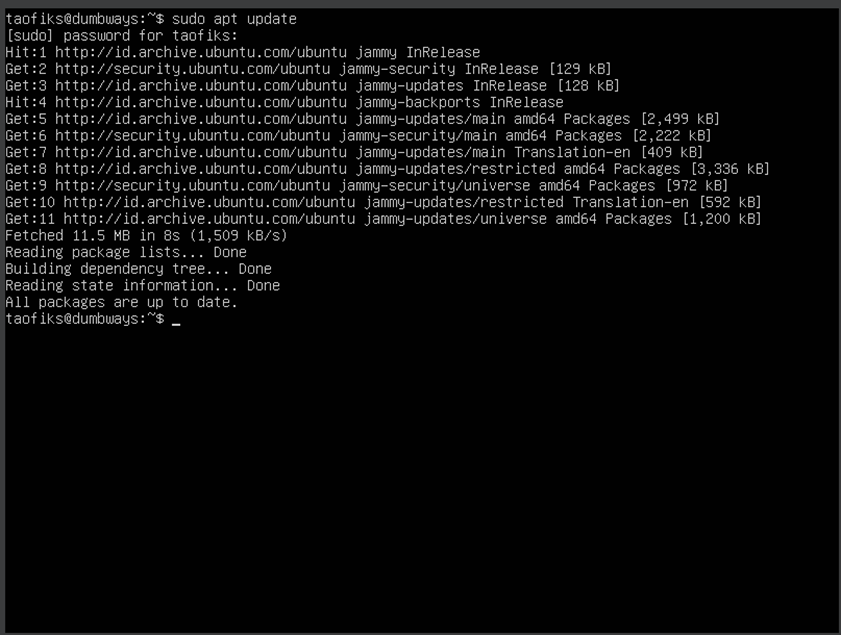

- Menginstal versi terbaru dari paket yang sudah terpasang.

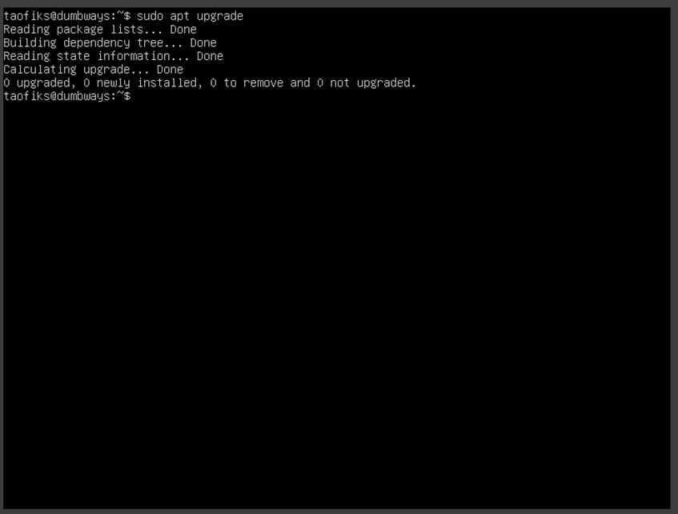

- Membuat direktori baru

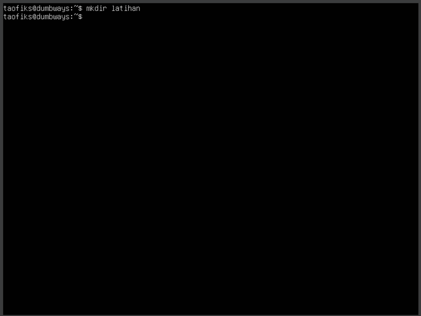

- Membuat file kosong

- Menampilkan daftar file dan direktori dalam direktori saat ini.

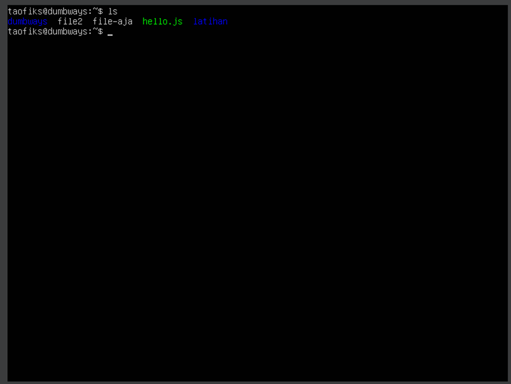

- Menampilkan daftar file dan direktori dengan detail tambahan (permissions, owner, dll) serta hidden file dan direktori.

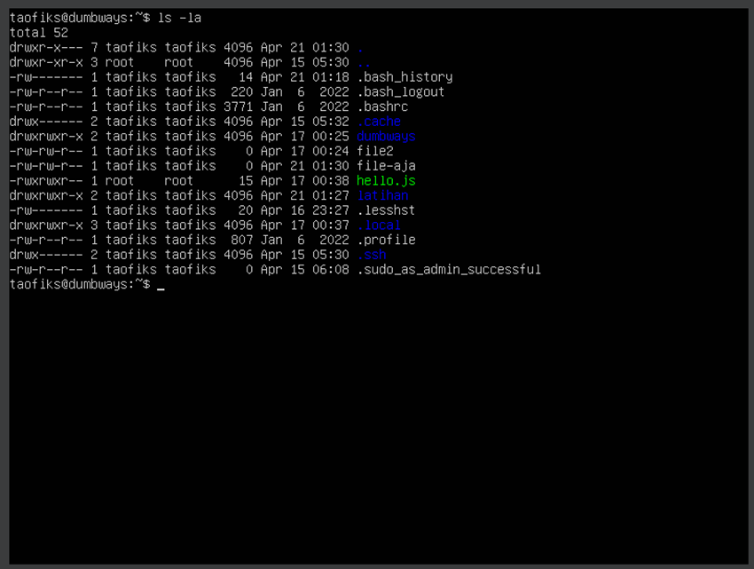

- Pindah ke direktori latihan

- Pindah ke direktori induk (parent directory).

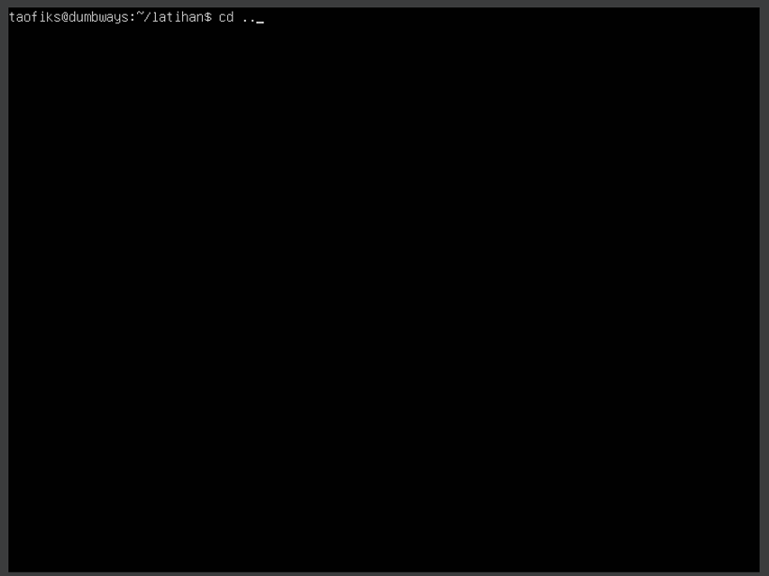

- Menyalin file

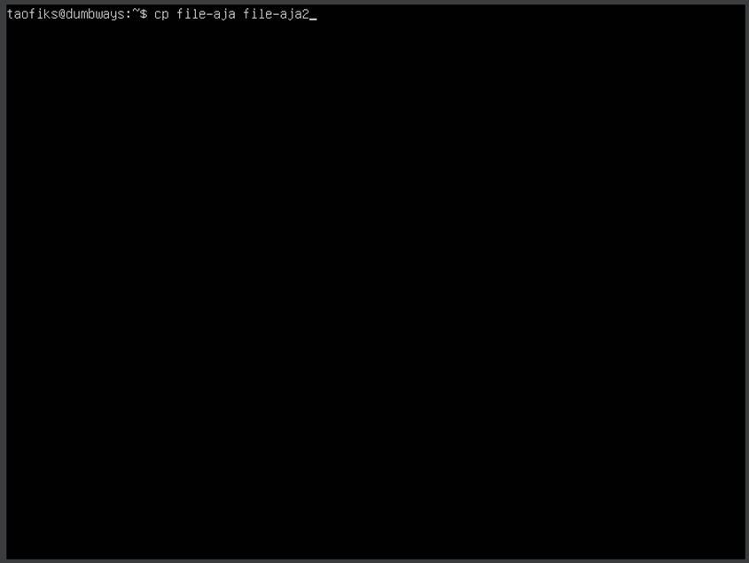

- Memindahkan file ke direktori latihan

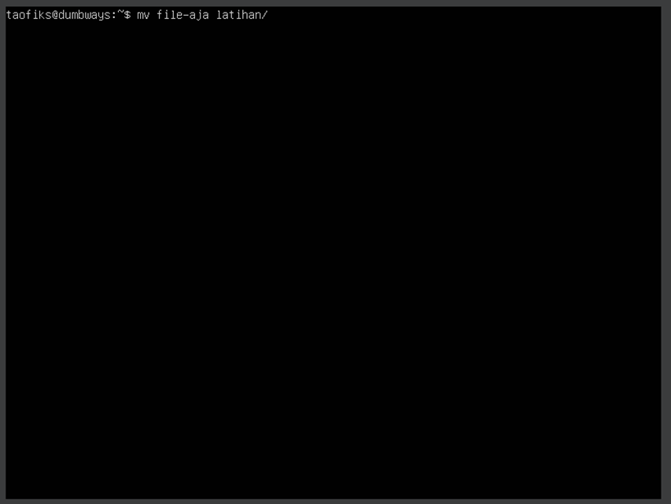

- Mengganti nama file

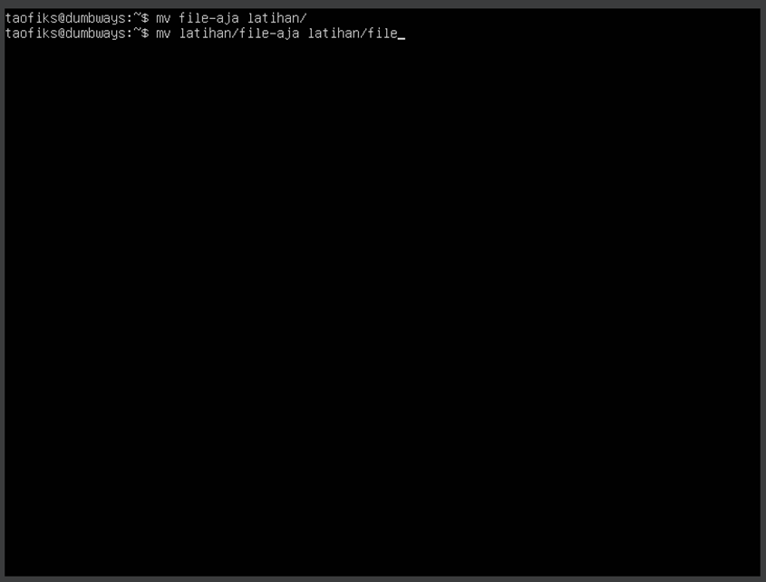

- Menampilkan string atau teks ke output

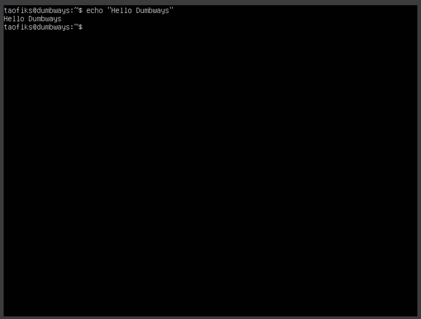

- Menampilkan string atau teks ke output file

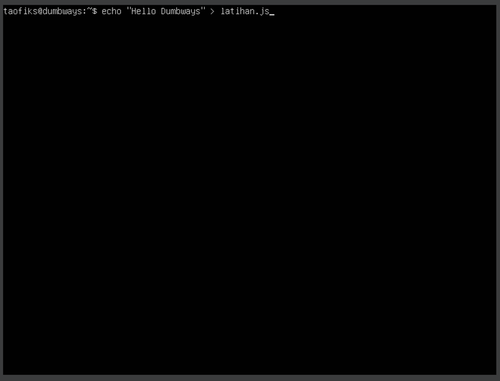

- Melihat isi file

- Mencari file dan direktori

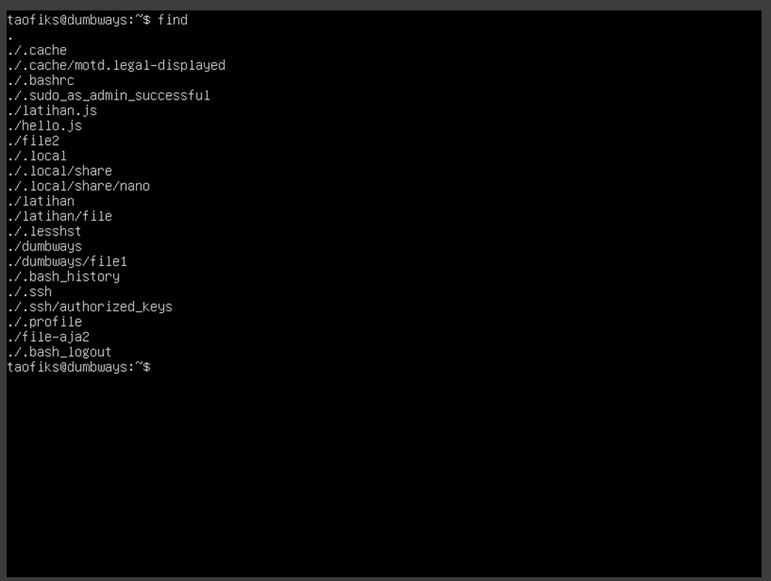

- Mencari file dengan spesifik

- Mencari teks dalam file

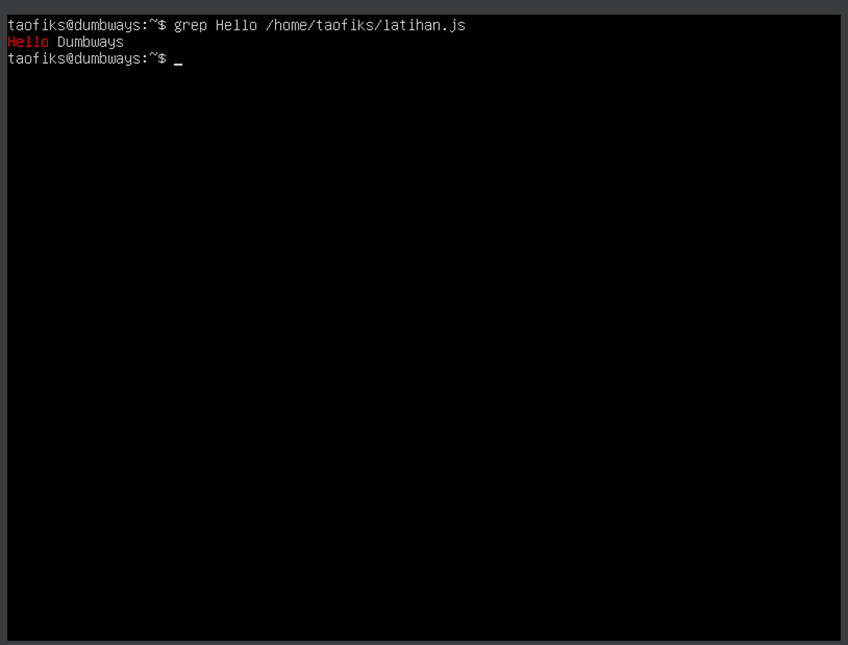

- Membuka teks editor bawaan linux

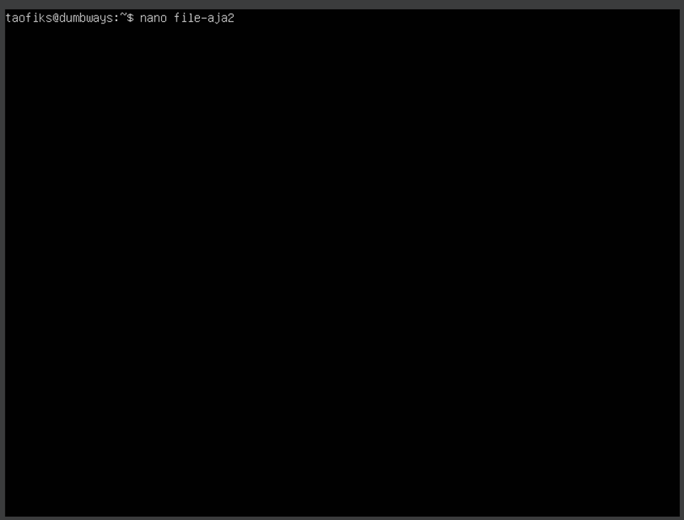

- Menacri teks di semua file

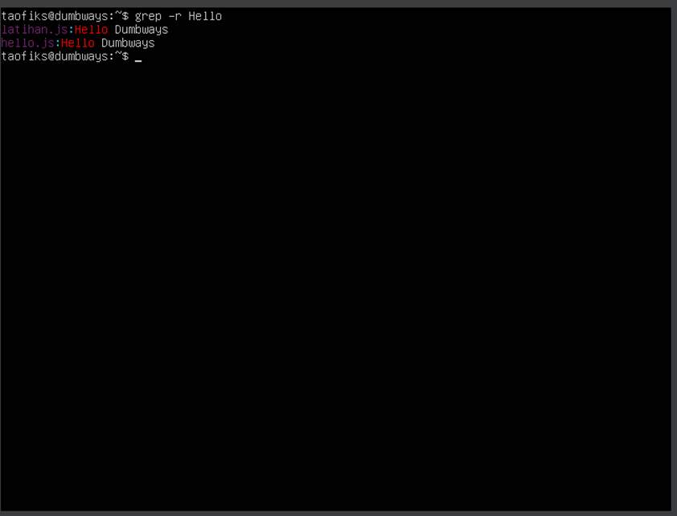

- Merubah file permission

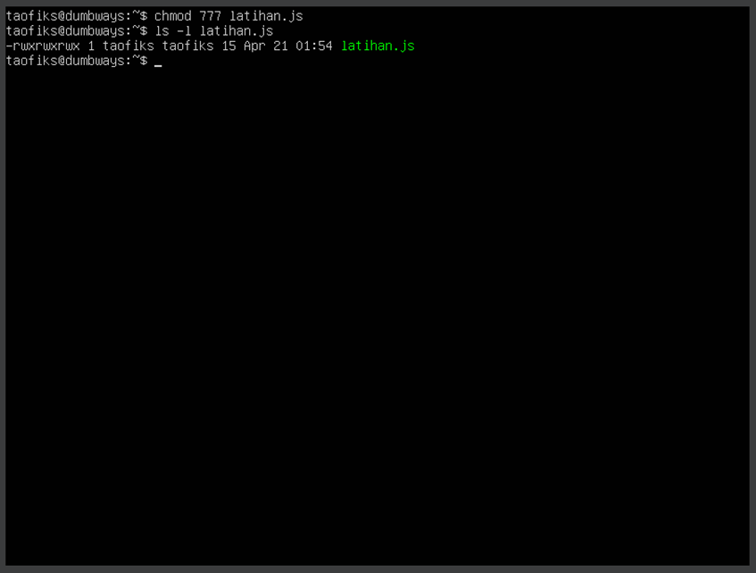

- Mengubah pemilik dan grup dari suatu file.

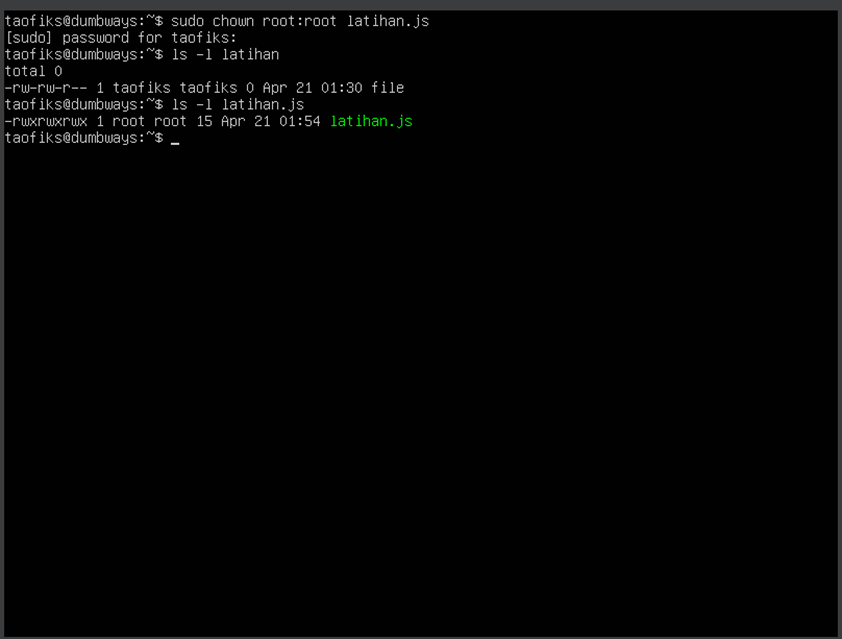

- Melihat command yang sudah digunakan

- Berpindah ke root user

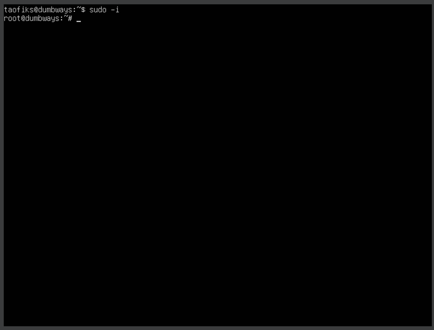
