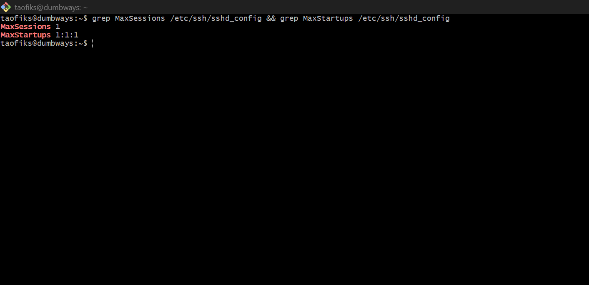
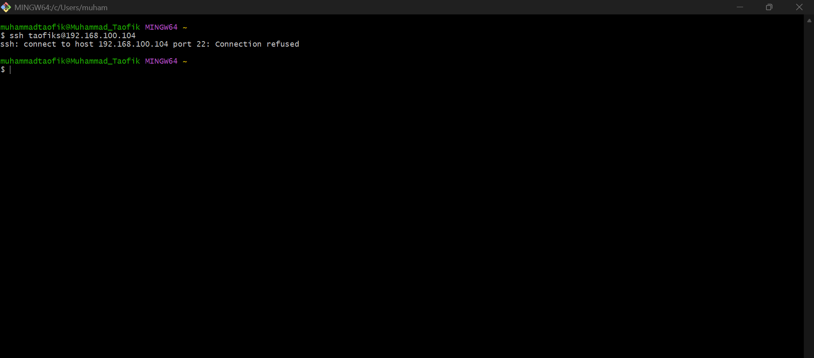
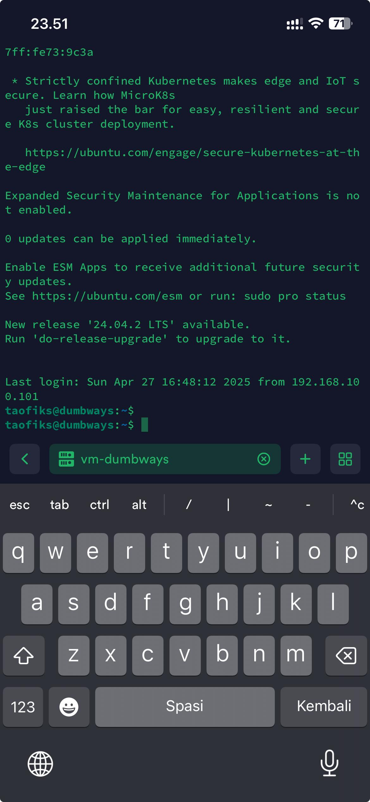

# 📘 DevOps Challenge - Day 3

- Bisa ssh kedalam server dengan contoh command : `ssh vm-dumbways`
- Rubah port SSH menjadi 6969
- SSH hanya bisa diakses 1 device (jika login dari device lain akan bentrok)

## 📃 Membuat alias 'vm-dumbways' untuk Login SSH

- Membuat file config di direktori 'C:\Users\nama_user\.ssh'


- Buka file config dengan notepad dan menambahkan script berikut kemudian simpan:

```
Host vm-dumbways
    HostName 192.168.100.104
    User taofiks
    Port 22
    IdentityFile ~/.ssh/taofiks_key
```


- Buka terminal lalu login SSH dengan command berikut:

```
ssh vm-dumbways
```


## 📝 Mengubah Konfigurasi Port SSH ke 6969

- Buka konfigurasi SSH pada Ubuntu Server dengan text editor nano

```
sudo nano /etc/ssh/sshd_config
```


- Ubah konfigurasi port yang sebelumnya default 22 menjadi 6969. Setelah selesai lalu simpan file konfigurasi tersebut.


- Restart service SSH

```
sudo systemctl restart ssh
```


- Logout dari SSH dengan mengeksekusi command exit, lalu masuk kembali


- Diketahui koneksi pada port 22 ditolak, untuk mengatasinya maka diperlukan modifikasi pada file 'C:\Users\nama_user\.ssh\config' dengan mengubah konfigurasi port dari 22 ke 6969


- Simpan file config dan coba login ulang pada SSH Server


## ⚔️ Pembatasan Akses Server melalui SSH Hanya 1 Device

- Buka konfigurasi SSH pada Ubuntu Server dengan text editor nano

```
sudo nano /etc/ssh/sshd_config
```

- Ubah konfigurasi MaxSessions dan MaxStartups. Setelah selesai lalu simpan file konfigurasi tersebut.

**Catatan :**

MaxSessions 1 = Maksimal 1 sesi SSH per koneksi.

MaxStartups 1:1:1 = Cuma 1 koneksi SSH diizinkan pada saat bersamaan (dengan delay 0%).



- Restart service SSH

```
sudo systemctl restart ssh
```


- Uji coba dengan device lain, maka akan terjadi Connection refused




