# 📘 DevOps Task - Day 3

- Akses server menggunakan terminal (Windows Terminal/PuTTY/etc.)
- Konfigurasi ssh kalian agar bisa di akses _hanya menggunakan publickey_ (password dimatikan)
- Buat step by step penggunaan text manipulation! (grep, sed, cat, echo)
- Nyalakan ufw dengan memberikan akses untuk port 22, 80, 443, 3000, 5000 dan 6969!

## 💻 Akses server menggunakan terminal

### 1. Melihat Ip Adrress Server

- Gunakan perintah berikut untuk melihat ip address server

```
ip a
```

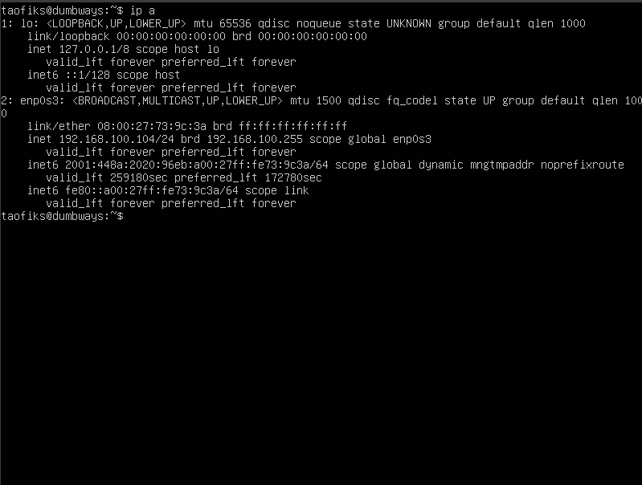

### 2. Akses lewat Terminal device pribadi

- Disini saya menggunakan bash atau terminal bawaan git kemudian jalankan perintah berikut

```
ssh username@ip_address
```

- Jika terjadi Connection refused install terlebih dahulu openshh di server nya dengan perintah berikut

```
sudo apt install openssh-server
```

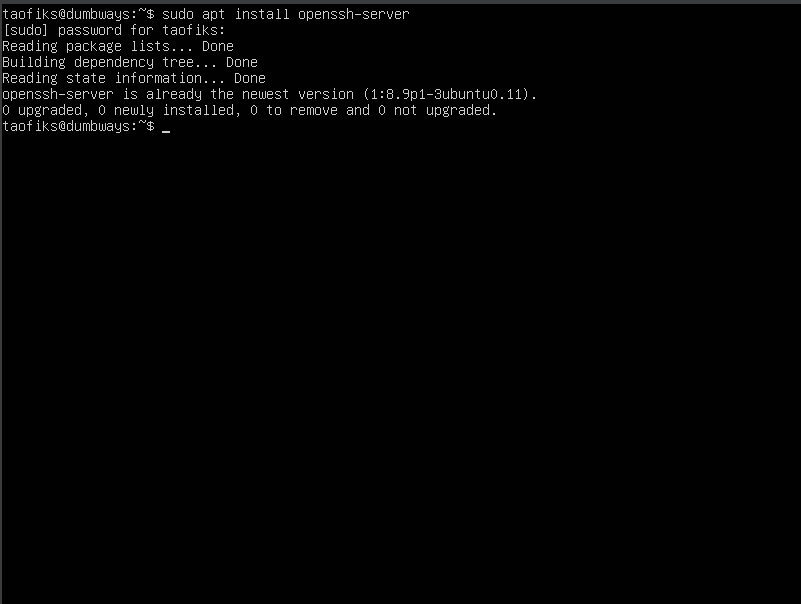

### 3. Cek apakah SSH sudah berjalan

- Gunakan perintah berikut untuk melihat status SSH

```
sudo systemctl status ssh
```

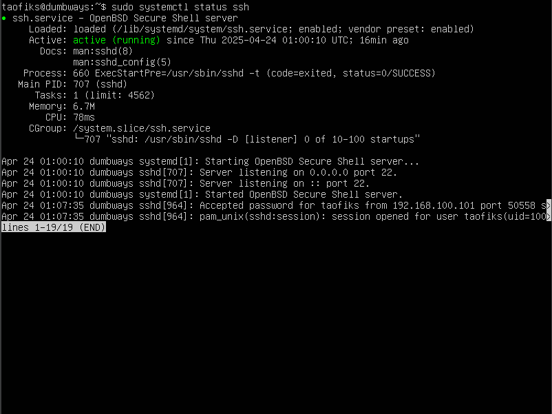

### 4. Akses kembali server

- Jika sudah melakukan installasi dan pengecekan status silahkan akses kembali server dengan perintah berikut

```
ssh username@ip_address
```

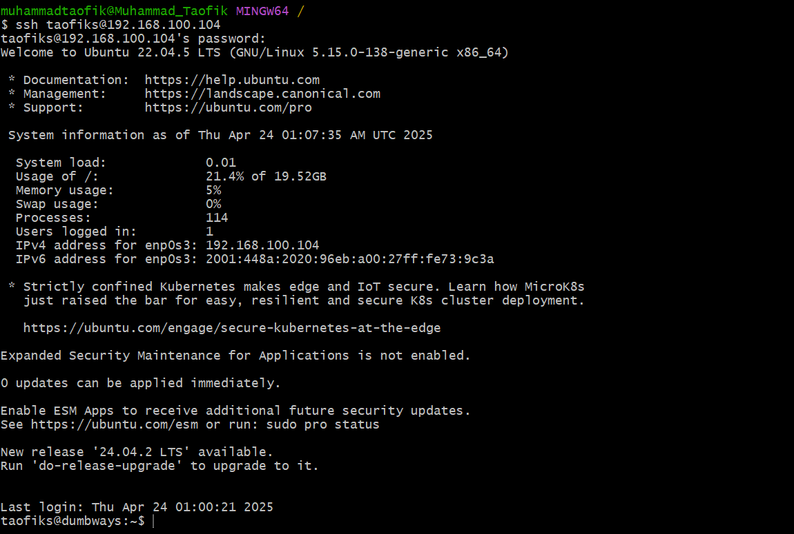

**Catatan** : username dan password yang digunakan harus sama dengan yang ada di server

## 🔐 Konfigurasi Akses SSH Menggunakan Public Key

### 1. Generate Public Key dan Private Key

- Untuk membuat Public Key dan Private Key gunakan perintah berikut

```
ssh-keygen
```

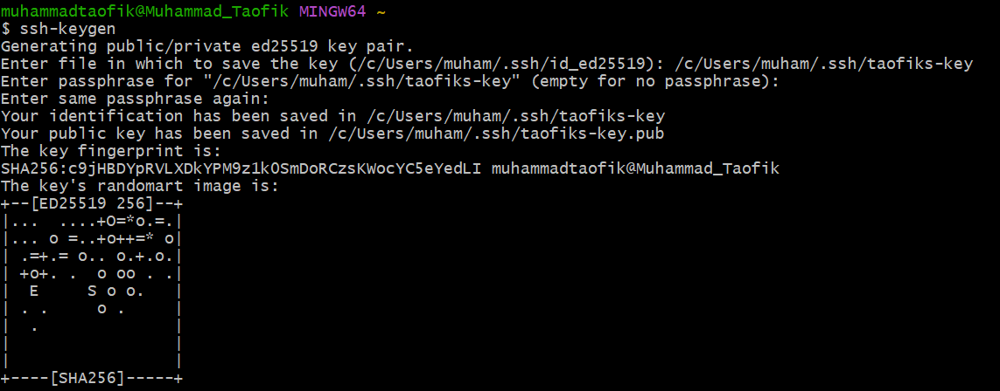

### 2. Buka Folder "C:\Users<nama_user>.ssh"

- Terdapat 2 key yaitu Public key (ekstensi .pub) dan Private Key. Private Key harus disimpan baik-baik dan harus dirahasiakan.

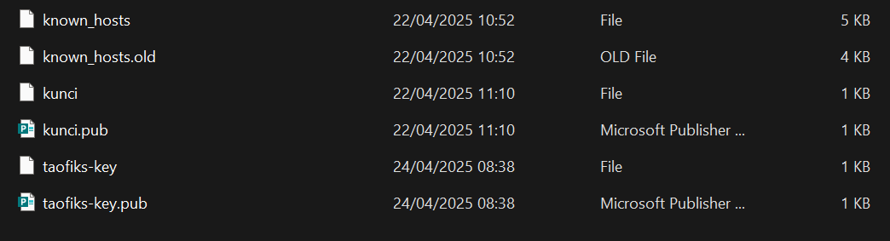

### 3. Buka file Public Key dan salin isinya

- Saya menggunakan notepad untuk melihat dan menyalin isi file nya


### 4. Akses kembali ke server dengan Terminal

- Kemudian, buka file "authorized_keys" di direktori ~/.ssh lalu gunakan perintah berikut

```
cd .ssh/
ls
sudo nano authorized_keys
```


### 5. Paste Public Key pada file "authorized_keys"

- Silahkan paste Public Key pada file "authorized_keys" di server Ubuntu dan simpan


### 6. Uji coba koneksi ke Server

- Lakukan pengujian koneksi ke server dengan SSH menggunakan Public Key Terminal dengan perintah berikut

```
ssh -i ~/.ssh/taofiks_key taofiks@192.168.100.104
```


### 7. konfigurasi login hanya dengan Public Key

- Lakukan konfigurasi pada file konfigurasi SSH

```
sudo nano /etc/ssh/sshd_config
```


- Atur parameter sebagai berikut. Setelah selesai simpan file tersebut.

```
PubkeyAuthentication yes
PasswordAuthentication no
```


**Catatan :**
PubkeyAuthentication = mengizinkan autentikasi via SSH key.
PasswordAuthentication = menonaktifkan login via password.

- Restart SSH service pada terminal

```
sudo systemctl restart sshd
```

- Disconnect SSH dengan mengetikkan "exit" atau ctrl + d di terminal dan coba login ke Server dengan password

- Server menolak login menggunakan password dan login hanya bisa menggunakan Public Key


```
ssh -i ~/.ssh/taofiks_key taofiks@192.168.100.104
```


## ✒️ Text Manipulation

### grep

| Perintah             | Fungsi                                                                                        |
| -------------------- | --------------------------------------------------------------------------------------------- |
| `grep hello file`    | Mencari baris yang mengandung kata "hello" di dalam file                                      |
| `grep -c hello file` | Menghitung jumlah baris yang mengandung kata "hello" di dalam file                            |
| `grep hello *`       | Mencari semua baris yang mengandung kata "hello" di semua file yang ada di direktori saat ini |
| `grep -c hello *`    | Menghitung jumlah baris yang mengandung kata "hello" di setiap file di direktori saat ini.    |

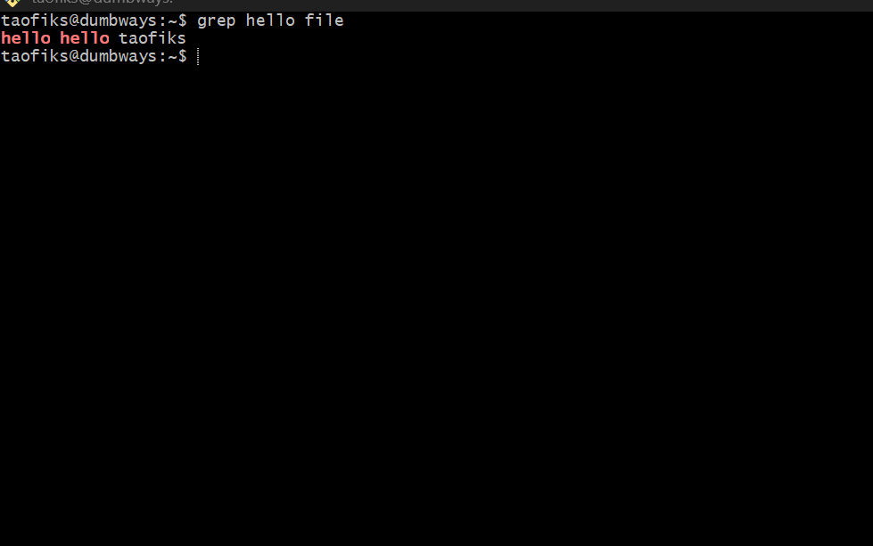

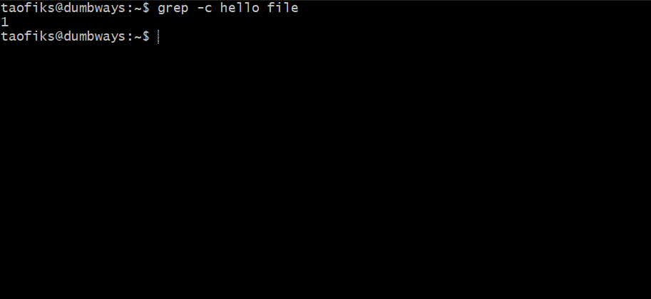

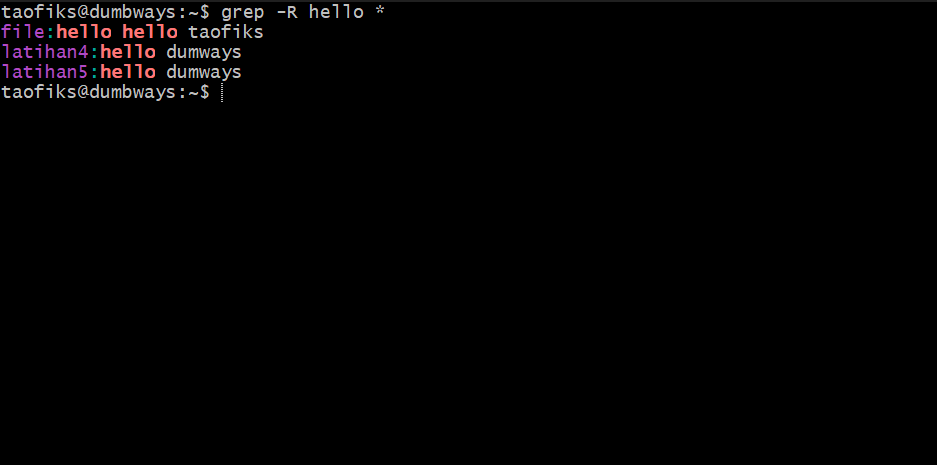

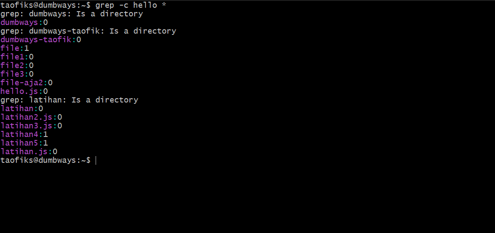

---

### sed

| Perintah                       | Fungsi                                                                                                 |
| ------------------------------ | ------------------------------------------------------------------------------------------------------ |
| `sed -i 's/hello/asek/g' file` | Mencari semua teks "hello" dalam file dan menggantinya dengan "asek" tanpa memilik output ke file lain |

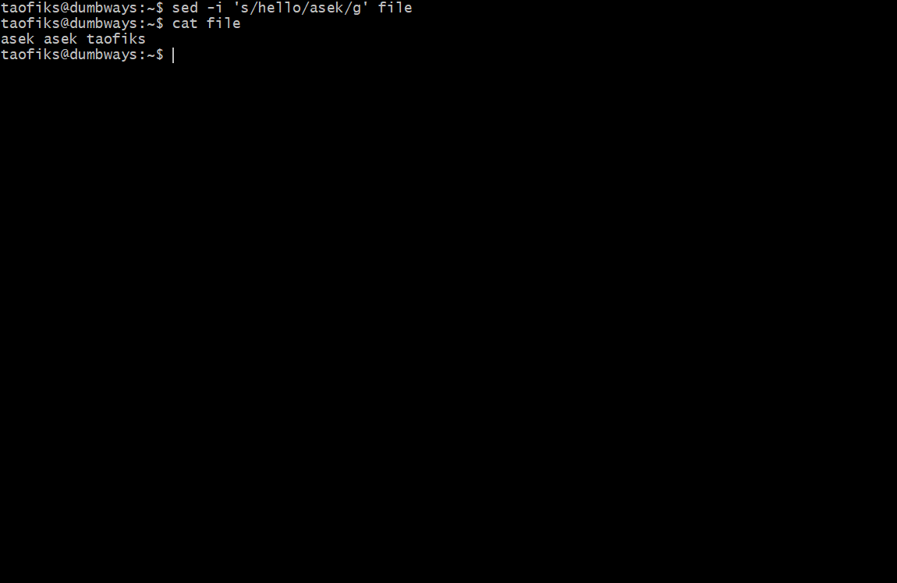

---

### cat

| Perintah                  | Fungsi                                                             |
| ------------------------- | ------------------------------------------------------------------ |
| `cat file`                | Melihat isi dari suatu file                                        |
| `cat > file1`             | Membuat file baru dengan isi sesuai teks yang diinputkan           |
| `cat file1 file2 > file3` | Menggabungkan / menyisipkan teks dalam beberapa file ke suatu file |

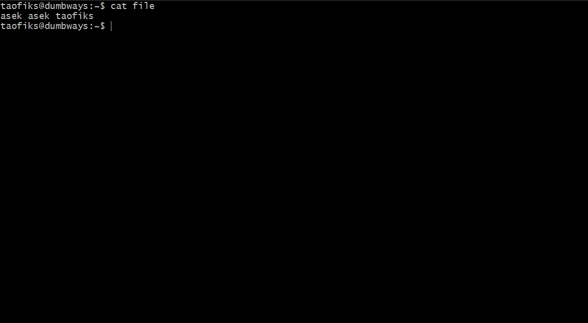


---

### echo

| Perintah                          | Fungsi                                                  |
| --------------------------------- | ------------------------------------------------------- |
| `echo "Hello taofiks"`            | Menampilkan teks biasa                                  |
| `echo "hai DumbWays" > file1`     | Menimpa isi suatu file (overwrite)                      |
| `echo "DevOps DumbWays" >> file1` | Menambahkan teks ke baris baru dari suatu file (append) |

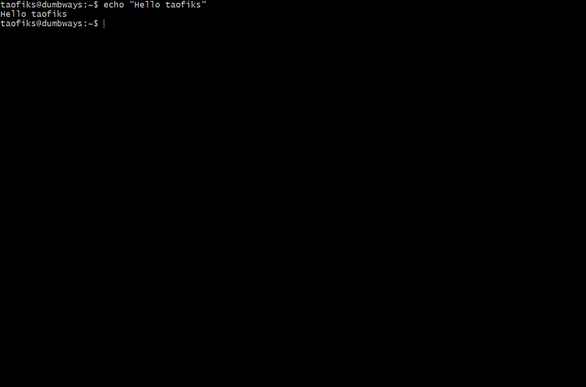

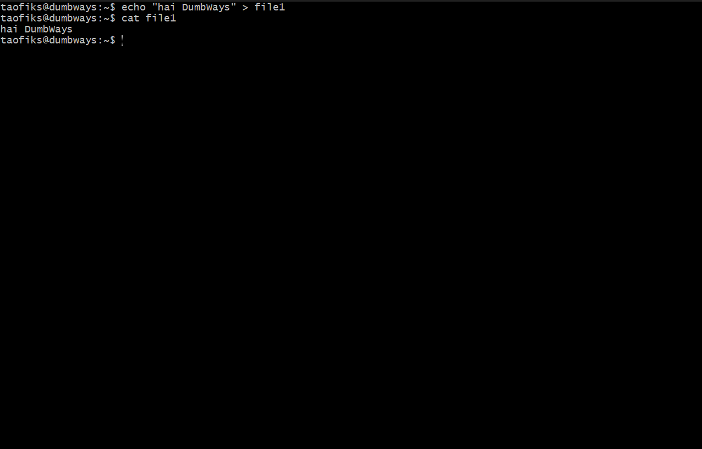

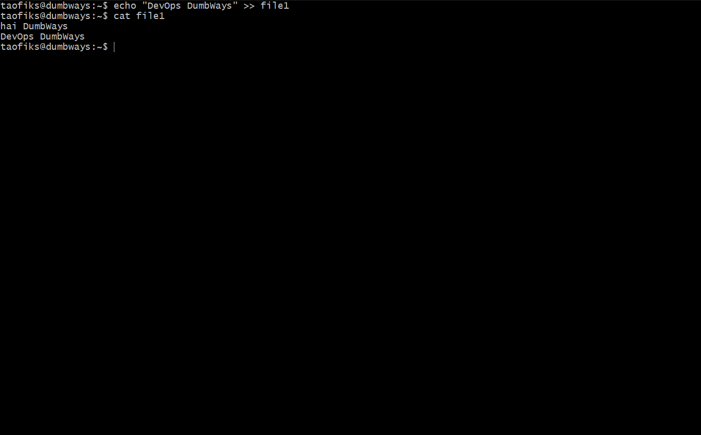

---

## 🌐 Menyalakan Uncomplicated Firewall (ufw) dan Manajemen Port
