# 📘 DevOps Task - Day 3

- Akses server menggunakan terminal (Windows Terminal/PuTTY/etc.)
- Konfigurasi ssh kalian agar bisa di akses _hanya menggunakan publickey_ (password dimatikan)
- Buat step by step penggunaan text manipulation! (grep, sed, cat, echo)
- Nyalakan ufw dengan memberikan akses untuk port 22, 80, 443, 3000, 5000 dan 6969!

## 💻 Akses server menggunakan terminal

### 1. Melihat Ip Adrress Server

- Gunakan perintah berikut untuk melihat ip address server

```
ip a
```

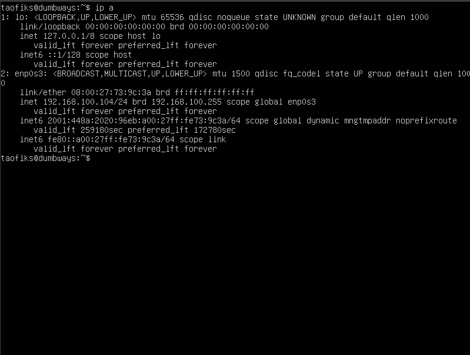

### 2. Akses lewat Terminal device pribadi

- Disini saya menggunakan bash atau terminal bawaan git kemudian jalankan perintah berikut

```
ssh username@ip_address
```

- Jika terjadi Connection refused install terlebih dahulu openshh di server nya dengan perintah berikut

```
sudo apt install openssh-server
```

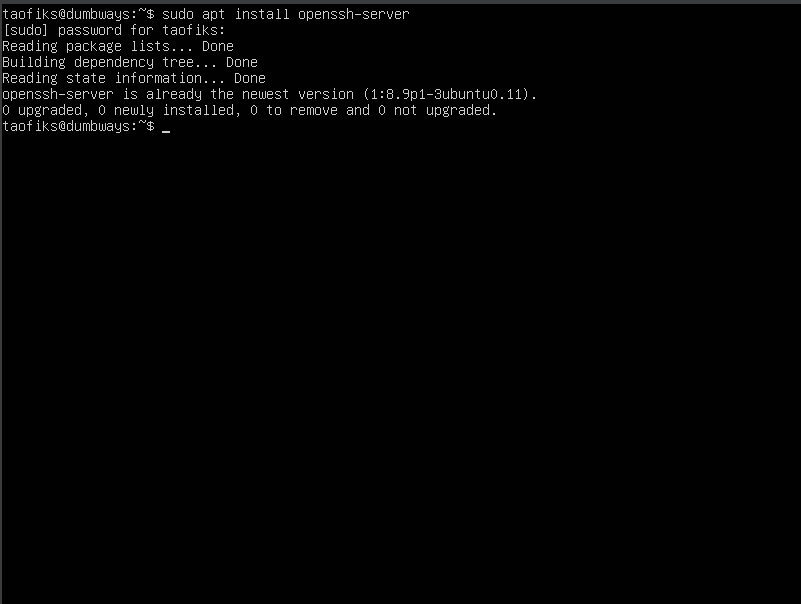

### 3. Cek apakah SSH sudah berjalan

- Gunakan perintah berikut untuk melihat status SSH

```
sudo systemctl status ssh
```

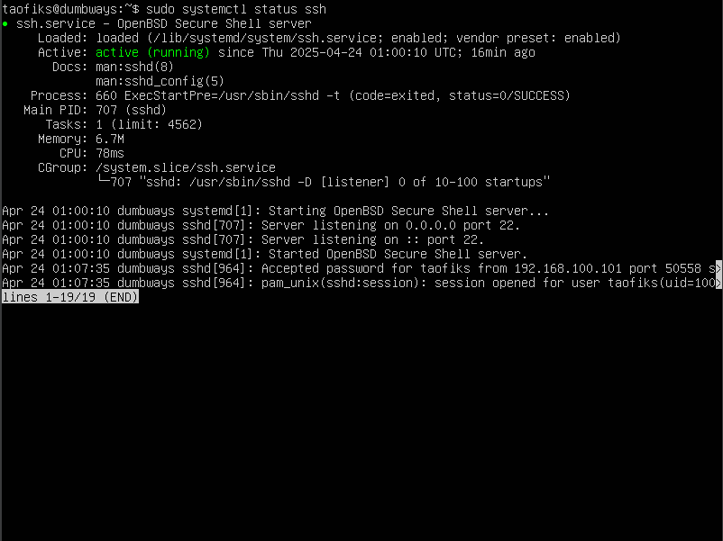

### 4. Akses kembali server

- Jika sudah melakukan installasi dan pengecekan status silahkan akses kembali server dengan perintah berikut

```
ssh username@ip_address
```

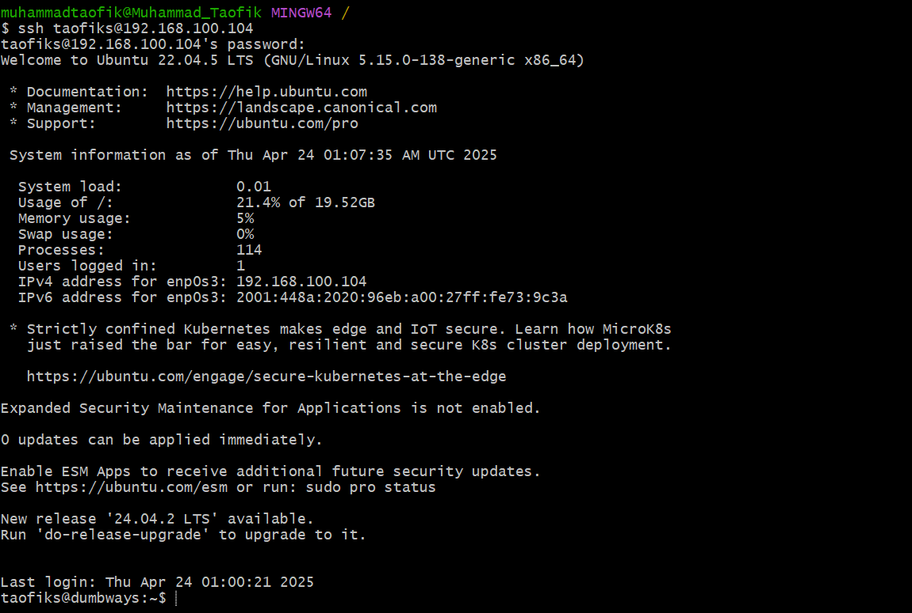

**Catatan** : username dan password yang digunakan harus sama dengan yang ada di server

## 🔐 Konfigurasi Akses SSH Menggunakan Public Key

### 1. Generate Public Key dan Private Key

- Untuk membuat Public Key dan Private Key gunakan perintah berikut

```
ssh-keygen
```

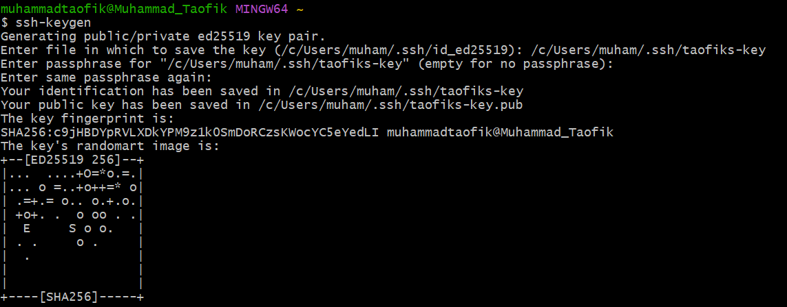

### 2. Buka Folder "C:\Users<nama_user>.ssh"

- Terdapat 2 key yaitu Public key (ekstensi .pub) dan Private Key. Private Key harus disimpan baik-baik dan harus dirahasiakan.


### 3. Buka file Public Key dan salin isinya

- Saya menggunakan notepad untuk melihat dan menyalin isi file nya

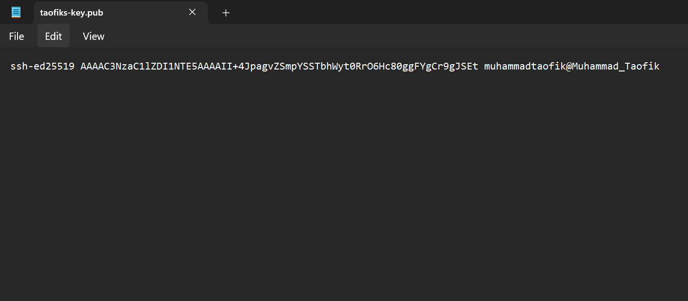

### 4. Akses kembali ke server dengan Terminal

- Kemudian, buka file "authorized_keys" di direktori ~/.ssh lalu gunakan perintah berikut

```
cd .ssh/
ls
sudo nano authorized_keys
```

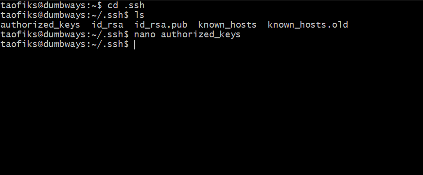

### 5. Paste Public Key pada file "authorized_keys"

- Silahkan paste Public Key pada file "authorized_keys" di server Ubuntu dan simpan

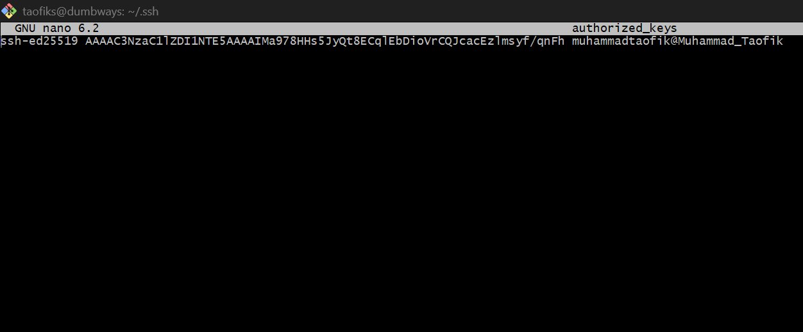

### 6. Uji coba koneksi ke Server

- Lakukan pengujian koneksi ke server dengan SSH menggunakan Public Key Terminal dengan perintah berikut

```
ssh -i ~/.ssh/taofiks_key taofiks@192.168.100.104
```

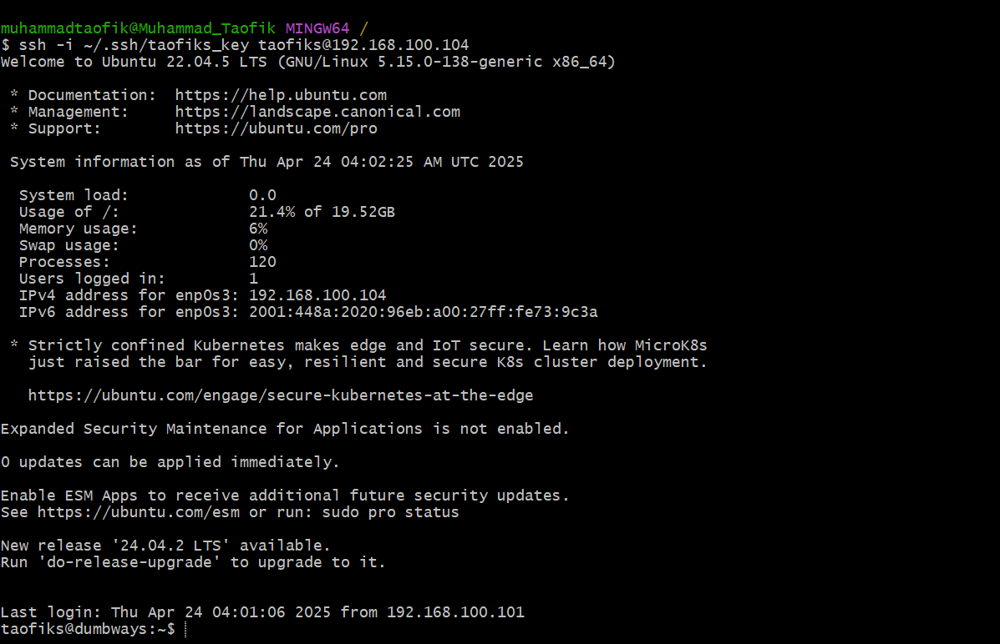

### 7. konfigurasi login hanya dengan Public Key

- Lakukan konfigurasi pada file konfigurasi SSH

```
sudo nano /etc/ssh/sshd_config
```

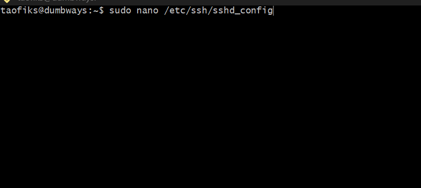

- Atur parameter sebagai berikut. Setelah selesai simpan file tersebut.

```
PubkeyAuthentication yes
PasswordAuthentication no
```


**Catatan :**
PubkeyAuthentication = mengizinkan autentikasi via SSH key.
PasswordAuthentication = menonaktifkan login via password.

- Restart SSH service pada terminal

```
sudo systemctl restart sshd
```

- Disconnect SSH dengan mengetikkan "exit" atau ctrl + d di terminal dan coba login ke Server dengan password:

- Server menolak login menggunakan password dan login hanya bisa menggunakan Public Key

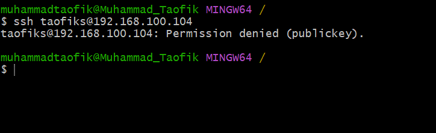

```
ssh -i ~/.ssh/taofiks_key taofiks@192.168.100.104
```

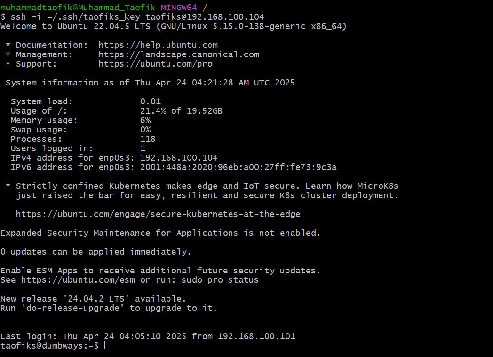

## Dokumentasi Dasar Command Linux

### Manajemen Paket

| Perintah           | Fungsi                                                    |
| ------------------ | --------------------------------------------------------- |
| `sudo apt update`  | Memperbarui daftar paket dari repositori.                 |
| `sudo apt upgrade` | Menginstal versi terbaru dari paket yang sudah terpasang. |
| `sudo apt install` | Menginstall paket                                         |
| `sudo apt remove`  | Menghapus paket                                           |

---

### Navigasi Direktori

| Perintah          | Fungsi                                                   |
| ----------------- | -------------------------------------------------------- |
| `pwd`             | Menampilkan path direktori kerja saat ini.               |
| `cd ..`           | Pindah ke direktori induk (parent directory).            |
| `cd /path/to/dir` | Pindah ke direktori yang ditentukan dengan path lengkap. |

---

### Melihat isi direktori

| Perintah | Fungsi                                                                                  |
| -------- | --------------------------------------------------------------------------------------- |
| `ls`     | Menampilkan daftar file dan direktori dalam direktori saat ini.                         |
| `ls -l`  | Menampilkan daftar file dan direktori dengan detail tambahan (permissions, owner, dll). |
| `ls -a`  | Menampilkan semua file, termasuk file tersembunyi (yang dimulai dengan titik).          |
| `ls -h`  | Menampilkan ukuran file dalam format yang lebih mudah dibaca (misal: KB, MB).           |

---

### Manajemen File & Folder

| Perintah              | Fungsi                               |
| --------------------- | ------------------------------------ |
| `touch file.txt`      | Membuat file kosong                  |
| `mkdir folder`        | Membuat folder baru                  |
| `cp file.txt folder/` | Menyalin file ke folder              |
| `mv file.txt folder/` | Memindahkan atau mengganti nama file |
| `rm file.txt`         | Menghapus file                       |
| `rm -r folder/`       | Menghapus folder dan isinya          |

---

### Pengguna & Hak Akses

| Perintah                 | Fungsi                                                                                     |
| ------------------------ | ------------------------------------------------------------------------------------------ |
| `whoami`                 | Menampilkan nama user yang sedang aktif.                                                   |
| `chmod ugoa+rwx file.sh` | Memberikan hak baca, tulis, dan eksekusi kepada semua pengguna (user, group, others, all). |
| `chmod 755 file.sh`      | Mengatur permission file secara numerik.                                                   |
| `ls -l`                  | Menampilkan file + permission                                                              |
| `chown user:group file`  | Mengubah pemilik dan grup dari suatu file.                                                 |

---

- Memperbarui daftar paket dari repositori.


- Menginstal versi terbaru dari paket yang sudah terpasang.


- Membuat direktori baru


- Membuat file kosong


- Menampilkan daftar file dan direktori dalam direktori saat ini.


- Menampilkan daftar file dan direktori dengan detail tambahan (permissions, owner, dll) serta hidden file dan direktori.


- Pindah ke direktori latihan


- Pindah ke direktori induk (parent directory).


- Menyalin file


- Memindahkan file ke direktori latihan


- Mengganti nama file

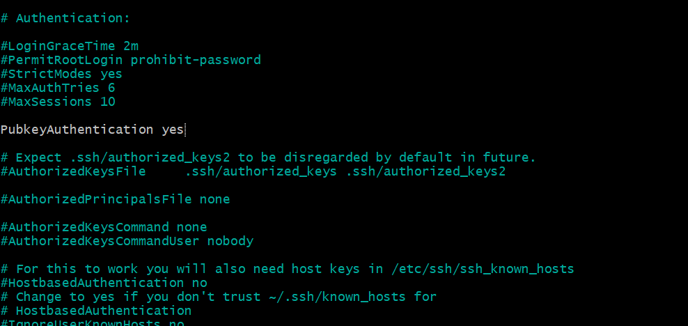

- Menampilkan string atau teks ke output

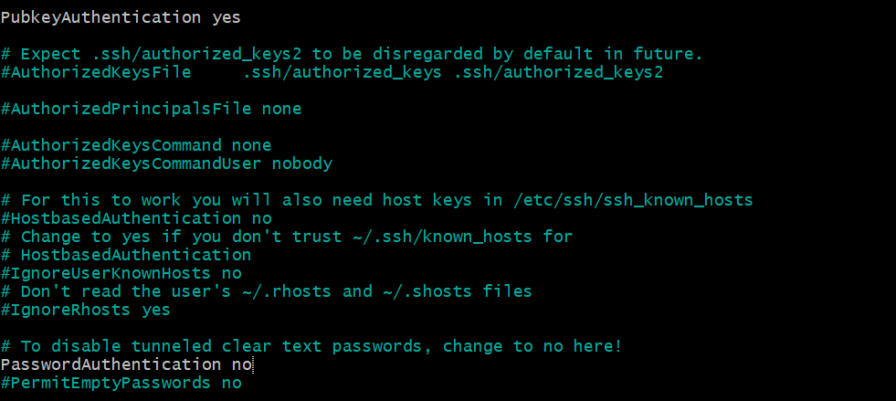

- Menampilkan string atau teks ke output file


- Melihat isi file


- Mencari file dan direktori

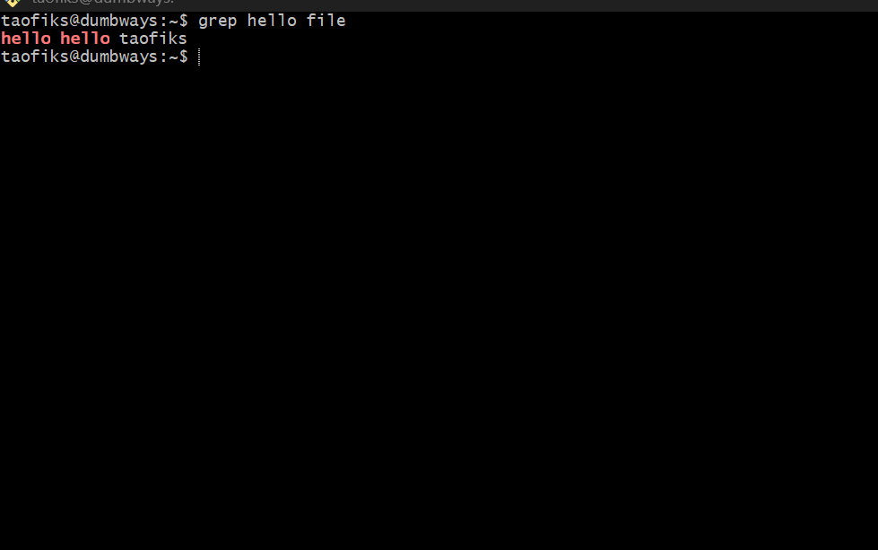

- Mencari file dengan spesifik

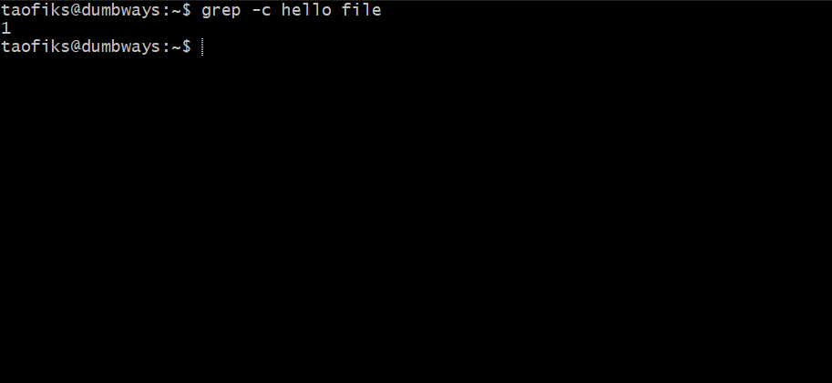

- Mencari teks dalam file

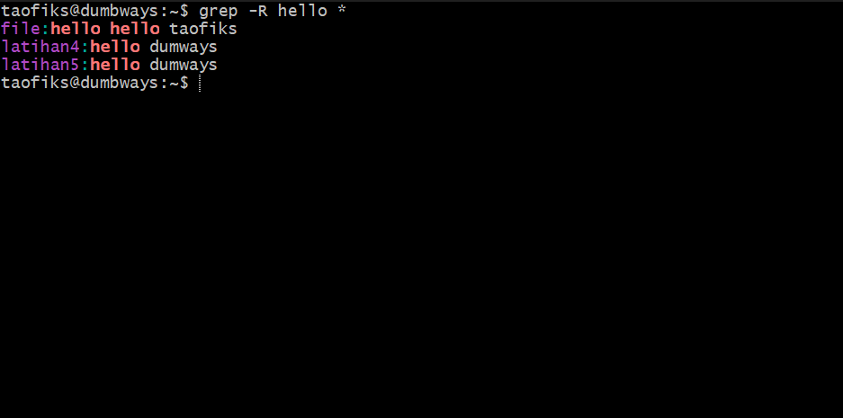

- Membuka teks editor bawaan linux

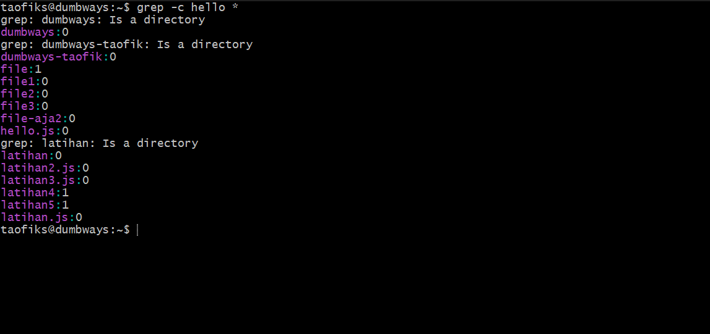

- Menacri teks di semua file

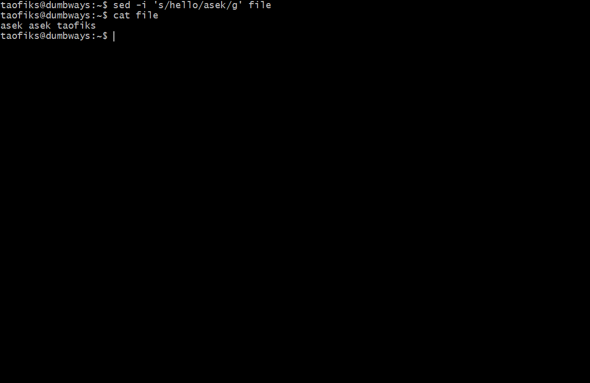

- Merubah file permission

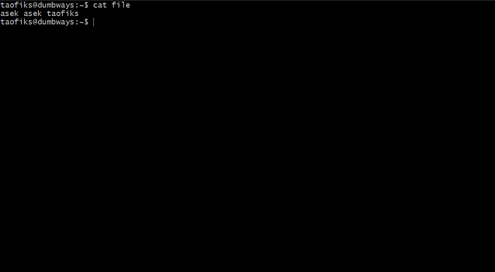

- Mengubah pemilik dan grup dari suatu file.

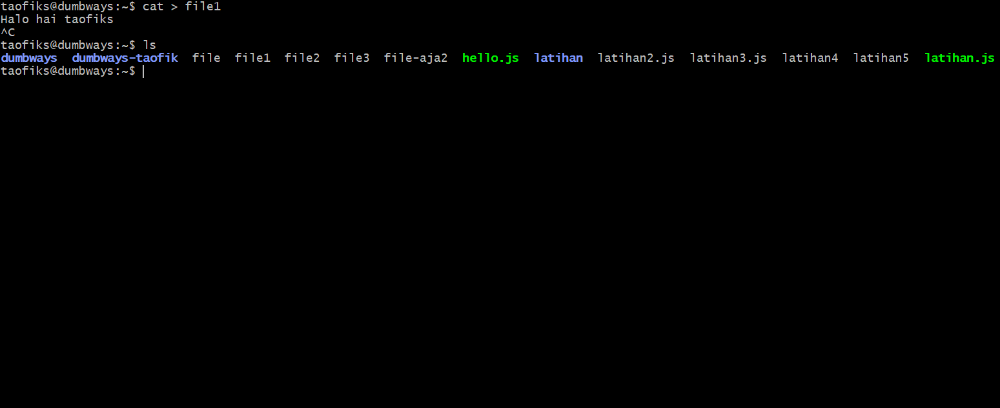

- Melihat command yang sudah digunakan

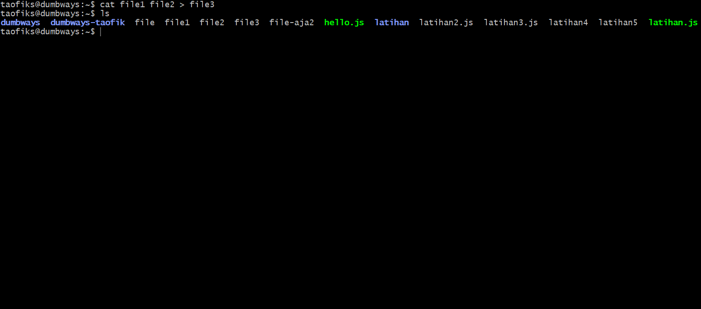

- Berpindah ke root user

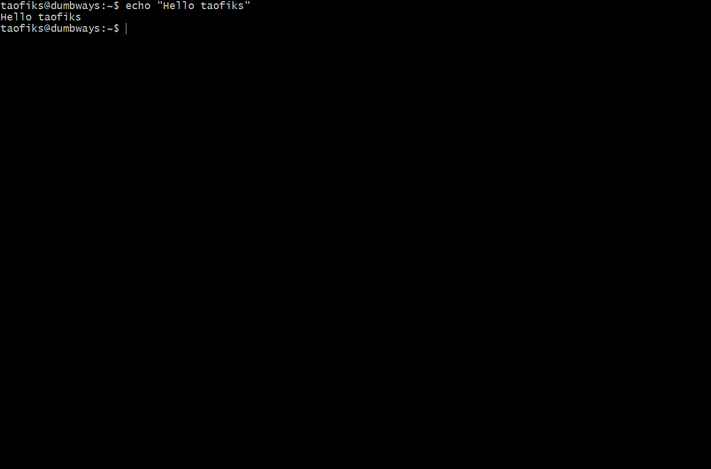
