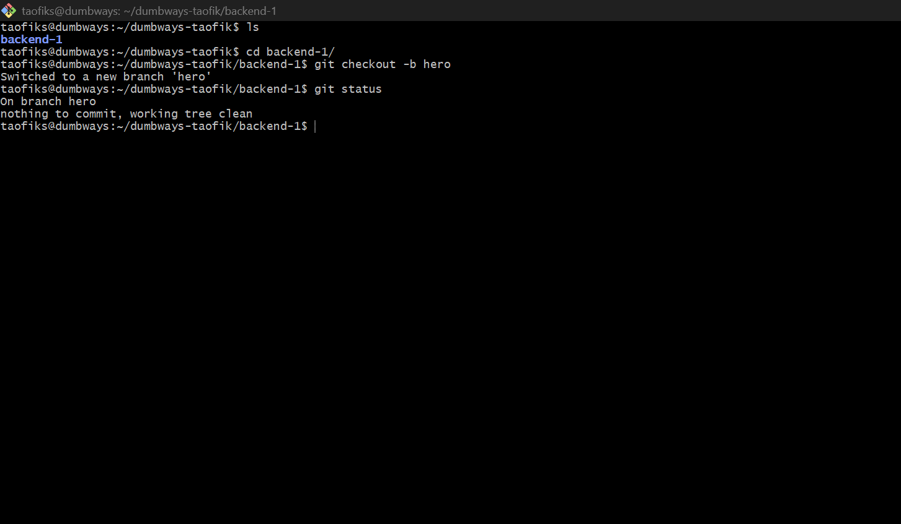
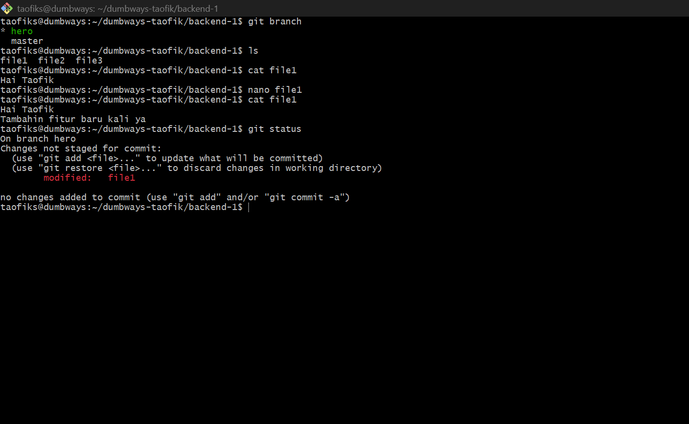

# 📘 DevOps Challenge - Day 4

- Repository dumbways-batch-23 dibuat private

- Demokan penggunaan Pull Request

## 📃 Membuat Repositori dumbways-batch-23 Menjadi Private

- Membuka repositori dumbways-batch-23
- Pilih Settings
- Muncul halaman Settings untuk repositori tersebut, scroll sampai menemukan tampilan sebagai berikut, lalu pilih Change visibility
- Change to private


- Klik I want to make this repository private


- Klik I have read and understand these effects


- Klik Make this repository private


- Masukkan password akun Github untuk konfirmasi


- Setelah berhasil maka repositori dumbways-batch-23 sudah menjadi Private


## 📝 Demonstrasi Git Pull Request

- Clone repositori dumbways-batch-23 ke direktori lokal

```
git clone git@github.com:MTC0D3/dumbways-batch-23.git backend-1
```


- Masuk ke direktori backende-1 dan buat branch baru

```
cd backend-1
```

```
git checkout -b hero
```

```
git status
```



- Buat perubahan pada salah satu file yang tersedia, misal file1

```
ls
```

```
cat file1
```

```
nano file1
```

```
cat file1
```

```
git status
```


