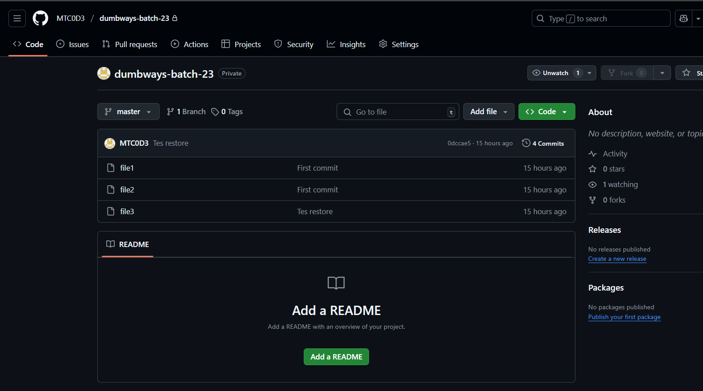

# 📘 DevOps Challenge - Day 4

- Repository dumbways-batch-23 dibuat private

- Demokan penggunaan Pull Request

## 📃 Membuat Repositori dumbways-batch-23 Menjadi Private

- Membuka repositori dumbways-batch-23
- Pilih Settings
- Muncul halaman Settings untuk repositori tersebut, scroll sampai menemukan tampilan sebagai berikut, lalu pilih Change visibility
- Change to private


- Klik I want to make this repository private


- Klik I have read and understand these effects


- Klik Make this repository private


- Masukkan password akun Github untuk konfirmasi


- Setelah berhasil maka repositori dumbways-batch-23 sudah menjadi Private



## 📝 Demonstrasi Git Pull Request

```
git push
```

**Catatan :**

- Saya telah menggunakan -u singkatan dari --set-upstream sebelumnya, artinya:
- Sudah di atur supaya next time kamu tinggal ketik git push atau git pull tanpa harus sebut nama branch lagi, karena Git udah tahu branch lokal ini terhubung ke branch master di remote origin.


