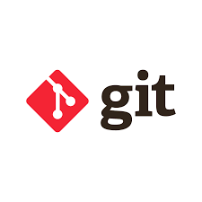

# 📘 DevOps Task - Day 4

- Penjelasan tentang git
- Buat sebuah repository bernama "dumbways-batch-23" yang berisi 3 file
- Manage repository tugas kalian (devops23-dumbways-<nama>) menggunakan terminal!

## Pengertian Git

- Git adalah satu version control system yag memiliki fitur unggulan distributed version control yang artinya penyimpanan git tidak hanya berada dalam satu tempat saja melainkan semua orang yang terlibat dalam pengkodean proyek akan menyimpan database git, sehingga akan memudahkan dalam mengelola proyek baik online atau offline.

