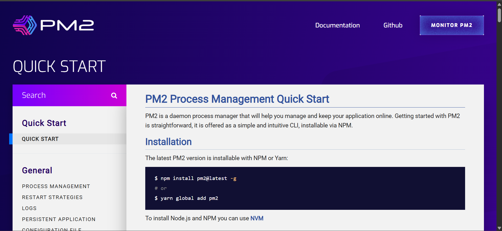
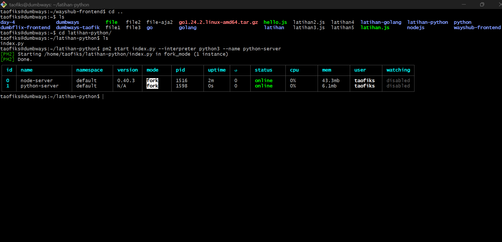
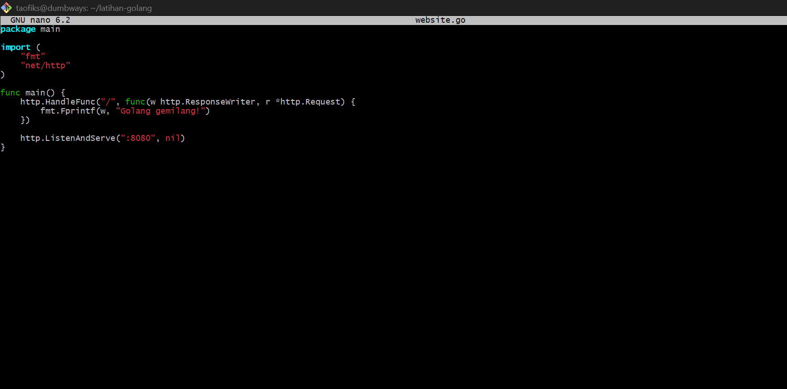

# 📘 DevOps Challenge - Day 5

1. NodeJS + Python berjalan di background (tanpa kondisi attached di terminal)

   - artinya, teman-teman tetep bisa menggunakan terminal di window yang sama namun app tetap berjalan

2. Golang bisa dibuka di browser kalian

## 📃 NodeJS + Python berjalan di background (tanpa kondisi attached di terminal)

- Kunjungi dokumentasi pm2 di link berikut

```
https://pm2.keymetrics.io/
```



- Buka project wayshub-frontend

```
cd wayshub-frontend
```


- Install pm2 dengan perintah berikut

```
nvm use 13
```

```
npm install pm2@latest -g
```


- Jalankan server NodeJS pada direktori wayshub-frontend dengan menggunakan pm2 dan namai proses ini sebagai node-server untuk dijalankan di background

```
pm2 start npm --name node-server -- start
```


- Pindah ke file server Python berada di direktori latihan-python, menjalankan server Python dengan nama proses python-server untuk dijalankan di background

```
cd latihan-python
```

```
pm2 start index.py --interpreter python3 --name python-server
```



- Hasil dari eksekusi server NodeJS dan Python adalah sebagai berikut, kedua server dapat berjalan di background

```
192.168.100.104:3000
```

```
192.168.100.104:5000
```


## ⚔️ Golang Bisa Dibuka di Browser

- Kunjungi dokumentasi resmi golang

```
https://gowebexamples.com/hello-world/
```


- Masuk direktori latihan-golang, kemudian membuat file bernama website.go

```
nano website.go
```

- Masukkan snippet kode berikut

```
package main

import (
    "fmt"
    "net/http"
)

func main() {
    http.HandleFunc("/", func(w http.ResponseWriter, r *http.Request) {
        fmt.Fprintf(w, "Golang gemilang!")
    })

    http.ListenAndServe(":8080", nil)
}
```



- Cek apakah port yang akan digunakan sudah di izinkan

```
sudo ufw status
```

- Jika belum maka izinkan port dengan command berikut

```
sudo ufw allow 8080
```

- Kemudian, jalankan script dengan perintah

```
go run website.go
```


- Akses URL [ip address]:8080 di browser

```
192.168.100.104:8080
```


