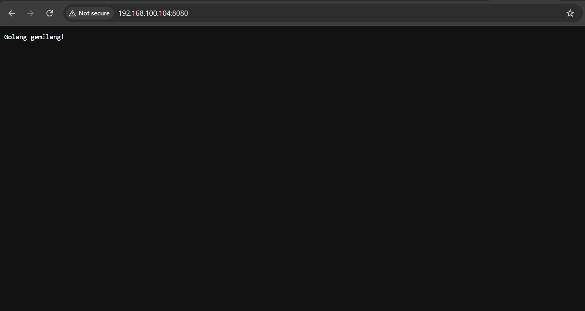
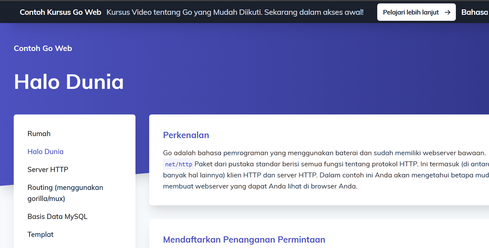
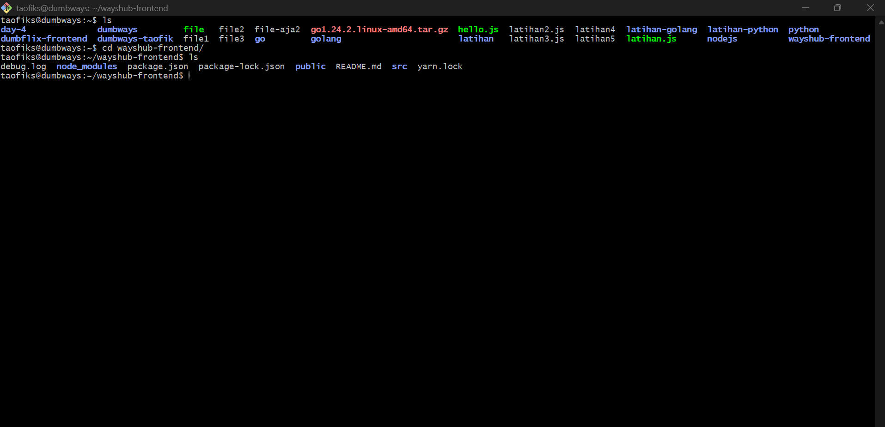
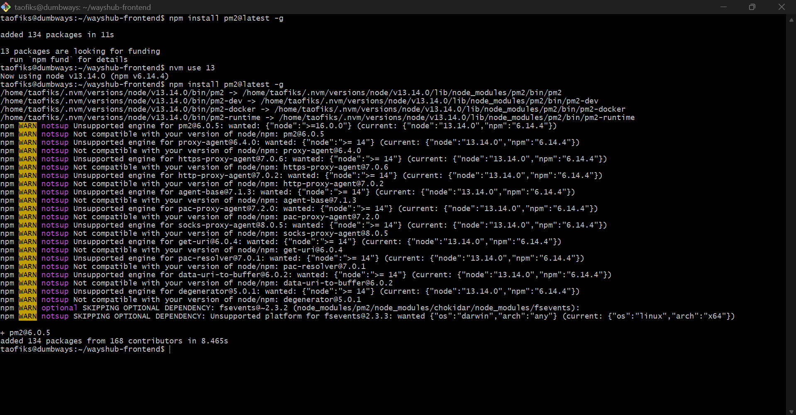
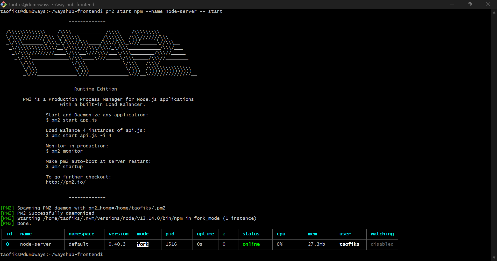
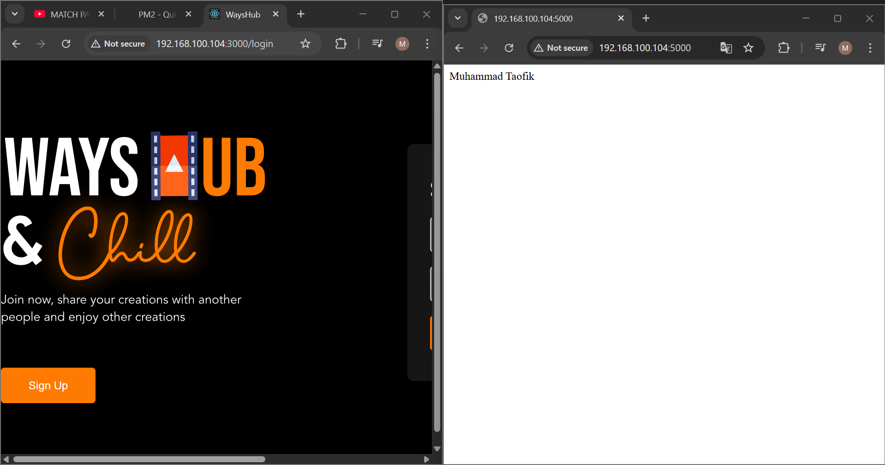

# 📘 DevOps Task - Day 5

1. NodeJS + Python berjalan di background (tanpa kondisi attached di terminal)

   - artinya, teman-teman tetep bisa menggunakan terminal di window yang sama namun app tetap berjalan

2. Golang bisa dibuka di browser kalian

## 📃 Deploy NodeJS di Ubuntu

- Install NodeJS dan download nvm melalui script bash berikut (URL Script):

```
curl -o- https://raw.githubusercontent.com/nvm-sh/nvm/v0.40.3/install.sh | bash
```


- Refresh bash dengan kode berikut

```
exec bash
```


- Clone repository wayshub-frontend

```
git clone git@github.com:dumbwaysdev/wayshub-frontend.git
```



- Cek versi NodeJS, nvm, dan npm. Install Node 13 yang sesuai dengan project wayshub-frontend

```
cd wayshub-frontend
```

```
ls
```

```
node -v && nvm current && nvm -v
```

```
nvm install 13
```

```
node -v && nvm current && nvm -v
```



- Jalankan server dengan perintah berikut

```
npm start
```


**Catatan :** node_module belum ada, sehingga perlu menginstal beberapa modules terlebih dahulu.

- Install modules

```
npm install
```



- Setelah instal modules jalankan kembali server nya

```
npm start
```



- Buka di browser dengan alamat [ip address]:3000

```
192.168.100.104:3000
```



## 📝 Deploy Python Flask di Ubuntu

- Cek paket python dan versi nya

```
pyhton3 -V
```


**Catatan :** Biasanya python sudah terinstall di ubuntu server

- Install pip sebagai package manager dari Python

```
sudo apt install python3-pip
```

```
pip -V
```



- Install framework Flask yang digunakan untuk membuat aplikasi web pada Python

```
pip install flask
```

- Memastikan Flask sudah terinstal

```
pip list
```


- Buat folder agar pengerjaan rapih (opsional)

```
mkdir latihan-python
```

```
cd latihan-python
```


- Buat sebuah file script python dengan nama index.py

```
nano index.py
```

- Masukkan snippet kode berikut

```
from flask import Flask

app = Flask(__name__)

@app.route('/')
def index():
    return 'Muhammad Taofik'

app.run(host='0.0.0.0', port=5000)
```


- Cek apakah port yang akan digunakan sudah di izinkan

```
sudo ufw status
```


- Jika belum maka izinkan port dengan command berikut

```
sudo ufw allow 5000
```

- Kemudian, jalankan server dengan mengeksekusi command berikut

```
python3 index.py
```


- Akses URL [ip address]:5000 di browser

```
192.168.100.104:5000
```


## ⚔️ Golang Bisa Dibuka di Browser

- Kunjungi dokumentasi resmi golang

```
https://gowebexamples.com/hello-world/
```


- Masuk direktori latihan-golang, kemudian membuat file bernama website.go

```
nano website.go
```

- Masukkan snippet kode berikut

```
package main

import (
    "fmt"
    "net/http"
)

func main() {
    http.HandleFunc("/", func(w http.ResponseWriter, r *http.Request) {
        fmt.Fprintf(w, "Golang gemilang!")
    })

    http.ListenAndServe(":8080", nil)
}
```


- Kemudian, jalankan script dengan perintah

```
go run website.go
```


- Akses URL [ip address]:8080 di browser


