# 📘 DevOps Task - Day 5

### NodeJS

- Deploy app wayshub-frontend
- Berjalan di port 3000
- Menggunakan NodeJS 13

### Python

- Deploy app menampilkan text nama kalian!
- Berjalan di port 5000 & bisa dibuka melalui web

### Golang

- Deploy app menampilkan text "Golang geming!"

Note : Semua app bisa diakses dengan UFW enabled (firewall menyala abangkuh 🔥🔥🔥)

## 📃 Deploy NodeJS di Ubuntu

- Install NodeJS dan download nvm melalui script bash berikut (URL Script):

```
curl -o- https://raw.githubusercontent.com/nvm-sh/nvm/v0.40.3/install.sh | bash
```


- Refresh bash dengan kode berikut

```
exec bash
```


- Clone repository wayshub-frontend

```
git clone git@github.com:dumbwaysdev/wayshub-frontend.git
```


- Cek versi NodeJS, nvm, dan npm. Install Node 13 yang sesuai dengan project wayshub-frontend

```
cd wayshub-frontend
```

```
ls
```

```
node -v && nvm current && nvm -v
```

```
nvm install 13
```

```
node -v && nvm current && nvm -v
```


- Jalankan server dengan perintah berikut

```
npm start
```


**Catatan :** node_module belum ada, sehingga perlu menginstal beberapa modules terlebih dahulu.

- Install modules

```
npm install
```


- Setelah instal modules jalankan kembali server nya

```
npm start
```


- Buka di browser dengan alamat [ip address]:3000

```
192.168.100.104:3000
```


## 📝 Deploy Python Flask di Ubuntu

- Cek paket python dan versi nya

```
pyhton3 -V
```


**Catatan :** Biasanya python sudah terinstall di ubuntu server

- Install pip sebagai package manager dari Python

```
sudo apt install python3-pip
```

```
pip -V
```

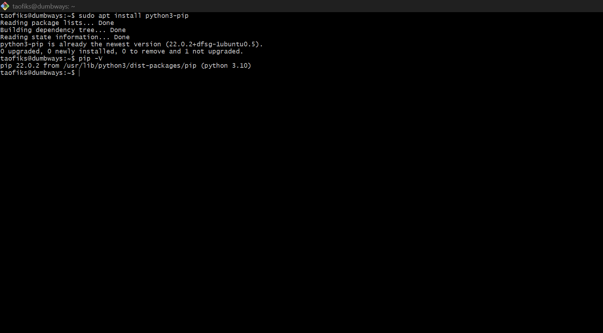

- Install framework Flask yang digunakan untuk membuat aplikasi web pada Python

```
pip install flask
```

- Memastikan Flask sudah terinstal

```
pip list
```

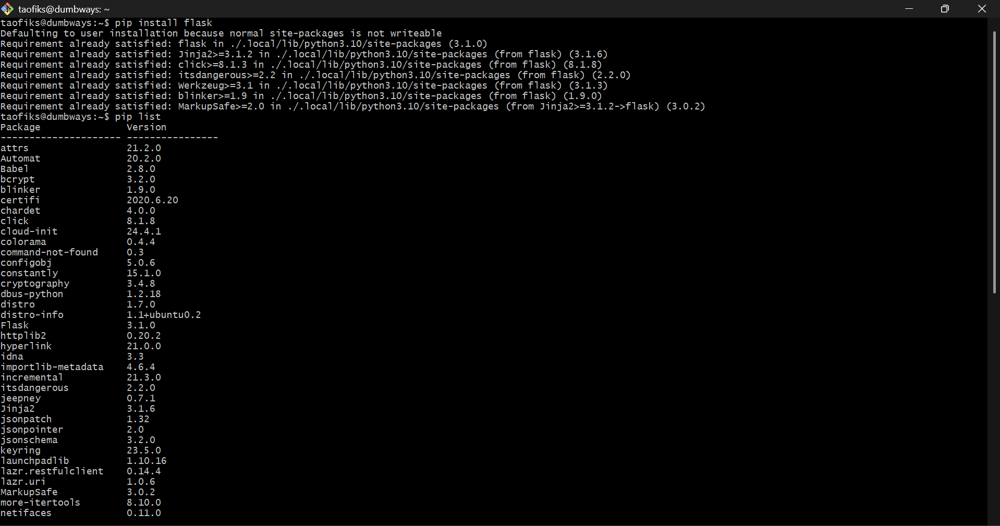

- Buat folder agar pengerjaan rapih (opsional)

```
mkdir latihan-python
```

```
cd latihan-python
```

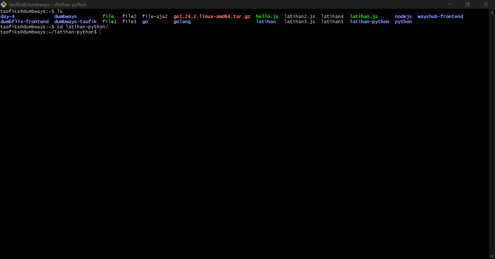

- Buat sebuah file script python dengan nama index.py

```
nano index.py
```

- Masukkan snippet kode berikut

```
from flask import Flask

app = Flask(__name__)

@app.route('/')
def index():
    return 'Muhammad Taofik'

app.run(host='0.0.0.0', port=5000)
```

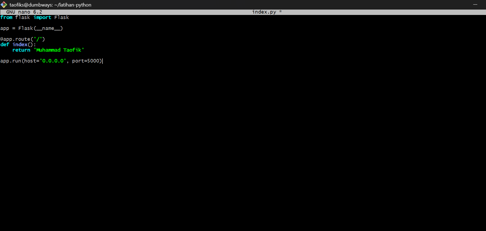

- Cek apakah port yang akan digunakan sudah di izinkan

```
sudo ufw status
```

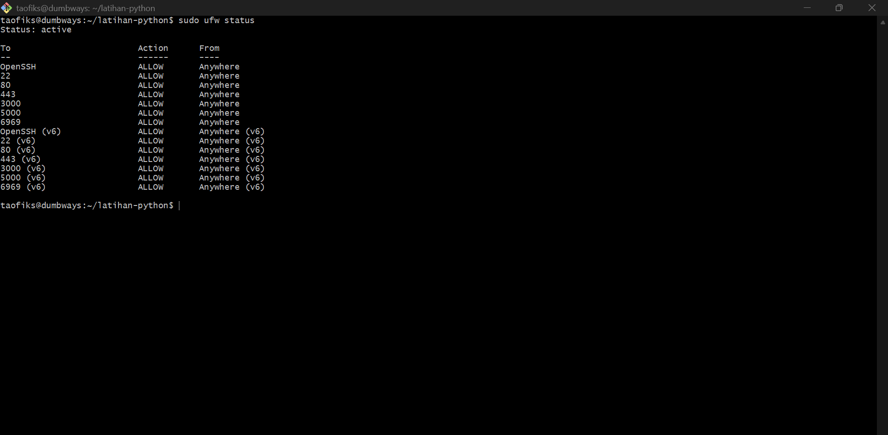

- Jika belum maka izinkan port dengan command berikut

```
sudo ufw allow 5000
```

- Kemudian, jalankan server dengan mengeksekusi command berikut

```
python3 index.py
```

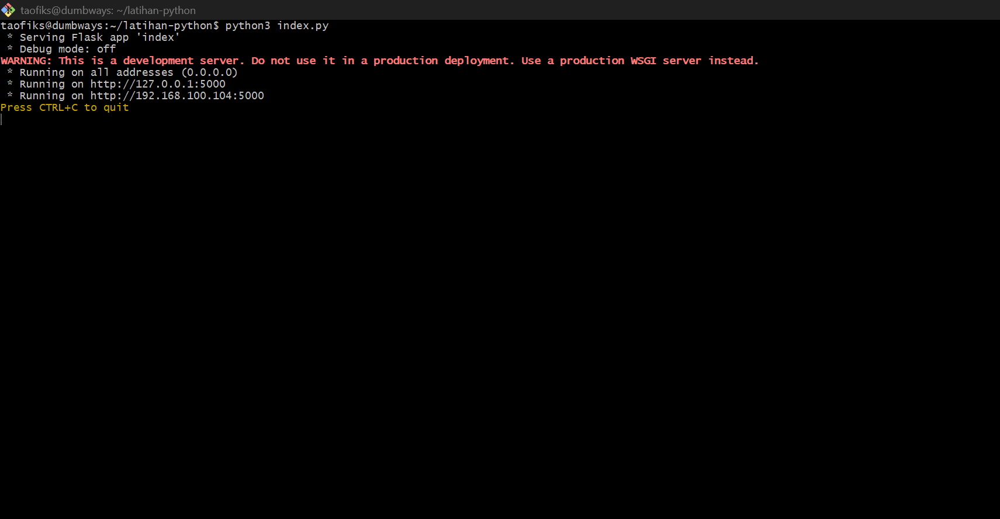

- Akses URL [ip address]:5000 di browser

```
192.168.100.104:5000
```

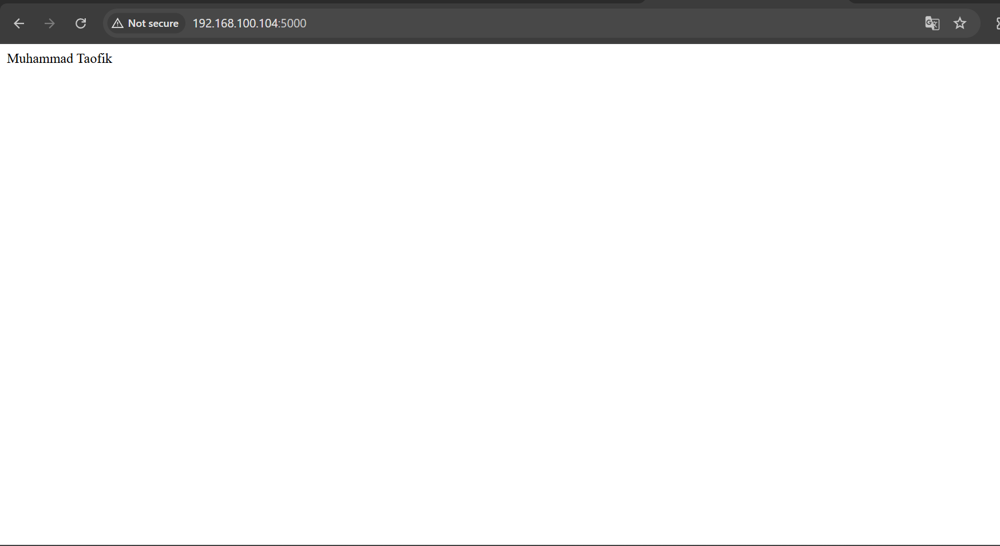

## ⚔️ Deploy app menampilkan text "Golang geming!"

- Buat direktori latihan-golang dan pindah ke direktori tersebut

```
mkdir latihan-golang
```

```
cd latihan-golang
```

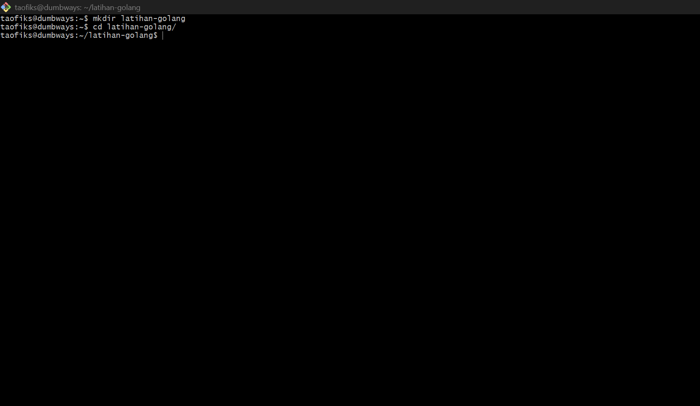

- Unduh instalasi Golang dari link ini

```
wget https://go.dev/dl/go1.24.2.linux-amd64.tar.gz
```

```
ls
```

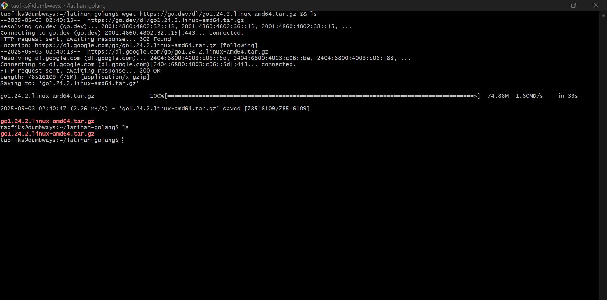

- Masuk ke mode root untuk mengupgrade Golang secara manual dengan command berikut

```
sudo su
```

```
rm -rf /usr/local/go && tar -C /usr/local -xzf go1.24.2.linux-amd64.tar.gz
```

```
exit
```

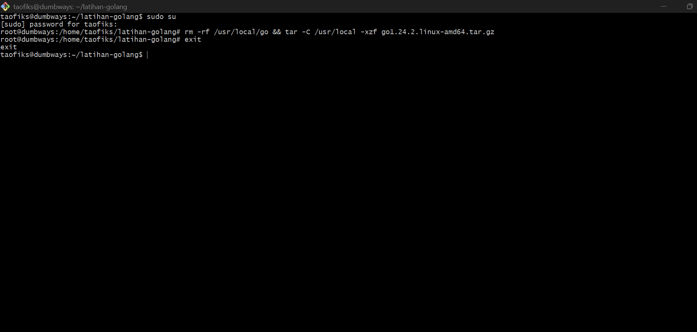

- Menambahkan direktori /usr/local/go/bin ke dalam variabel lingkungan PATH

```
export PATH=$PATH:/usr/local/go/bin
```

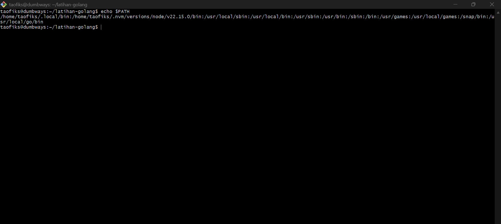

- Cek apakah Golang sukses di instal dengan memeriksa versinya

```
go version
```

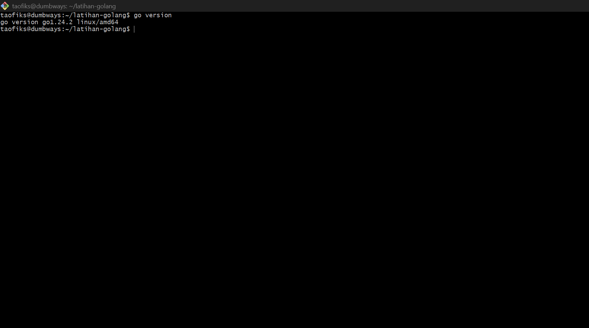

- Buat file script bernama index.go

```
nano index.go
```

- Masukkan snippet kode berikut

```
package main

import (
        "fmt"
)

func main() {
        fmt.Println("Golang geming!")
}
```

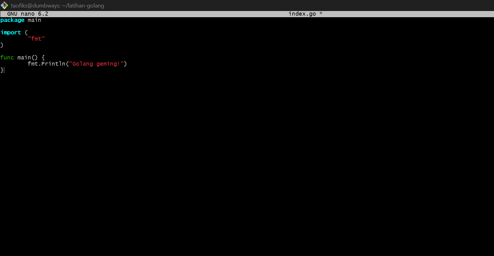

- Jalankan script Golang dengan command berikut

```
go run index.go
```

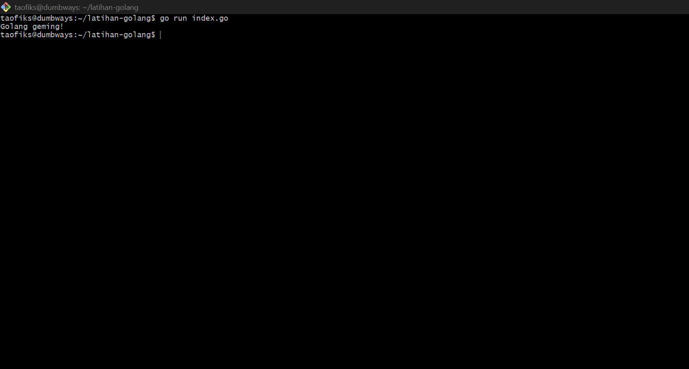
