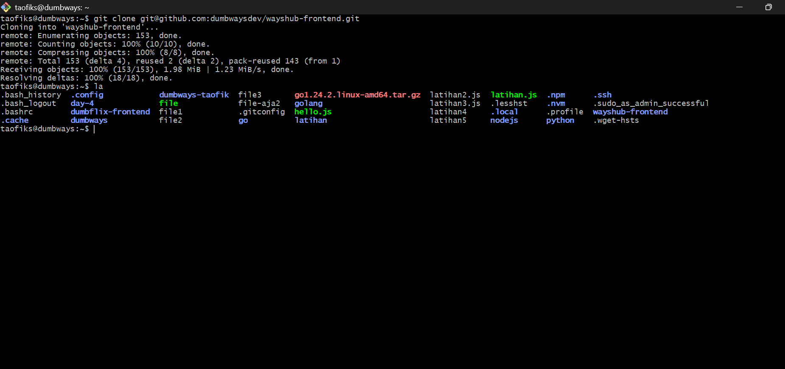

# 📘 DevOps Task - Day 5

### NodeJS

- Deploy app wayshub-frontend
- Berjalan di port 3000
- Menggunakan NodeJS 13

### Python

- Deploy app menampilkan text nama kalian!
- Berjalan di port 5000 & bisa dibuka melalui web

### Golang

- Deploy app menampilkan text "Golang geming!"

Note : Semua app bisa diakses dengan UFW enabled (firewall menyala abangkuh 🔥🔥🔥)

## 📃 Deploy NodeJS di Ubuntu

- Install NodeJS dan download nvm melalui script bash berikut (URL Script):

```
curl -o- https://raw.githubusercontent.com/nvm-sh/nvm/v0.40.3/install.sh | bash
```


- Refresh bash dengan kode berikut

```
exec bash
```


- Clone repository wayshub-frontend

```
git clone git@github.com:dumbwaysdev/wayshub-frontend.git
```



- Cek versi NodeJS, nvm, dan npm. Install Node 13 yang sesuai dengan project wayshub-frontend

```
cd wayshub-frontend
```

```
ls
```

```
node -v && nvm current && nvm -v
```

```
nvm install 13
```

```
node -v && nvm current && nvm -v
```


- Jalankan server dengan perintah berikut

```
npm start
```


**Catatan :** node_module belum ada, sehingga perlu menginstal beberapa modules terlebih dahulu.

- Install modules

```
npm install
```


- Setelah instal modules jalankan kembali server nya

```
npm start
```


- Buka di browser dengan alamat [ip address]:3000

```
192.168.100.104:3000
```


## 📝 Membuat Repositori Github dan push ke Repositori

### 1. Konfigurasi username dan email untuk akun Github

- Gunakan perintah berikut untuk melakukan konfigurasi

```
git config --global user.name <username>
git config --global user.email "<email>"
git config --list
```


### 2. Cek apakah Public Key dan Private Key sudah ada

- Lakukan pengecekan apakah public key dan private key sudah ada dengan perintah berikut

```
cd .ssh
ls
```


### 3. Buat pasangan Public Key dan Private Key (Jika belum ada)

- Buatlah pasangan public key dan private key jika belum ada dengan perintah berikut

```
ssh-keygen
```

### 4. Salin Public key

- Tampilkan isi file id_rsa.pub dan salin dengan perintah berikut

```
cat id_rsa.pub
```


### 5. Konfigurasi di github

- Masuk ke menu settings pilih tab SSH and GPG keys


- Pilih new SSH kemudian masukan title dan masukan public key di form key kemudian klik add SSH key


- Github akan mengonfirmasi dengan meminta password login akun Github, mengisi password dan tekan Confirm

- Maka SSH Key berhasil ditambahkan ke akun Github

- Uji koneksi dari terminal SSH ke server Github dengan perintah berikut

```
ssh git@github.com -T
```

Jika muncul pesan seperti berikut maka koneksi berhasil


### 6. Buat direktori dan beberapa file (Opsional)

- Buatlah sebuah direktori dan beberapa file dengan perintah berikut

```
mkdir day-4
cd day-4
echo "Hai Taofik" > file1
"Semangat yaa" > file2
echo "Bisa koo" > file3
ls
```


### 7. Buat repositori lokal baru dengan nama "dumbways-batch-23"

- Gunakan perintah berikut untuk membuat repositori lokal

```
git init dumbways-batch-23
```


### 8. Pindahkan file1, file2, dan file3 ke direktori "dumbways-batch-23"

- Gunakan perintah berikut untuk memindahkan file

```
mv file1 dumbways-batch-23
mv file2 dumbways-batch-23
mv file3 dumbways-batch-23
```


### 9. Membuat .gitignore untuk menyimpan file atau direktori yang akan diabaikan git

- Buat file .gitignore dengan perintah berikut

```
nano .gitignore
```


### 10. Menambahkan perubahan repositori ke staging index

- Gunakan perintah berikut untuk menambahkan perubahan repo kita ke staging index

```
git add .
git status
```


### 11. Melakukan commit dan memberikan pesan "First commit"

- Gunakan perintah berikut untuk menyimpan projek ke repo lokal dan menambahkan pesan

```
git commit -m "First commit"
```


### 12. Restore repositori

- Jika ingin mengembalikan atau merubah isi file sebelum di commit sesuai dengan sebelumnya gunakan git restore

```
git restore file1
```


### 13. Buat repositori baru di Github

- Buat repositori dengan nama yang sama seperti di repo lokal yaitu "dumbways-batch-23"


### 14. Menghubungkan repo Github dengan repo lokal

- Remote sesuai link dan pastikan memilih SSH di atas sebab perubahan akan dikirim ke repositori Github menggunakan command SSH

```
git remote add origin git@github.com:MTC0D3/dumbways-batch-23.git
```


- Jika ingin mengganti branch yang tersedia, dapat menggunakan command berikut:

```
git branch -M <branch>
```


### 15. Mengirim perubahan ke repositori Github

- Gunakan perintah berikut untuk mengirim perubahan

```
git push -u origin master
```


### 16. Maka sudah terjadi perubahan di repositori Github "dumbways-batch-23"


## ⚔️ Manage repository menggunakan terminal

### The Three States

- Git memiliki tiga state terhadap file kita: modified, staged dan committed
- Modified artinya kita mengubah (menambah, mengedit, menghapus) file, namun belum disimpan secara permanen ke repository
- Staged artinya kita menandai modifikasi yang kita lakukan terhadap file akan disimpan secara permanen ke repository
- Committed artinya data sudah aman disimpan di repository

### 1. Memeriksa status dari repositori lokal

- Gunakan perintah berikut untuk melihat statusnya

```
git status
```


### 2. Menambahkan perubahan repositori ke staging index

- Gunakan perintah berikut untuk menambahkan ke staging index

```
git add .
```


### 3. Melakukan commit dan memberikan pesan

- Gunakan perintah berikut untuk melakukan commit

```
git commit -m "Update Readme.md task day-4"
```


### 4. Mengirim perubahan ke repositori Github

- Gunakan perintah berikut untuk mengirim perubahan

```
git push
```

**Catatan :**

- Saya telah menggunakan -u singkatan dari --set-upstream sebelumnya, artinya:
- Sudah di atur supaya next time kamu tinggal ketik git push atau git pull tanpa harus sebut nama branch lagi, karena Git udah tahu branch lokal ini terhubung ke branch master di remote origin.


