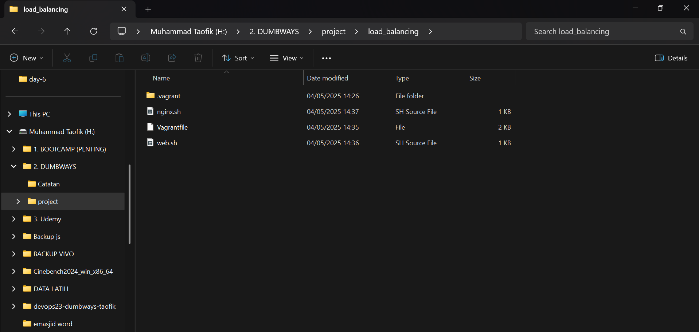
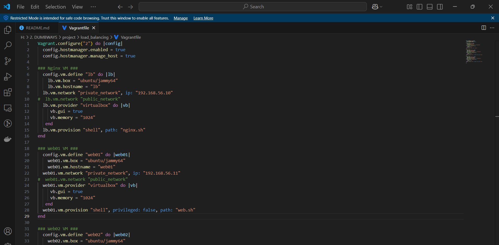
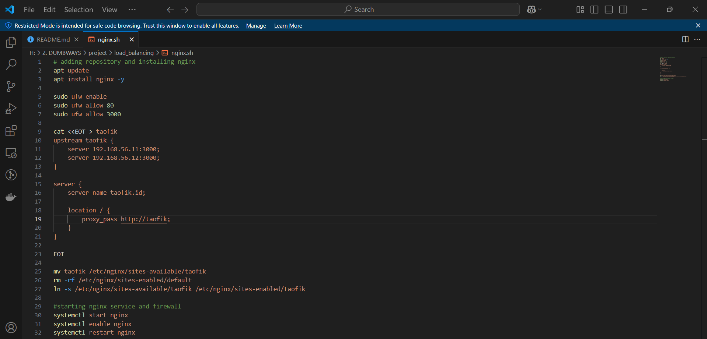
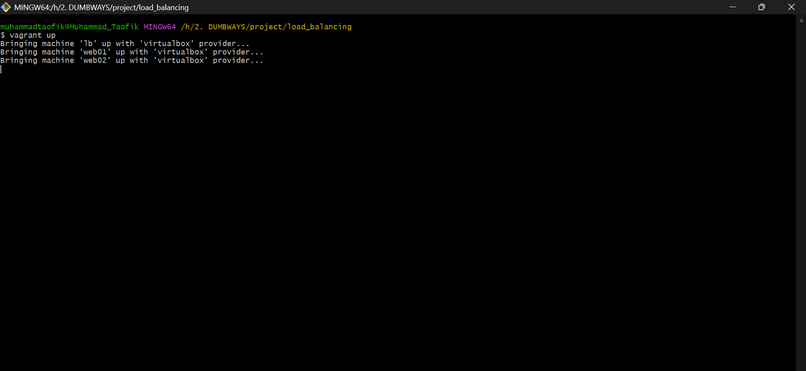
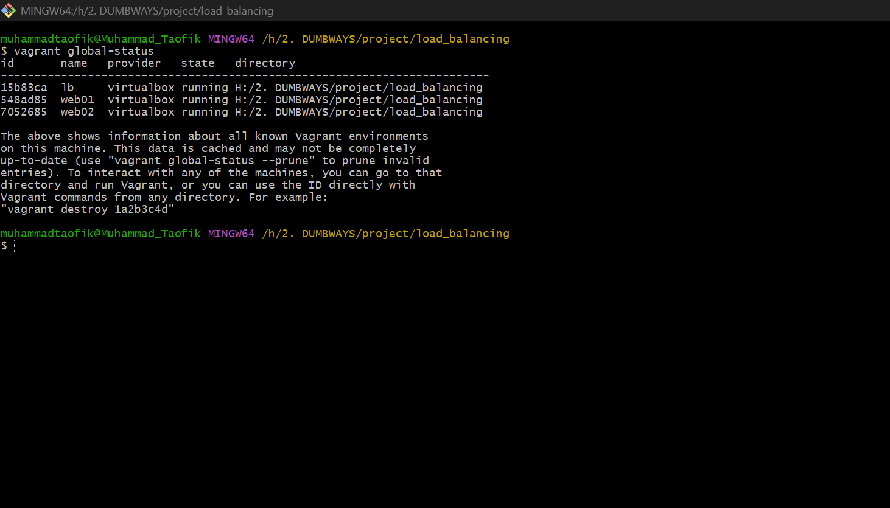
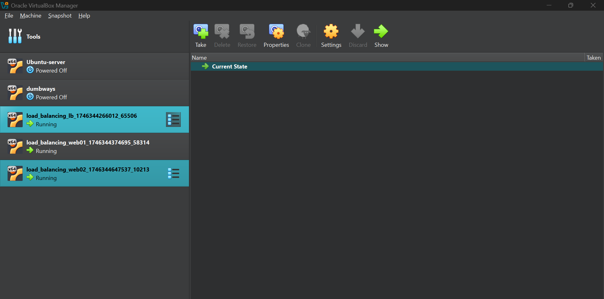
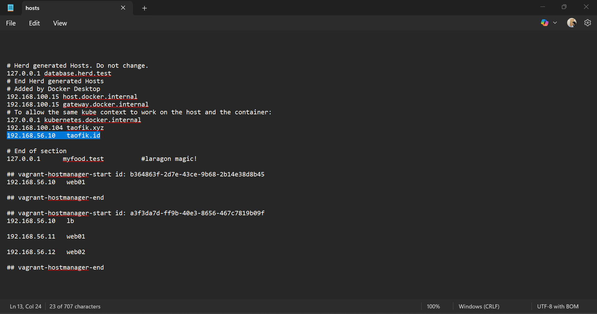
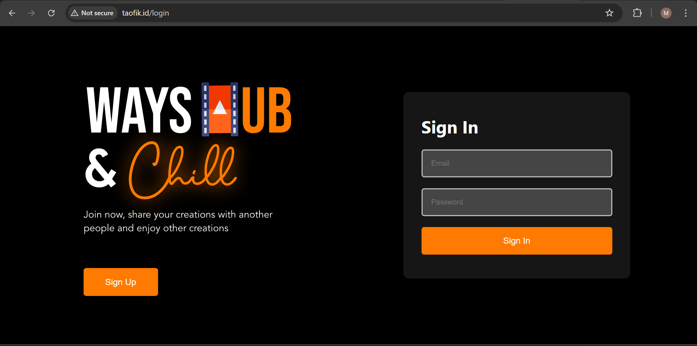
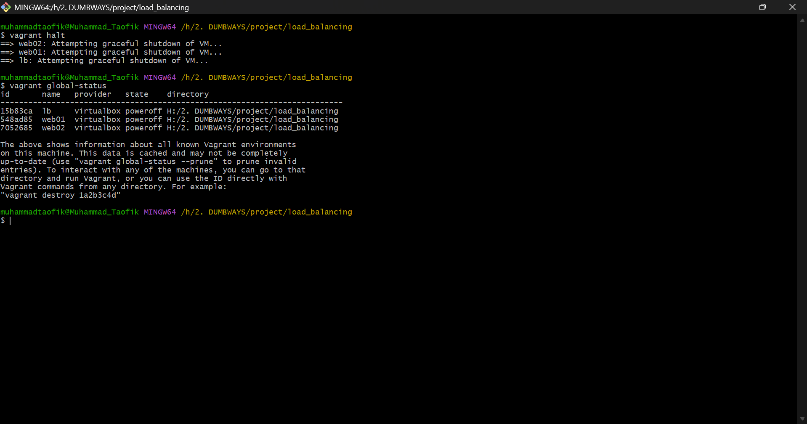

# 📘 DevOps Challenge - Day 6

- Implementasikan load balancing kepada aplikasi wayshub yang telah kalian gunakan. (Gunakan 2 server)

## 📃 Implementasikan load balancing kepada aplikasi wayshub yang telah kalian gunakan

- Oke kali ini saya akan gunakan pendekatan yang berbeda, saya akan menggunakan Infrastructure as Code (IaC) dengan bantuan vagrant.

### Apa itu vagrant ?

- Vagrant adalah sebuah alat (tool) yang digunakan untuk mengelola mesin virtual (virtual machine) dengan cara yang mudah, konsisten, dan otomatis.

- Vagrant membantu developer membuat lingkungan pengembangan (development environment) yang sama di semua komputer, tanpa harus mengatur semuanya secara manual. Ia bekerja di atas software virtualisasi seperti VirtualBox atau VMware dan menggunakan file konfigurasi bernama Vagrantfile.

```
https://developer.hashicorp.com/vagrant
```

### 1. Installasi vagrant

- Pertama kita harus membuat Vagranfile yang akan digunakan sebagai konfigurasi vm nya

```
vagrant init
```



### 2. Buka Vagranfile lalu masukan snippet kode

- Untuk mulai menggunakan IaC harus terlebih dahulu memahami semua hal secara manual

```
# Mengatur versi konfigurasi Vagrant yang digunakan (versi 2)
Vagrant.configure("2") do |config|

  # Mengaktifkan plugin 'vagrant-hostmanager' agar Vagrant mengelola file /etc/hosts
  config.hostmanager.enabled = true
  # Memungkinkan Vagrant untuk mengelola /etc/hosts pada mesin host (bukan hanya guest)
  config.hostmanager.manage_host = true

  ### Konfigurasi VM untuk Load Balancer (Nginx) ###
  config.vm.define "lb" do |lb|
    # Menentukan box (template OS) yang digunakan, yaitu Ubuntu 22.04 (jammy)
    lb.vm.box = "ubuntu/jammy64"
    # Menetapkan hostname untuk VM ini sebagai "lb"
    lb.vm.hostname = "lb"
    # Mengatur IP jaringan privat untuk VM ini
    lb.vm.network "private_network", ip: "192.168.56.10"

    # Pengaturan provider VirtualBox untuk VM ini
    lb.vm.provider "virtualbox" do |vb|
      # Mengaktifkan GUI saat VM dijalankan
      vb.gui = true
      # Menetapkan alokasi memori RAM sebesar 1024MB
      vb.memory = "1024"
    end

    # Menjalankan skrip provisioning untuk menginstal dan mengatur Nginx
    lb.vm.provision "shell", path: "nginx.sh"
  end

  ### Konfigurasi VM untuk Web Server 1 ###
  config.vm.define "web01" do |web01|
    # Menggunakan box Ubuntu 22.04
    web01.vm.box = "ubuntu/jammy64"
    # Menetapkan hostname menjadi "web01"
    web01.vm.hostname = "web01"
    # Mengatur IP jaringan privat
    web01.vm.network "private_network", ip: "192.168.56.11"

    # Konfigurasi VirtualBox
    web01.vm.provider "virtualbox" do |vb|
      # Aktifkan GUI
      vb.gui = true
      # Alokasi memori RAM sebesar 1024MB
      vb.memory = "1024"
    end

    # Provisioning menggunakan skrip shell 'web.sh' (tanpa hak akses root)
    web01.vm.provision "shell", privileged: false, path: "web.sh"
  end

  ### Konfigurasi VM untuk Web Server 2 ###
  config.vm.define "web02" do |web02|
    # Menggunakan box Ubuntu 22.04
    web02.vm.box = "ubuntu/jammy64"
    # Hostname ditetapkan sebagai "web02"
    web02.vm.hostname = "web02"
    # IP jaringan privat
    web02.vm.network "private_network", ip: "192.168.56.12"

    # Konfigurasi VirtualBox
    web02.vm.provider "virtualbox" do |vb|
      # Menampilkan GUI saat boot
      vb.gui = true
      # RAM dialokasikan sebesar 1024MB
      vb.memory = "1024"
    end

    # Menjalankan skrip provisioning yang sama seperti web01
    web02.vm.provision "shell", privileged: false, path: "web.sh"
  end

end

```



### 3. Buat file provisioning terpisah sesuai script diatas

- Provisioning adalah proses otomatis untuk menyiapkan dan mengonfigurasi lingkungan pada mesin virtual (VM) setelah VM selesai dibuat oleh Vagrant.

| file       | Fungsi                          |
| ---------- | ------------------------------- |
| `nginx.sh` | Konfigurasi untuk load balanced |
| `web.sh`   | Konfigurasi untuk aplikasi      |

### 4. Buka file untuk load balanced masukan snippet kode berikut

- Konfigurasi ini tidak jauh berbeda saat menggunakan versi manual

```
# Memperbarui daftar paket dari repository Ubuntu
apt update

# Menginstal web server nginx tanpa perlu konfirmasi (-y)
apt install nginx -y

# Mengaktifkan firewall UFW
sudo ufw enable

# Membuka akses ke port 80 (HTTP)
sudo ufw allow 80

# Membuka akses ke port 3000 (biasanya digunakan oleh web app seperti Node.js)
sudo ufw allow 3000

# Membuat file konfigurasi nginx bernama 'taofik' menggunakan heredoc
cat <<EOT > taofik
# Mendefinisikan grup server backend (load balancer) dengan dua node di port 3000
upstream taofik {
    server 192.168.56.11:3000;
    server 192.168.56.12:3000;
}

# Konfigurasi virtual host nginx
server {
    # Nama server/domain virtual (tidak perlu domain asli)
    server_name taofik.id;

    # Semua request ke / akan diarahkan (proxy) ke upstream taofik
    location / {
        proxy_pass http://taofik;
    }
}
EOT

# Memindahkan file konfigurasi ke direktori sites-available milik nginx
mv taofik /etc/nginx/sites-available/taofik

# Menghapus konfigurasi default yang aktif (opsional tapi umum dilakukan)
rm -rf /etc/nginx/sites-enabled/default

# Membuat symbolic link dari sites-available ke sites-enabled agar konfigurasi aktif
ln -s /etc/nginx/sites-available/taofik /etc/nginx/sites-enabled/taofik

# Memulai layanan nginx
systemctl start nginx

# Mengatur agar nginx otomatis berjalan saat boot
systemctl enable nginx

# Me-restart nginx untuk menerapkan konfigurasi baru
systemctl restart nginx
```



### 5. Buka file untuk aplikasi masukan snippet kode berikut

- Konfigurasi ini tidak jauh berbeda saat menggunakan versi manual

```
#!/bin/bash

# Memperbarui daftar paket
sudo apt update

# Mengaktifkan firewall dan membuka port 3000
sudo ufw enable
sudo ufw allow 3000

# Mengunduh dan menginstal NVM (Node Version Manager)
curl -o- https://raw.githubusercontent.com/nvm-sh/nvm/v0.40.3/install.sh | bash

# Memuat NVM ke shell saat ini
export NVM_DIR="$HOME/.nvm"
source "$NVM_DIR/nvm.sh"

# Menginstal Node.js versi 13 menggunakan NVM
nvm install 13

# Mengatur agar Node.js versi 13 yang digunakan
nvm use 13

# Mengkloning repositori aplikasi frontend dari GitHub
git clone https://github.com/dumbwaysdev/wayshub-frontend.git

# Masuk ke direktori proyek
cd wayshub-frontend

# Menginstal semua dependency Node.js dari file package.json
npm install

# Menginstal PM2 secara global, sebuah process manager untuk Node.js
npm install pm2@latest -g

# Menjalankan aplikasi menggunakan PM2 dan memberi nama proses "node-server"
pm2 start npm --name node-server -- start
```

### 6. Menjalankan Vagranfile

- Saat kita sudah selesai menyiapkan semua code untuk infrastruktur nya saat nya kita jalankan

- Pertama wajib ada di path dimana Vagrantfile nya berada, lalu buka terminal gunakan perintah berikut untuk menjalankan

- Tunggu installasi sampai selesai memang membutuhkan waktu lumayan lama

```
vagrant up
```



### 7. Cek VM yang sedang berjalan

- Setelah selesai menejalankan semua installasi, gunakan command berikut untuk melihat VM yang berjalan dan samakan dengan yang ada di virtual box

```
vagrant global-status
```





### 8. Buat Reverse Proxy untuk aplilkasi yang sudah di deploy

- Buka direktori windows

```
C:\Windows\System32\drivers\etc
```

- Daftarkan ip dari vm yang digunakan sebagai load balanced

- Edit hosts dengan notepad++ sebagai admin

```
192.168.56.10	taofik.id
```



### 9. Cek di browser menggunakan domain yang sudah di buat



### 10. Berhentikan VM yang berjalan

```
vagrant halt
```

```
vagrant global status
```



### 11. Menghapus VM yang sudah dibuat

```
vagrant destroy --force
```

```
vagrant global-status --prune
```
