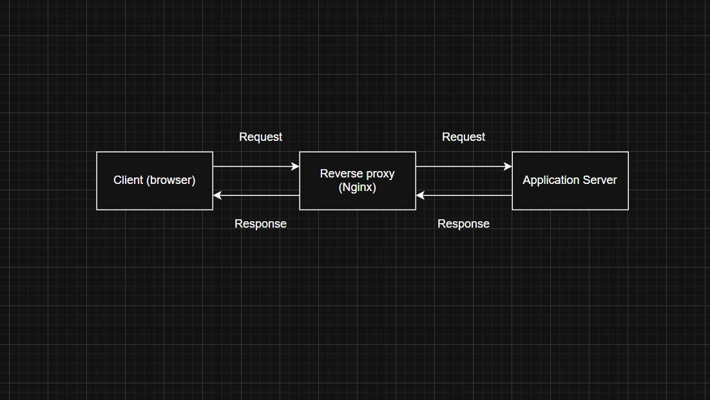
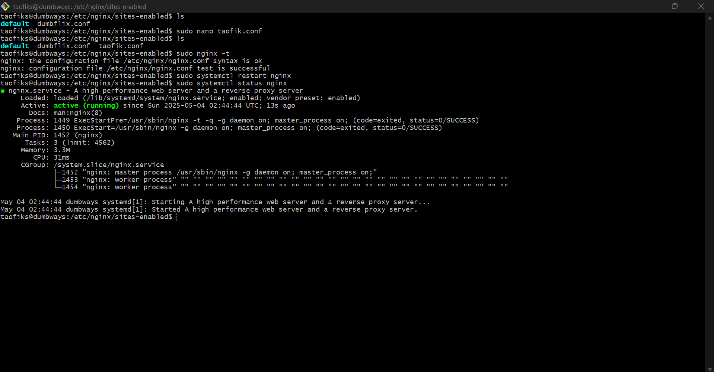

# 📘 DevOps Task - Day 6

- Gambarkan sturktur web server menggunakan reverse proxy dan jelaskan cara kerjanya!

- Buatlah Reverse Proxy untuk aplilkasi yang sudah kalian deploy kemarin. (wayshub), untuk domain nya sesuaikan nama masing" ex: alvin.xyz .

## 📃 Gambarkan sturktur web server menggunakan reverse proxy dan jelaskan cara kerjanya!



### Apa itu reverse proxy ?

- Simpelnya Reverse proxy adalah perantara antara pengguna dan server aplikasi. Ia menerima permintaan dari pengguna, meneruskannya ke server sebenarnya, lalu mengembalikan hasilnya ke pengguna seolah-olah dialah servernya.

### Cara kerja

1. Client membuat permintaan

- Pengguna (misalnya lewat browser) mengakses suatu domain, contohnya buka taofik.xyz di browser

2. Permintaan diterima oleh reverse proxy

- Reverse proxy (seperti Nginx atau Apache) menerima permintaan ini terlebih dahulu bukan langsung ke server aplikasi

3. Reverse proxy meneruskan ke server internal

- Reverse proxy melihat permintaan itu, lalu meneruskannya ke server aplikasi yang sesuai, misalnya ke localhost:3000 atau localhost:5000

4. Server aplikasi memproses permintaan

- Server aplikasi memproses permintaan (misalnya generate halaman web atau ambil data dari database), lalu memberikan responsnya kembali ke reverse proxy

5. Reverse proxy mengembalikan hasil ke client

- Reverse proxy menerima respons dari server aplikasi, lalu mengirimkannya ke pengguna (browser).

**Catatan:** Jadi, client tidak tahu bahwa ada server lain di balik reverse proxy semuanya tampak seperti dari satu alamat saja.

## ⚔️ Buatlah Reverse Proxy untuk aplilkasi yang sudah kalian deploy kemarin. (wayshub), untuk domain nya sesuaikan nama masing" ex: alvin.xyz .

- Buka direktori windows

```
C:\Windows\System32\drivers\etc
```


- Edit hosts dengan notepad++ sebagai admin

```
192.168.100.200 taofik.xyz
```


- Buka terminal akses server dan run wayshub-frontend

```
ssh vm-dumbways
```


- Install nginx (jika belum ada)

```
sudo apt install nginx
```


- Cek status nginx running atau tidak

```
sudo systemctl status nginx
```


- Cek port http (80) apakah sudah dizinkan atau belum

```
sudo ufw status
```


- Cek di browser apakah domain sudah bisa digunakan

```
taofik.xyz
```


- Buat file untuk konfigurasi di sites-enabled

```
sudo nano /etc/nginx/sites-enabled/taofik.conf
```

```
    server {
        listen 80;
        server_name taofik.xyz;  # Your domain

        location / {
            proxy_pass http://192.168.100.104:3000;  # Forward to WaysHub
            proxy_set_header Host $host;
            proxy_set_header X-Real-IP $remote_addr;
        }
    }
```


- Tes konfigurasi nginx dan restart nginx

```
sudo nginx -t
```

```
sudo systemctl restart nginx
```

```
sudo systemctl status nginx
```



- Jalankan project wayshub-frontend

```
use nvm 13
```

```
npm start
```


- Cek kembali di browser dengan menggunakan domain yang dibuat

```
taofik.xyz
```


