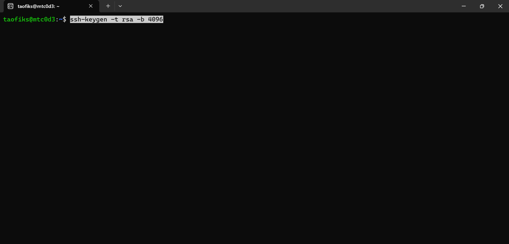
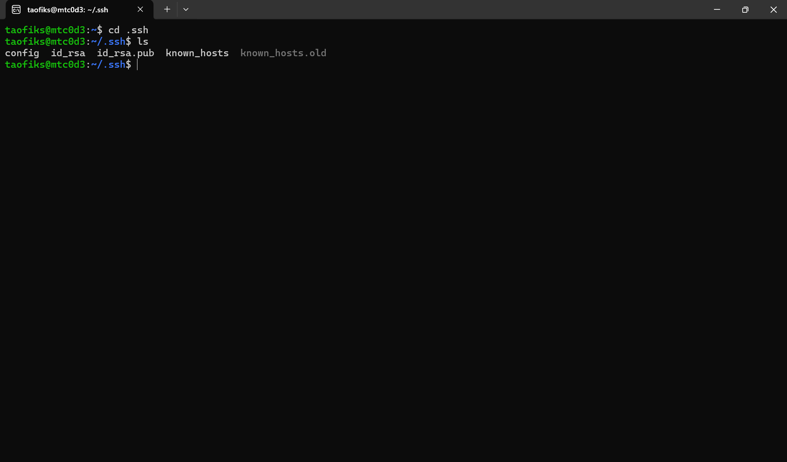
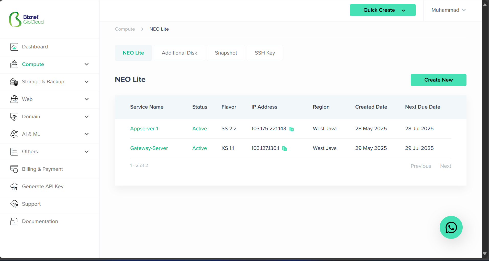
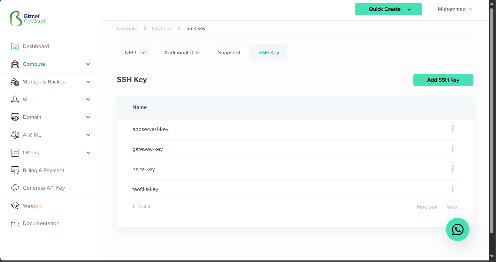
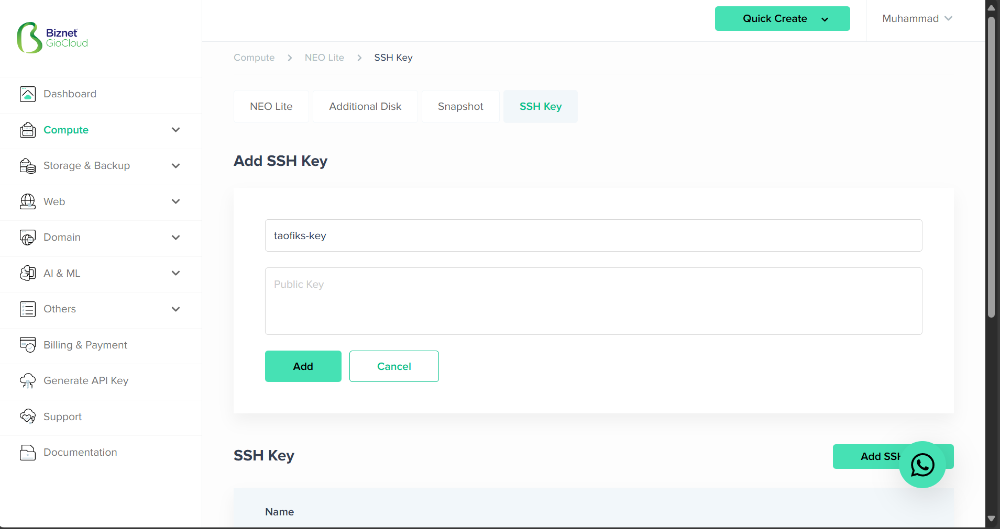
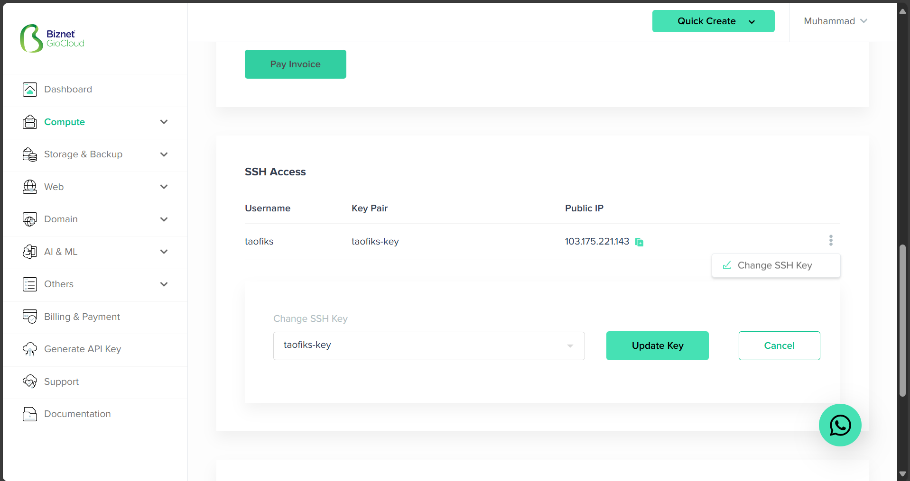

---
# Provisioning
---

## TASK

**Before you start the task, please read this:**
- Please screenshot the command step-by-step
- Describe the process in your final task repository

**Requirements**
- Local machine w/ Ansible & Terraform
- Biznet GIO NEO Lite Servers
  - Appserver - 2 CPU, 2GB RAM
  - Gateway - 1 CPU, 1GB RAM
-  Others Servers if required

**Instructions**
- Attach SSH keys & IP configuration to all VMs
- Server Configuration using Ansible

---

## Attach SSH keys & IP configuration to all VMs

1. Buat public dan private key di local computer (saya pakai wsl)

```
ssh-keygen -t rsa -b 4096
```



2. Tekan enter saja semua sampai public dan private key terbuat

3. Cek public dan private key di direktori `.ssh`, jika benar maka akan ada `id_rsa` dan `id_rsa.pub`

```
cd .ssh

ls
```




4. Lalu copy isi dari public key yaitu dari file `id_rsa.pub`

```
cat id_rsa.pub
```

5. Lalu buka biznet gio cloud dan akses dashboard nya



6. Klik tab `SSH key`



7. Lalu klik `Add SSH Key`

8. Beri nama ssh key dan masukan public key yang dibuat tadi



9. Lalu klik `Add`

10. Pilih tab `NEO Lite`

11. Masuk ke salah satu server scroll ke bawah cari SSH Access lalu ganti dengan key yang dibuat tadi, klik update key



12. Lakukan hal yang sama ke semua server

---

## Server Configuration using Ansible