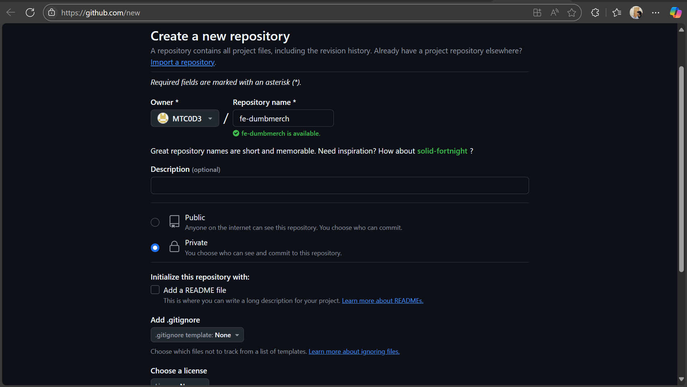
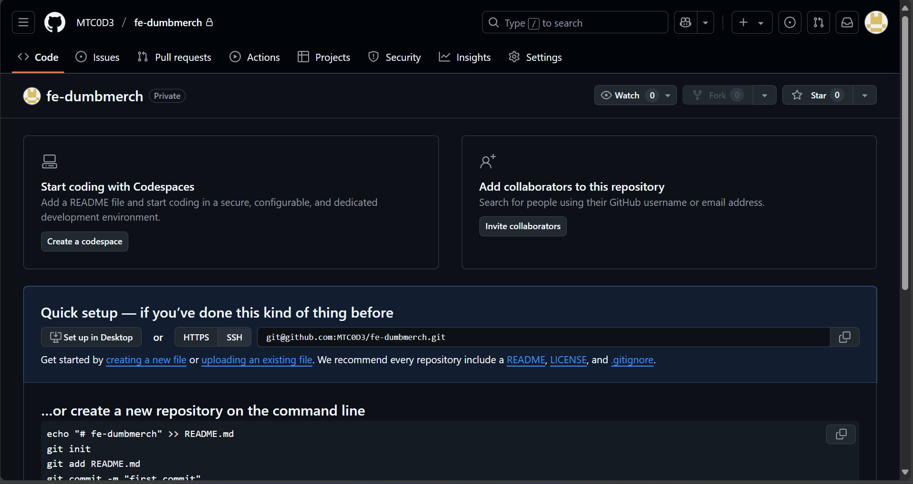
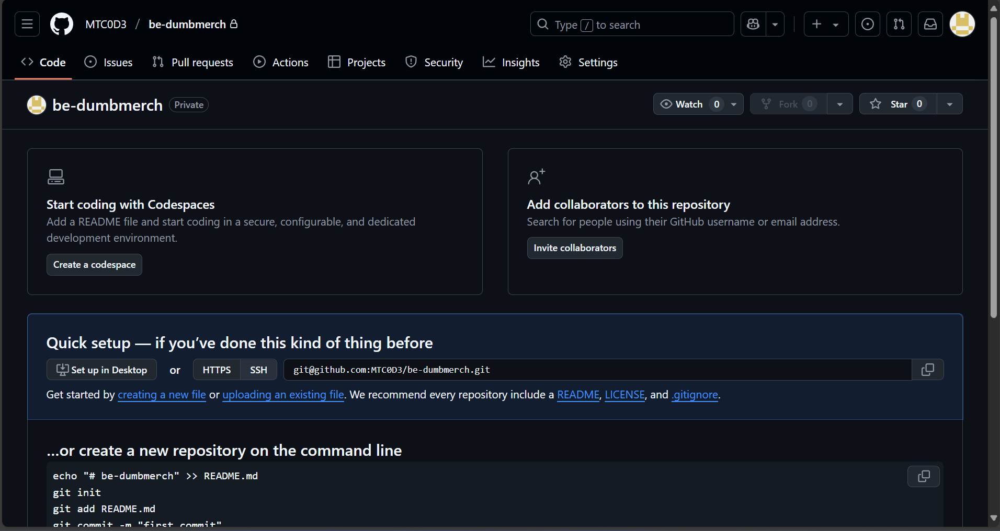

---
# REPOSITORY
---

## TASK

**Before you start the task, please read this:**
- Please screenshot the command step-by-step
- Describe the process in your final task repository

**Requirements**
- Personal Github/GitLab accounts (must be private)
- Frontend : [fe-dumbmerch](https://github.com/demo-dumbways/fe-dumbmerch)
  - NodeJS v16.x or above
  - Create .env file for FE+BE Integration (REACT_APP_BASEURL) https://api.ade.studentdumbways.my.id/api/v1

- Backend : [be-dumbmerch](https://github.com/demo-dumbways/be-dumbmerch)
  - Golang v1.16.x or above
  - Modify .env file for DB Integration

**Instructions**
- Create a repository on Github or Gitlab
- **Private** repository access
- Set up 2 branches
   - Staging
   - Production
- Each Branch have their own CI/CD

---

## Create Private Github Repository

1. Silahkan buat repository baru di github [DISINI](https://github.com/new)

2. Selanjutnya ganti dari public ke private, lalu buat repository-nya

- fe-dumbmerch

- be-dumbmerch

3.