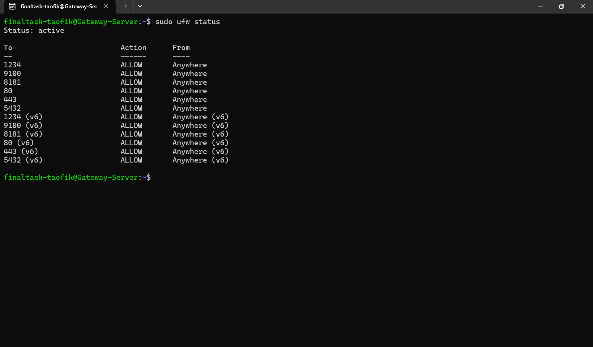

-----
# **SERVER**
-----

## TASK

**Before you start the task, please read this:**
- Please screenshot the command step-by-step
- Describe the process in your final task repository

**Requirements**
- 1 SSH keys max.
- SSH Config.
- Ubuntu 22.04 lts

**Instructions**
- Create new user `finaltask-$USER`
- Server login with SSH key and Password
- Create a working **SSH config** to log into servers
- Only use **1 SSH keys** for all purpose (Repository, CI/CD etc.)
- UFW enabled with only used ports allowed
- Change ssh port from (22) to (1234)

-----

## Setup using Ansible

1. Pada task ini saya menggunakan ansible, untuk membuat user bisa dilihat [DISINI](../ansible/2_create_user.yaml) 

2. Untuk merubah ssh port dan setup ufw [DISINI](../ansible/3_setup_ufw_port.yaml)


## SSH CONFIG


## login using password only

```
ssh -o PreferredAuthentications=password -o PubkeyAuthentication=no finaltask-taofik@103.175.221.143
```


## UFW Allow Custom Port

### Gateway



### Appserver


