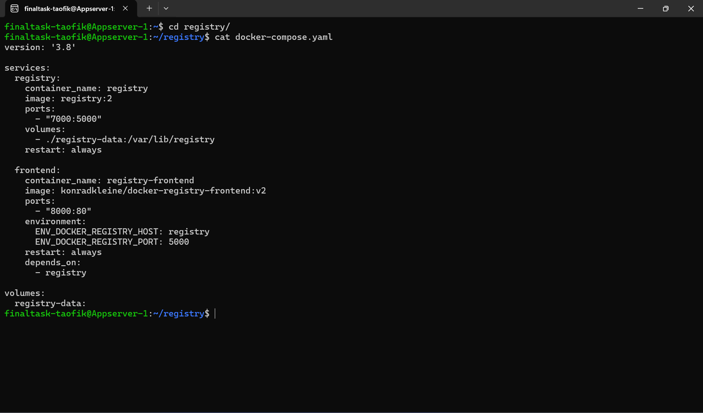
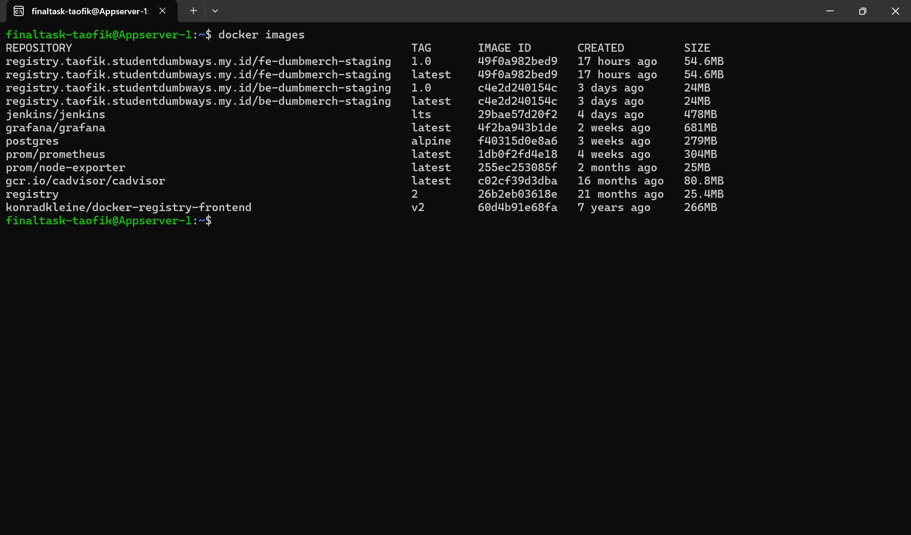
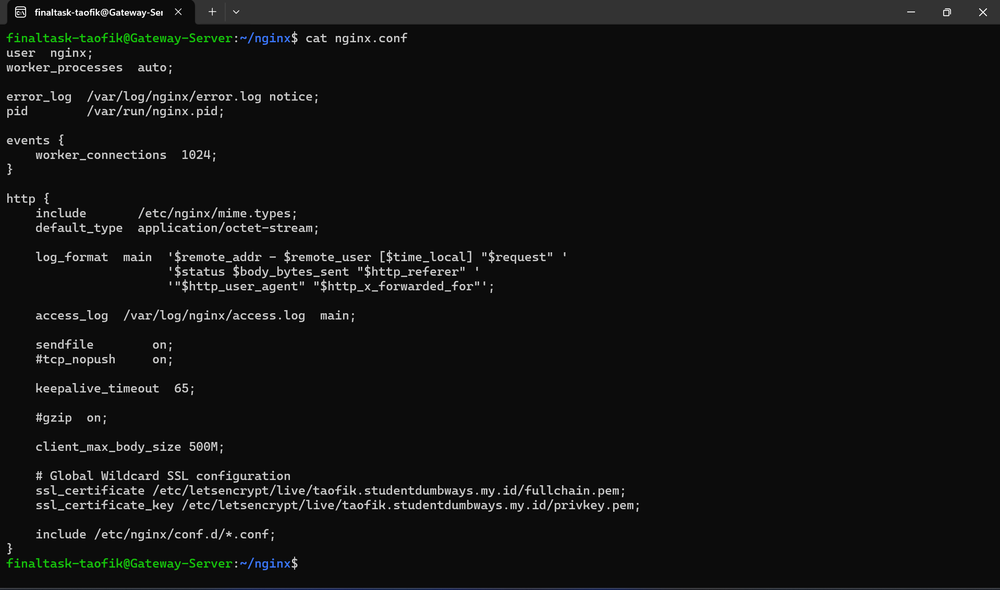
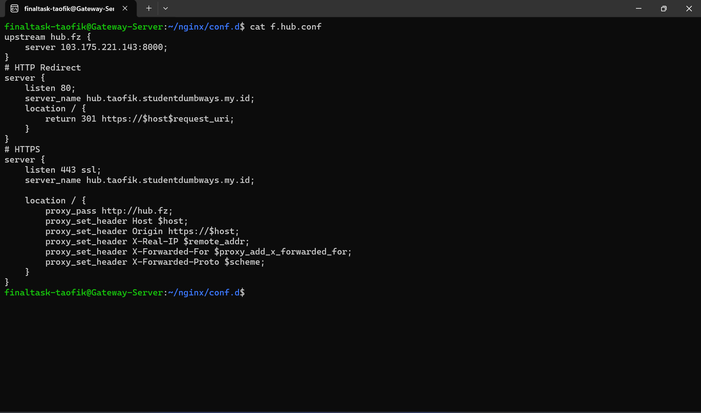
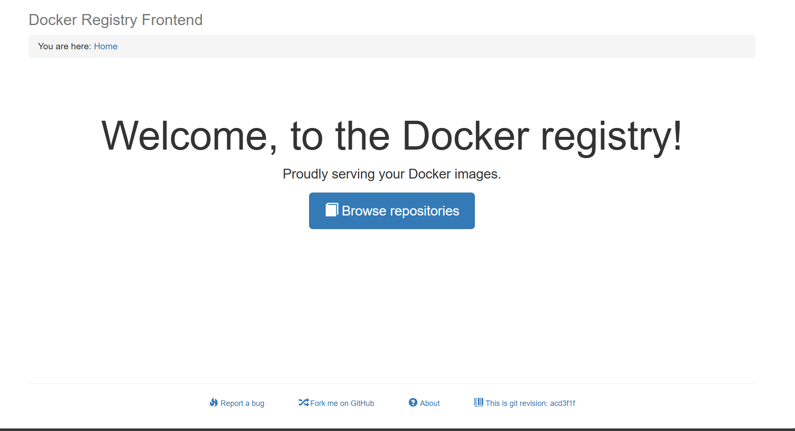
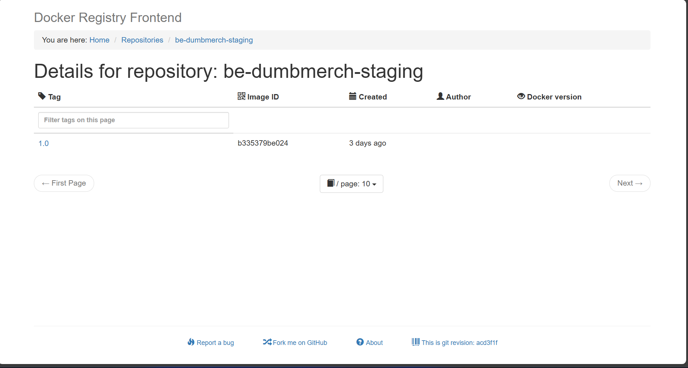

-----
# **DOCKER REGISTRY**
-----

## TASK

**Before you start the task, please read this:**
- Please screenshot the command step-by-step
- Describe the process in your final task repository

**Requirements**
- Docker Registry Private

**Instructions**

[ *Docker Registry* ]

- Deploy Docker Registry Private on this server
- Push your image into Your Own Docker Registry
- reverse proxy registry-$name.studentdumbways.my.id

[*Referention*]
[Docker Registry Private](https://hub.docker.com/_/registry)

-----

## Deploy docker registry private

1. Buat file ```docker-compose.yaml```

2. Disini saya juga menambahkan frontend untuk registry

```
version: '3.8'

services:
  registry:
    container_name: registry
    image: registry:2
    ports:
      - "7000:5000"
    volumes:
      - ./registry-data:/var/lib/registry
    restart: always

  frontend:
    container_name: registry-frontend
    image: konradkleine/docker-registry-frontend:v2
    ports:
      - "8000:80"
    environment:
      ENV_DOCKER_REGISTRY_HOST: registry
      ENV_DOCKER_REGISTRY_PORT: 5000
    restart: always
    depends_on:
      - registry

volumes:
  registry-data:
```



2. Jalankan docker compose

```
docker compose up -d
```




### Reverse Proxy

1. Pada file nginx.conf, tambahkan limit upload sebesar max 500MB dan tambahkan juga SSL Cert



2. Konfigurasi untuk subdomain registry.taofik.studentdumbways.my.id:


3. Konfigurasi untuk subdomain hub.taofik.studentdumbways.my.id



### Hasil



## Push Image to Docker Private Registry

1. Build imagenya terlebih dahulu

```
docker build -t registry.taofik.studentdumbways.my.id/be-dumbmerch-staging:1.0 .
```

2. Selanjutnya push ke registry

```
docker push registry.taofik.studentdumbways.my.id/be-dumbmerch-staging:1.0
```


