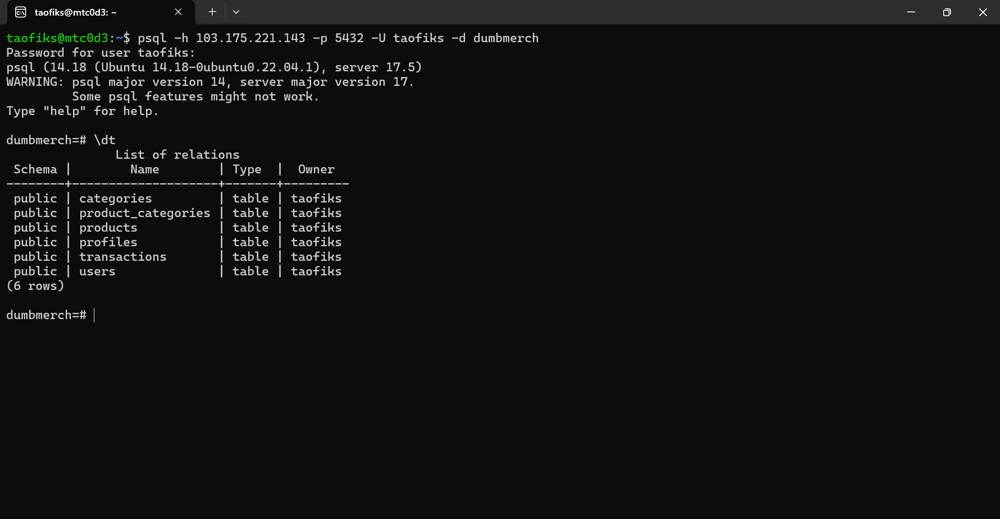
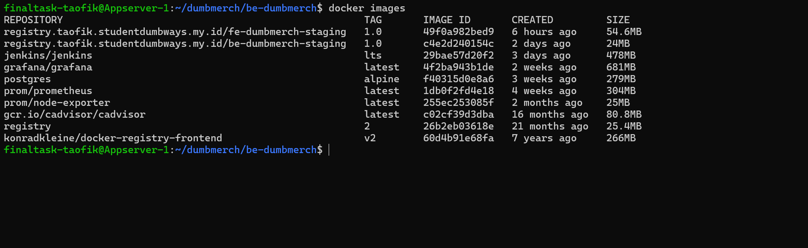
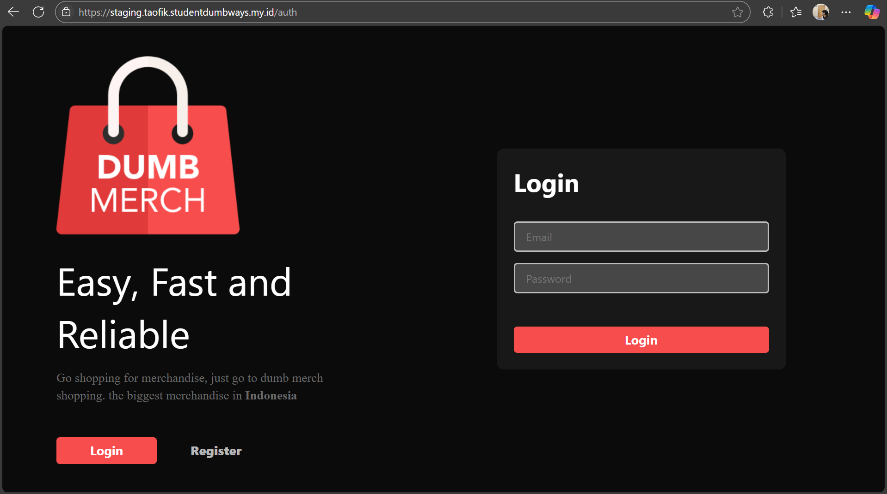
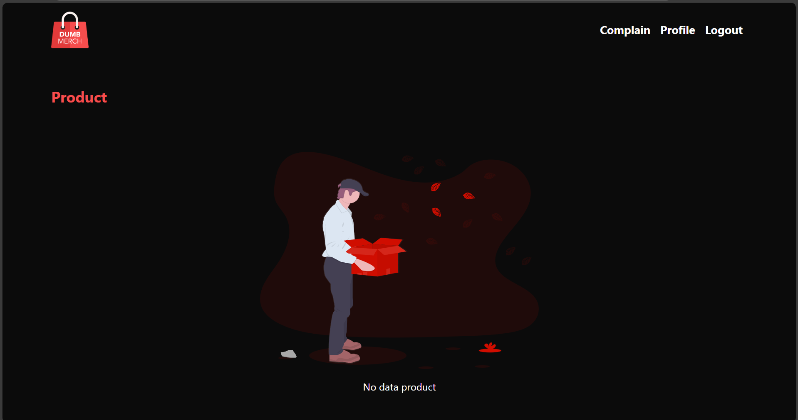

-----
# **DEPLOYMENT**
-----

## TASK

**Before you start the task, please read this:**
- Please screenshot the command step-by-step
- Describe the process in your final task repository

**Requirements**
- Deployments on top Docker
- Frontend : [fe-dumbmerch](https://github.com/demo-dumbways/fe-dumbmerch)
- Backend : [be-dumbmerch](https://github.com/demo-dumbways/be-dumbmerch)

**Instructions**

[ *Database* ]
- App database using *PostgreSQL*
- Deploy postgresql on top docker
- Set the volume location in `/home/$USER/`
- Allow database to remote from another server

[ *Application* ]
- Create a Docker image for frontend & backend
- Staging: A lightweight docker image (as small as possible)
- Production: Deploy a production ready app
- Building Docker image on every environment using docker multistage build
- Create load balancing for frontend and backend

-----


## Database PostgreSQL for Staging 

1. Buat file docker-compose.yaml:
```
services:
  postgres:
    image: postgres:alpine
    container_name: postgres-staging
    restart: always
    environment:
      POSTGRES_DB: dumbmerch
      POSTGRES_USER: taofiks
      POSTGRES_PASSWORD: passwordmu
    ports:
      - "5432:5432"
    volumes:
      - /home/finaltask-taofik/postgres_data:/var/lib/postgresql/data
```

2. Test Connetion to PSQL remotely:

```
psql -h 103.175.221.143 -p 5432 -U taofiks -d dumbmerch
```




## Docker image for frontend

1. Buat Dockerfile

```
FROM node:16-alpine AS build

WORKDIR /app

COPY package*.json ./

RUN npm install

COPY . .

RUN npm run build

FROM nginx:alpine

COPY --from=build /app/build /usr/share/nginx/html

EXPOSE 80

CMD ["nginx", "-g", "daemon off;"]
```

2. Build image

```
docker build -t registry.taofik.studentdumbways.my.id/fe-dumbmerch-staging:latest .
```


## Docker image for backend

1. Edit .env

```
SECRET_KEY=bolehapaaja
PATH_FILE=http://localhost:5000/uploads/
SERVER_KEY=SB-Mid-server-fJAy6udMPnJCIyFguce8Eot3
CLIENT_KEY=SB-Mid-client-YUogx3u74Gq9MTMS
EMAIL_SYSTEM=taofik.code@gmail.com
PASSWORD_SYSTEM=Taofik020501
DB_HOST=103.175.221.143
DB_USER=taofiks
DB_PASSWORD=Taofik020501
DB_NAME=dumbmerch
DB_PORT=5432
PORT=5000
```

2. Buat Dockerfile

```
FROM golang:1.16-alpine as build

WORKDIR /app

COPY go.mod go.sum ./
RUN go mod download
COPY . .

RUN go build -o go-docker

FROM alpine:latest

WORKDIR /app

COPY --from=build /app/go-docker .
COPY .env .env

EXPOSE 5000

CMD ["./go-docker"]
```

3. Build image

```
docker build -t registry.taofik.studentdumbways.my.id/be-dumbmerch-staging:latest .
```



## Deploy frontend and backend staging

1. Buat file docker-compose.yaml

```
version: '3.8'

services:
  frontend:
    image: registry.taofik.studentdumbways.my.id/fe-dumbmerch-staging:latest
    container_name: frontend
    ports:
      - "3000:80"

  backend:
    image: registry.taofik.studentdumbways.my.id/be-dumbmerch-staging:latest
    container_name: backend
    ports:
      - "5000:5000"
```

2. Start docker compose

```
docker compose up -d
```


## Hasil



