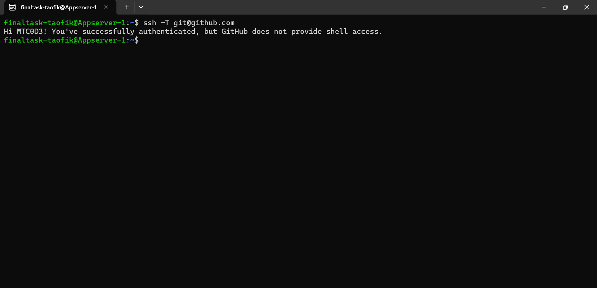
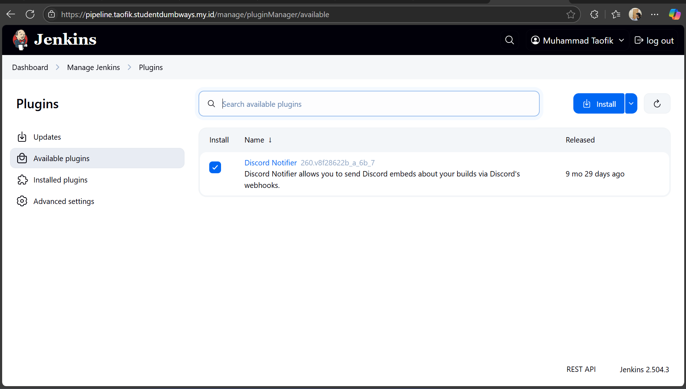
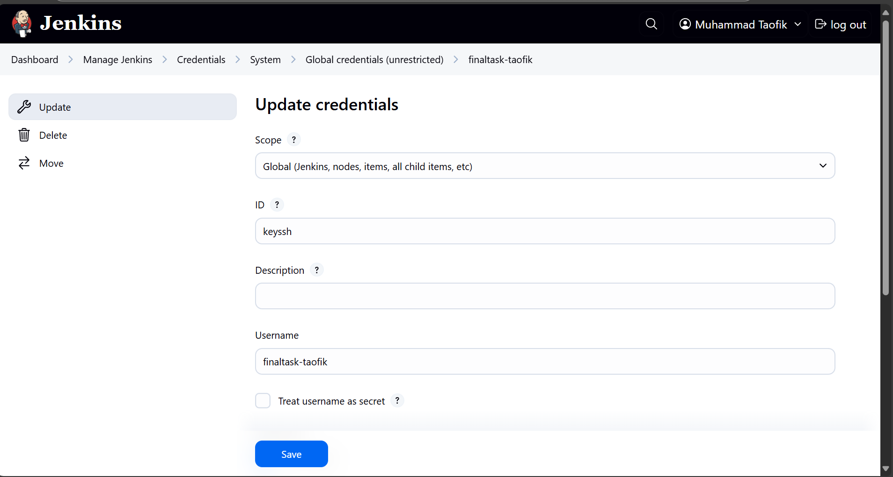
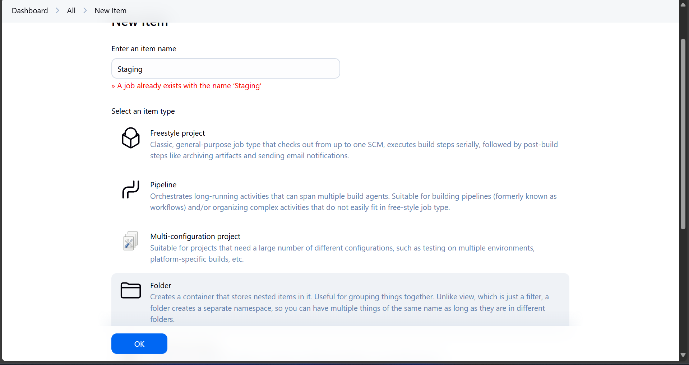
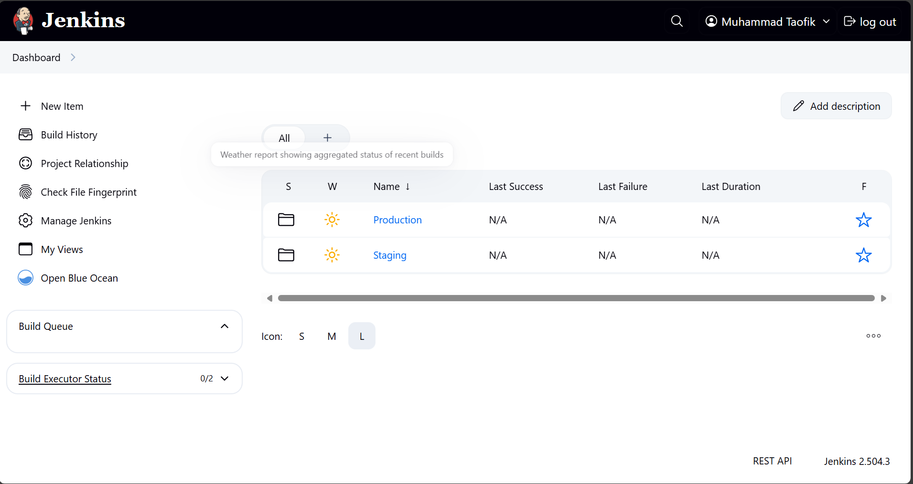
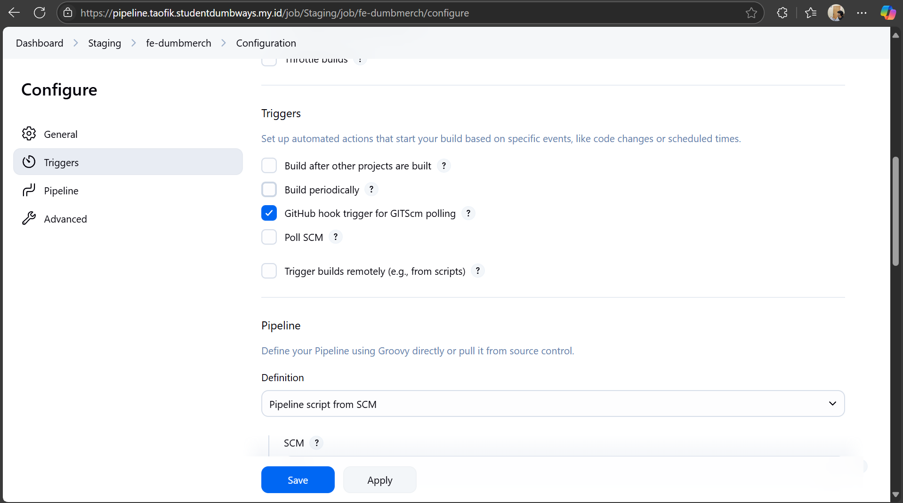
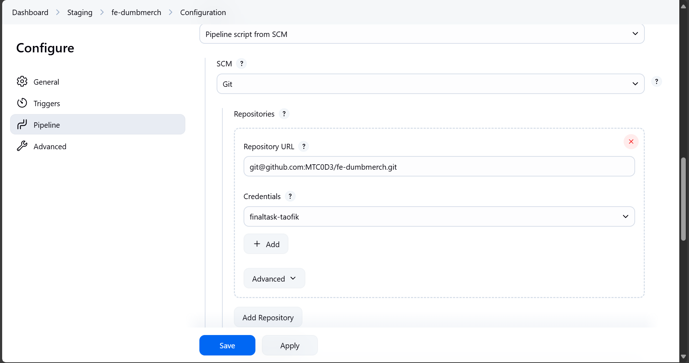
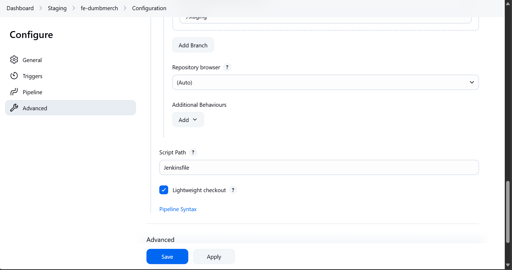
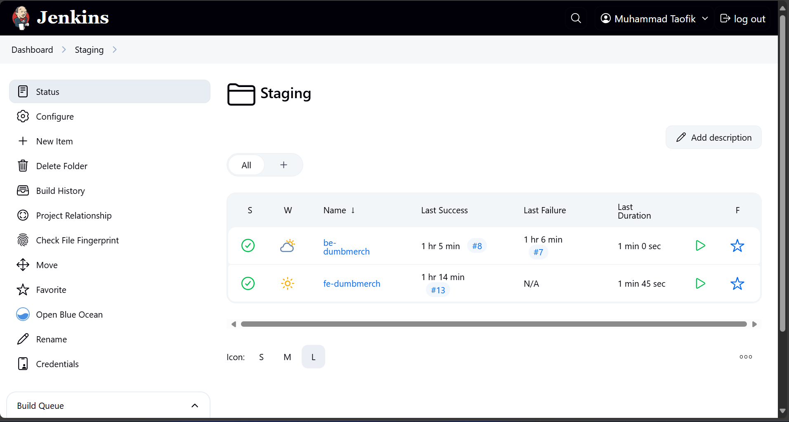
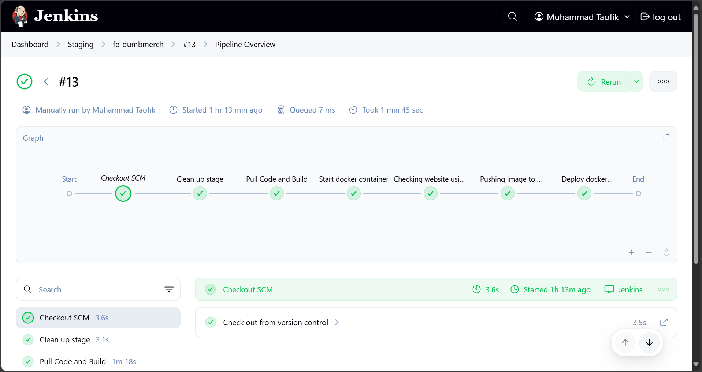

-----
# **CICD**
-----

## TASK

**Before you start the task, please read this:**
- Please screenshot the command step-by-step
- Describe the process in your final task repository

**Requirements**
- CI/CD with Jenkins

**Instructions**

[ *CI/CD* ]

- Using Jenkins, create a pipeline running:
   - Repository pull
   - Image build
   - Testing
   - Push Image into your own docker registry private
   - SSH into your biznet server
   - Pull image from docker registry private
   - Redeploy your deployment apps
 
-----

## Setup Jenkins

1. Sebelum menginstall jenkins, pastikan server dimana jenkins nantinya diinstall sudah terhubung ke github

```
ssh -T git@github.com
```



2. Untuk installasi Jenkins saya menggunakan Ansible, Scriptnya bisa dilihat [DISINI](../ansible/7_install_jenkins.yaml)

3. Jika installasi Jenkins sudah berhasil, nantinya akan ada ```Initial Admin Password``` untuk melanjutkan proses installasi jenkins di web.

4. Selanjutnya akses jenkins menggunakan web browser dan masukkan passwordnya.

5. Tunggu sampai proses initialisasi selesai.

6. Buat User baru, sesuaikan dengan kebutuhan.

7. Pastikan Jenkins URL sudah sesuai.

Selanjutnya Install Plugin. ```Manage Jenkins``` -> ```Plugins``` -> ```Available Plugins``` -> Cari ```SSH Agent``` dan ```Discord Notifier``` -> ```Install```.




8. Jika sudah sukses, buat ```Credentials``` baru. ```Manage Jenkins``` -> ```Credentials``` -> ```System``` -> ```Global credentials``` -> ```Add Credentials```.

9. Pilih ```SSH Username with private key```, masukkan ID yang nantinya berperan sebagai variable, masukkan username dan private key.



10. Kembali ke dashboard, klik ```New Item```, pilih folder buat 2 folder dengan nama ```Staging``` dan ```Production```.







11. Selanjutnya masuk ke dalam folder Staging, Buat Pipeline baru.

12. Pastikan untuk ceklist pada bagian ```GitHub hook trigger for GITScm polling```.



13. Pada Definition pilih ```Pipeline script from SCM```.

14. SCM ganti ke ```Git```

15. Masukkan ```Repository URL``` dan pada ```Credentials``` pilih Credentials yang barusan dibuat.



16. Pada bagian ```Branch Specifier``` Masukkan branch yang sesuai.

17. Pada bagian ```Script Path```, pastikan diisi sesuai dengan lokasi dan nama file dari script Jenkins nantinya.

18. Jika sudah ```Save```



19. Buat lagi dengan total 4 Pipeline, dengan masing - masing branch/folder berisi pipeline untuk Frontend dan Backend.



## Staging Pipeline
