-----
# **MONITORING**
-----

## TASK

**Before you start the task, please read this:**
- Please screenshot the command step-by-step
- Describe the process in your final task repository

**Requirements**
- Deployments on top Docker

**Instructions**
- Create Basic Auth into your Prometheus
- Monitor resources for *Appserver & Gateway & Registry server*
- Create a fully working dashboard in Grafana
  - Disk
  - Memory Usage
  - CPU Usage
  - VM Network
  - Monitoring all of container resources on VM
- Grafana Alert/Prometheus Alertmanager for:
  - Send Notification to Telegram
  - CPU Usage
  - RAM Usage
  - Free Storage
  - Network I/O (NGINX Monitoring)


-----

## Setup Monitoring

1. Untuk installasi monitoring, saya menggunakan ansible. Untuk scriptnya bisa dilihat [DISINI](../ansible/4_install_monitoring.yaml)

### **Adding Basic Auth**

1. Setelah monitoring terdeploy dengan ansible, buka dashboard grafana di browser.

2. Ke connections, lalu tambahkan source dari prometheus.

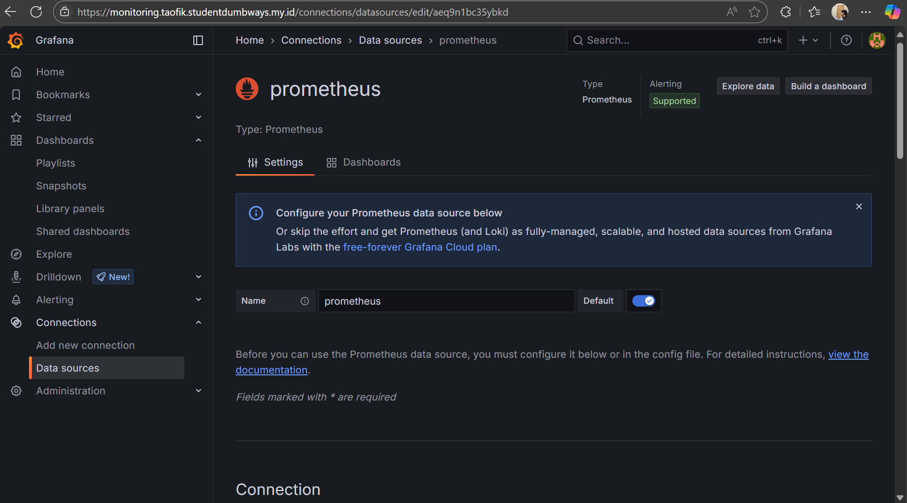

3. Pada bagian ```Connection```, Masukkan URL dari prometheus. 

4. Jika sudah Save.

5. Lalu klik `Data Sources`

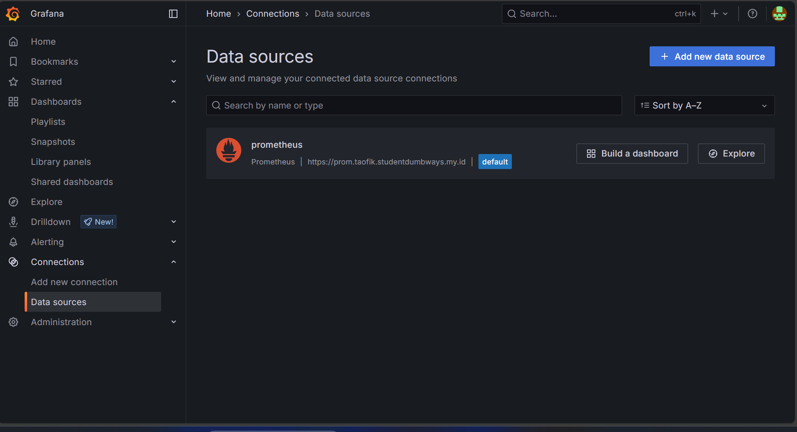

6. Klik Build Dashboard

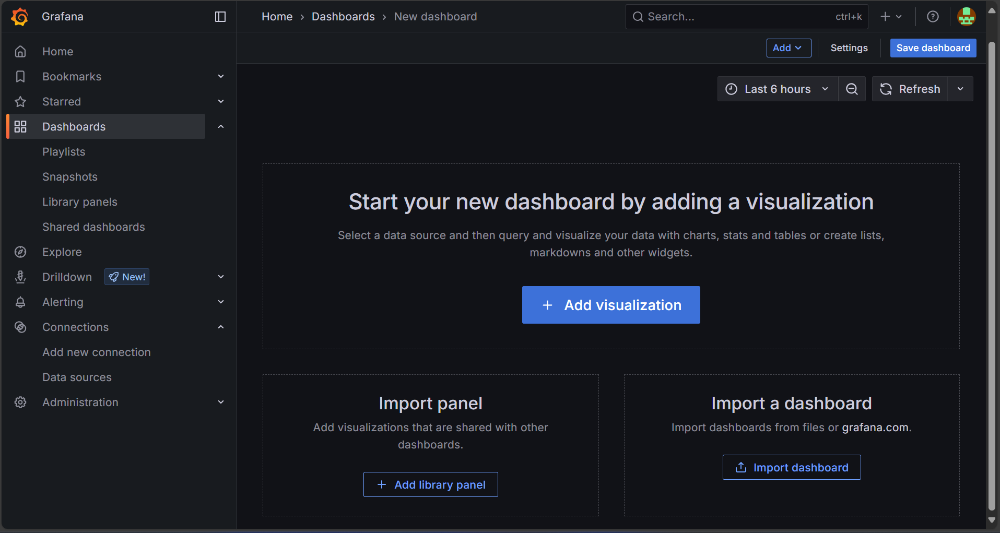


7. Klik import a dashboard, pilih discard

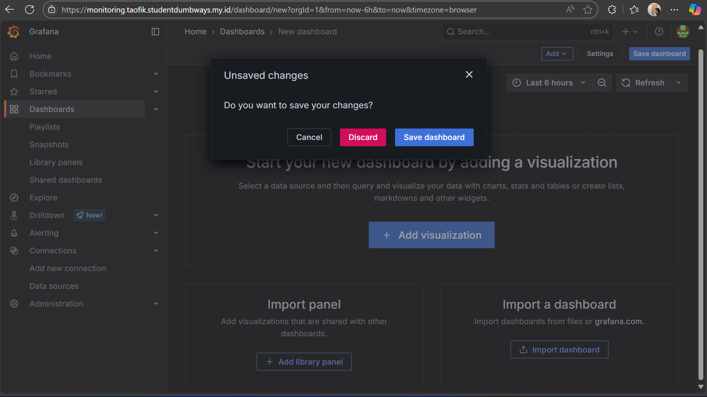


8. Cari template di https://grafana.com/grafana/dashboards/

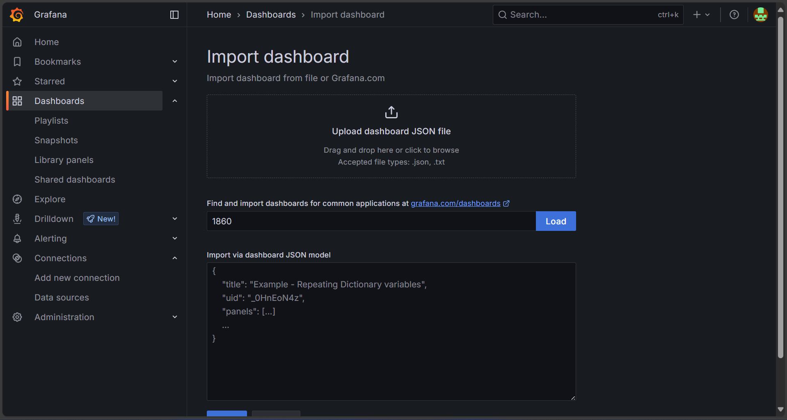

9. Klik load

10.  beri nama dan data source dari `prometehus`

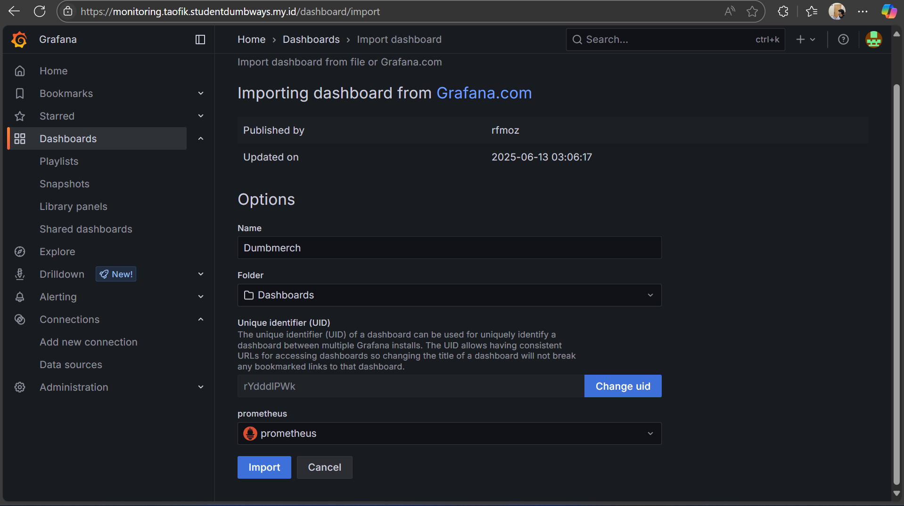

11. Klik import

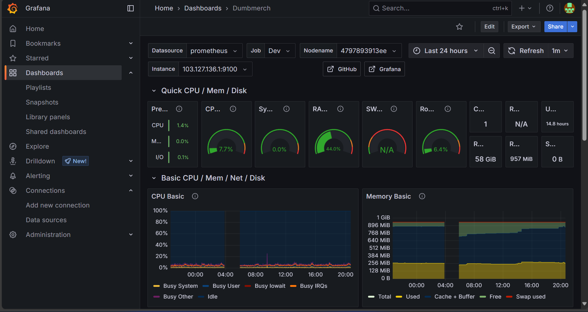

## Alerting

### Membuat bot Telegram

1. Buka telegram dan cari BotFather ```@BotFather``` lalu klik Start.

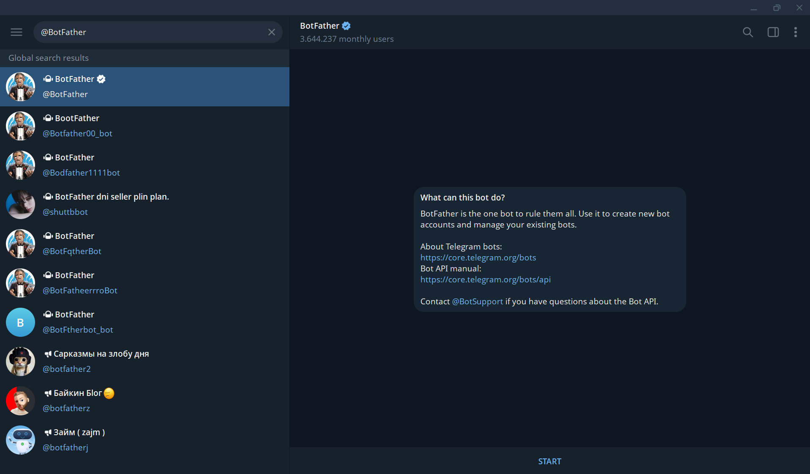

2. Selanjutnya kirim ```/newbot```, dan ikuti petunjuk selanjutnya. Nanti akan mendapatkan ```Access Token```.

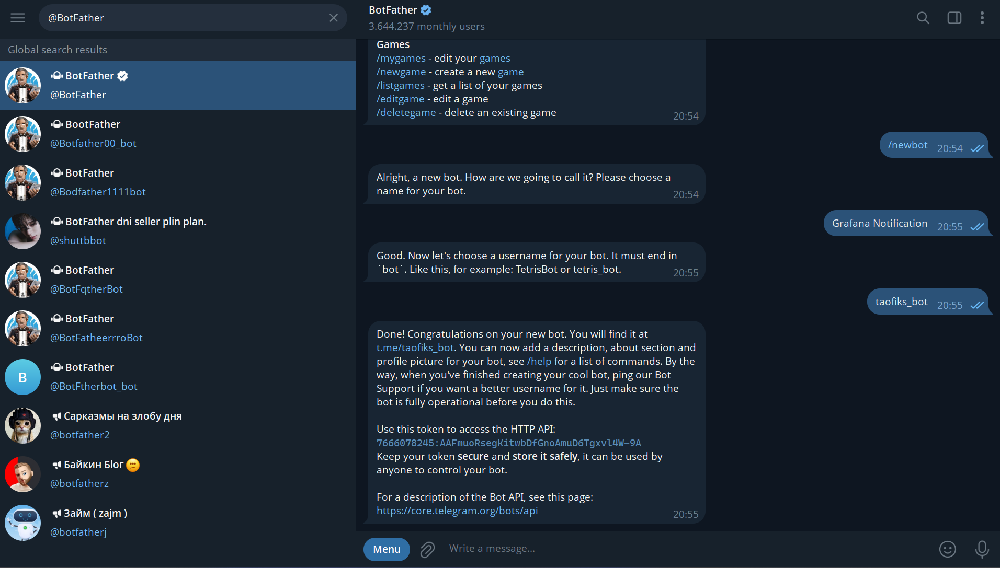

3. Cari lagi bot dengan nama Get My ID ```@getmyid_bot``` lalu klik Start. Simpan ```Chat ID``` dan ```Access Token``` tadi

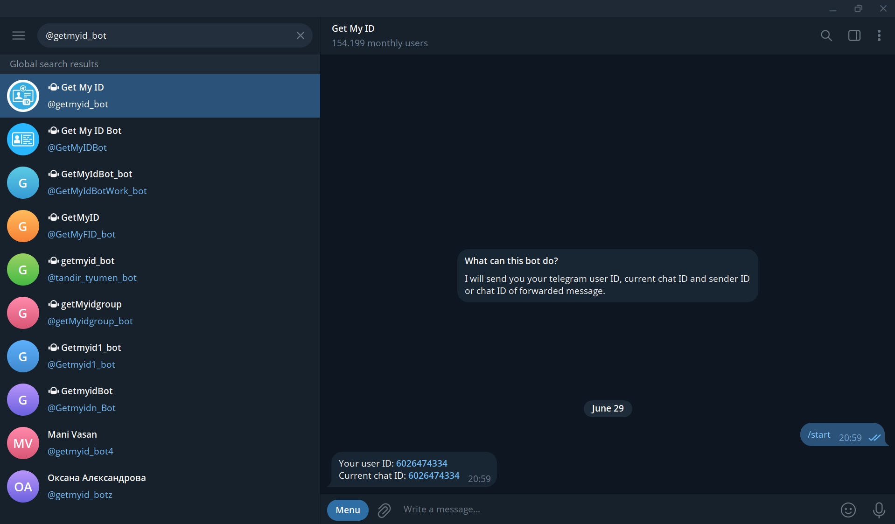

4. Ke ```Grafana``` -> ```Contact Points``` -> ```Add contact point``` -> Integration pilih ```Telegram``` -> Masukkan ```Access Token``` dan ```Chat ID``` tadi.

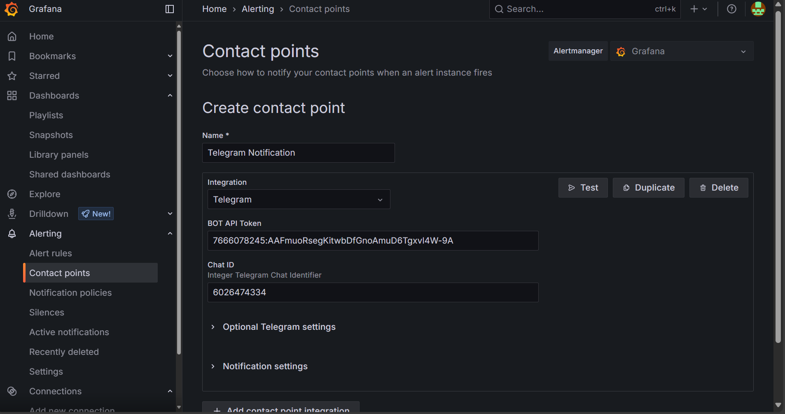

5. Pada bagian ```Optional Telegram Settings```, isi Message:
```
**🚨 Alert Firing 🚨**

**Alert Name:** {{ .CommonLabels.alertname }}
**Severity:** High

**Details:**
- **Instance:** {{ .CommonLabels.instance }}
- **Folder:** {{ .CommonLabels.grafana_folder }}

**Description:**
{{ .CommonAnnotations.description }}

**Summary:**
{{ .CommonAnnotations.summary }}


[View in Grafana]
https://monitoring.taofik.studentdumbways.my.id/d/rYdddlPWk/dumbmerch?orgId=1&from=now-24h&to=now&timezone=browser&var-DS_PROMETHEUS=aeq9n1bc35ybkd&var-job=Dev&var-nodename=4797893913ee&var-node=103.127.136.1:9100&var-diskdevices=%5Ba-z%5D%2B%7Cnvme%5B0-9%5D%2Bn%5B0-9%5D%2B%7Cmmcblk%5B0-9%5D%2B&refresh=1m
```

6. Lakukan test dengan mengklik ```Test``` -> ```Send test notification```.

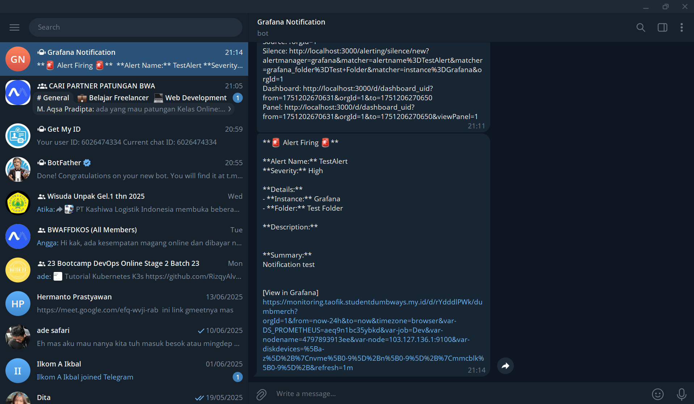


7. Jika sudah benar, Klik ```Save contact point```.


8. Selanjutnya ke ```Notification Policies```. Pada default policy klik tanda ```more``` -> ```Edit```.


9. Ganti ```Default contact point``` menjadi contanc point yang barusan dibuat yaitu ```Telegram Notif```.


10. Pada ```Timing Options``` sesuaikan dengan kebutuhan.


11. Jika sudah klik ```Update default policy```.


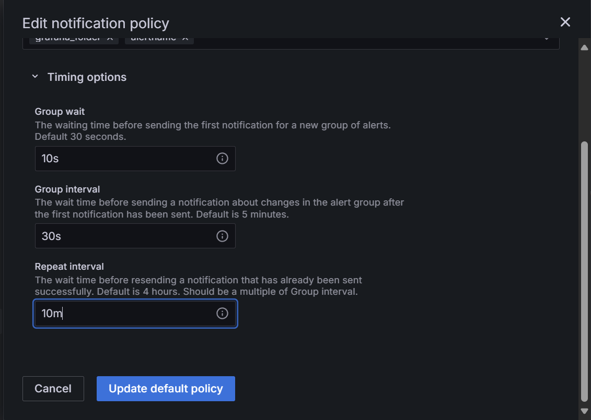


12. Selanjutnya buat ```Alert Rules```.


13. Masukkan Query yang sama dengan CPU Usage.

```
100 - (avg by(instance) (rate(node_cpu_seconds_total{mode="idle"}[5m])) * 100)
```

14. Pada bagian expressions, ganti input menjadi A dan IS ABOVE value menjadi 70. Jadi tiap cpu usage melebihi 70%, maka akan melakukan alerting.


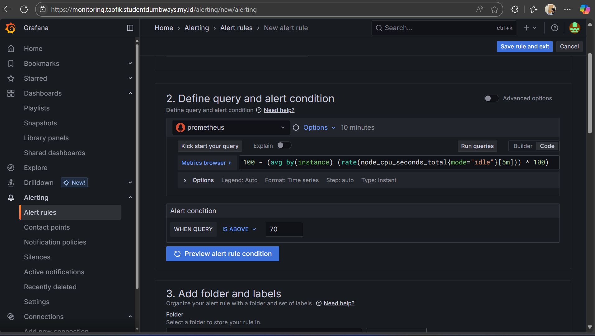


15. Buat ```new folder``` dan ```new evaluation group```


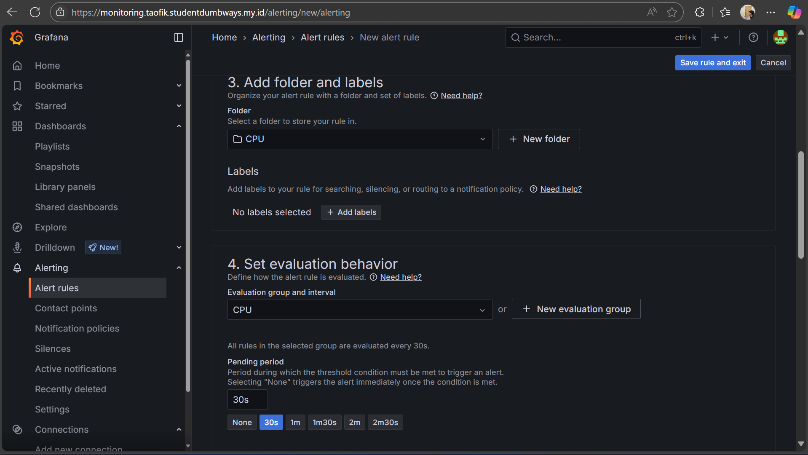


Pada contact point pilih ```Telegram Notif```.


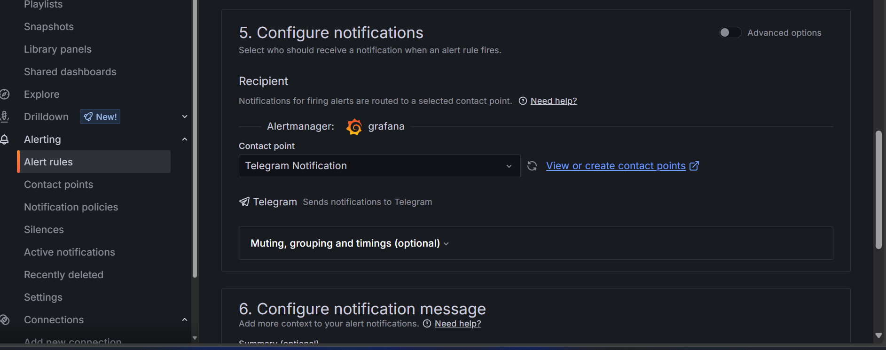


Pada bagian ```Annotation``` isi sesuai keperluan.


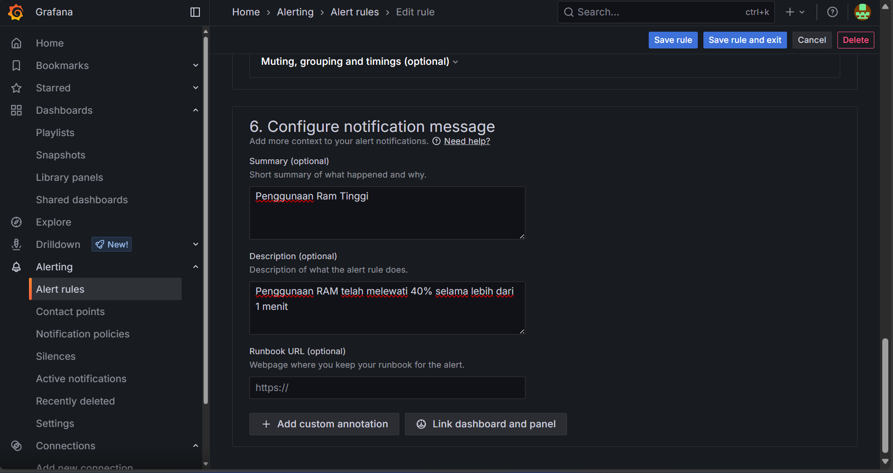


## Hasil Notif


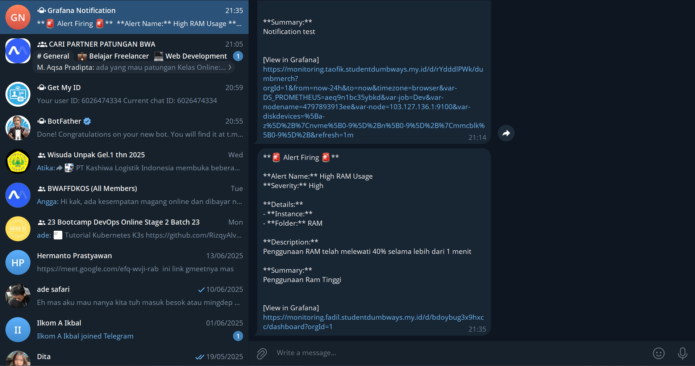


Buat juga untuk ```RAM Usage```, ```Free Storage```, dan ```Network I/O (NGINX Monitoring)```.

