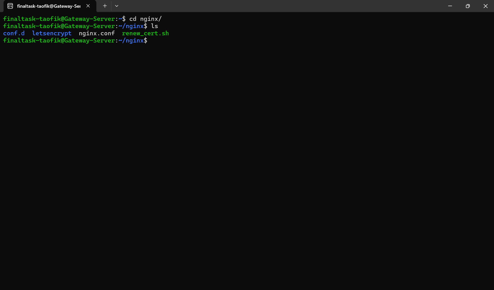
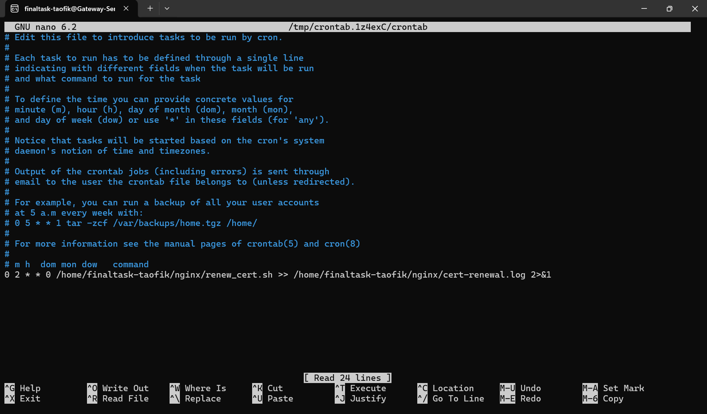

-----
# WEB SERVER
-----

## TASK

**Before you start the task, please read this:**
- Please screenshot the command step-by-step
- Describe the process in your final task repository

**Requirements**
- NGINX/Apache2/Lightspeed on Gateway
- SSL Certbot using Wildcard
- Automatic SSL (Ansible/Cronjob/Script etc.)

**Instructions**
- Create domains:
  - <name>.studentdumbways.my.id - App
  - api.<name>.studentdumbways.my.id - Backend API
  - exporter.<name>.studentdumbways.my.id - Node Exporter
  - prom.<name>.studentdumbways.my.id - Prometheus
  - monitoring.<name>.studentumbways.my.id - Grafana
  - registry.<name>.studentdumbways.my.id - Docker Registry
- All domains are HTTPS
- Create Bash Script for Automatic renewal for Certificates

-----

# Setup Webserver

1. Untuk setup webserver disini saya menggunakan Ansible, Untuk Scriptnya bisa dilihat [DISINI](../ansible/5_reverse_proxy.yaml)

## Setup Automatic Renewal for Certificate

1. Buat file baru dengan nama ```renew_cert.sh```

```
#!/bin/bash

# Define variables
CONTAINER_NAME="certbot-auto"
IMAGE="certbot/dns-cloudflare"
EMAIL="taofik.code@gmail.com"
DOMAINS="*.taofik.studentdumbways.my.id,taofik.studentdumbways.my.id"
CONFIG_DIR="/home/finaltask-taofik/nginx/letsencrypt"
CLOUDFLARE_INI_PATH="/etc/letsencrypt/renewal/cloudflare.ini"

# Run the docker container to renew certificates
docker run --rm \
  --name $CONTAINER_NAME \
  -v "$CONFIG_DIR:/etc/letsencrypt:rw" \
  $IMAGE certonly --dns-cloudflare \
  --dns-cloudflare-credentials $CLOUDFLARE_INI_PATH \
  --email $EMAIL \
  --agree-tos \
  --domain $DOMAINS \
  --non-interactive \
  --config-dir /etc/letsencrypt \
  --work-dir /etc/letsencrypt \
  --logs-dir /etc/letsencrypt

# Reload Nginx to apply the new certificates
docker exec nginx-reverse-proxy nginx -s reload
```

2. Lakukan chmod

```
chmod +x renew_cert.sh
```



3. Jalankan Crontab editor. Pilih 1 untuk menggunakan nano

```
crontab -e
```

4. Masukkan script berikut

```
0 2 * * 0 /home/finaltask-taofik/nginx/renew_cert.sh >> /home/finaltask-taofik/nginx/cert-renewal.log 2>&1
```




## Explanation ```0 2 * * 0```

1. Minute (0-59)
2. Hour (0-23)
3. Day of Month (1-31)
4. Month (1-12)
5. Day of Week (0-7) (Sunday is 0 or 7)

Jadi, scriptnya akan berjalan tiap hari Minggu jam 2 Pagi


## Nginx Directory Tree

```
root@gateway:/home/finaltask-taofik/nginx# tree -a
.
├── .htpasswd
├── conf.d
│   ├── f.api-staging.conf
│   ├── f.be-staging.conf
│   ├── f.exporter.conf
│   ├── f.fe-staging.conf
│   ├── f.hub.conf
│   ├── f.monitoring.conf
│   ├── f.pgadmin.conf
│   ├── f.pipeline.conf
│   ├── f.prom.conf
│   ├── f.registry.conf
│   └── f.staging.conf
├── letsencrypt
│   ├── accounts
│   │   └── acme-v02.api.letsencrypt.org
│   │       └── directory
│   │           └── 68d7fdf8da8231f8812d4a2f75eea244
│   │               ├── meta.json
│   │               ├── private_key.json
│   │               └── regr.json
│   ├── archive
│   │   └── taofik.studentdumbways.my.id
│   │       ├── cert1.pem
│   │       ├── chain1.pem
│   │       ├── fullchain1.pem
│   │       └── privkey1.pem
│   ├── letsencrypt.log
│   ├── letsencrypt.log.1
│   ├── live
│   │   ├── README
│   │   └── taofik.studentdumbways.my.id
│   │       ├── README
│   │       ├── cert.pem -> ../../archive/taofik.studentdumbways.my.id/cert1.pem
│   │       ├── chain.pem -> ../../archive/taofik.studentdumbways.my.id/chain1.pem
│   │       ├── fullchain.pem -> ../../archive/taofik.studentdumbways.my.id/fullchain1.pem
│   │       └── privkey.pem -> ../../archive/taofik.studentdumbways.my.id/privkey1.pem
│   ├── renewal
│   │   ├── cloudflare.ini
│   │   └── taofik.studentdumbways.my.id.conf
│   └── renewal-hooks
│       ├── deploy
│       ├── post
│       └── pre
├── nginx.conf
└── renew_cert.sh
```